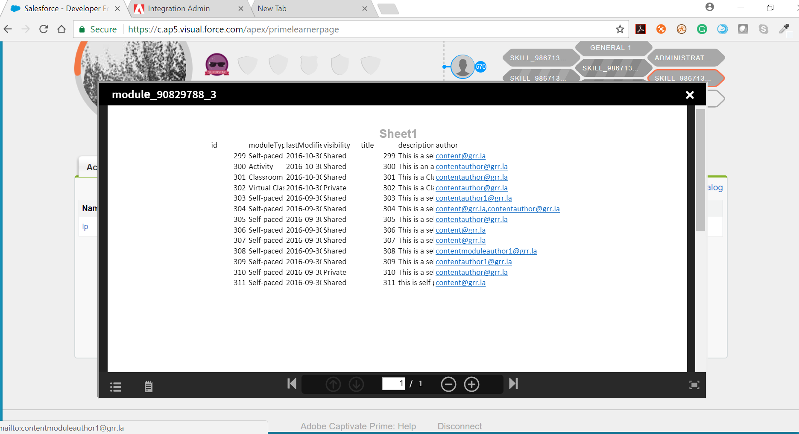

# 可嵌入流體播放器

閱讀本文，了解如何將流體演奏器嵌入自訂應用程式中。

作為企業，你現在甚至可以為學習者提供客製化體驗，甚至在 Learning Manager 之外。 利用公開 API，你可以取得所有與學習物件、學習者註冊及學習進度相關的資訊，並展示在你的網站上。 更重要的是，你甚至可以將 Learning Manager 的流暢播放器嵌入網站，讓學習者能直接在網站上閱讀內容。 流體玩家讓你能遊玩 Learning Manager 支援的任何內容。 當它嵌入在你自己的網站上時，功能與在 Learning Manager 中使用時完全相同。

**播放任何電子學習內容[](../../learners/feature-summary/fluidic-player.md#main-pars_text_779047019)**

Fluidic 播放器幾乎能以同樣一致且直覺的方式播放任何類型的電子學習內容，無需任何外掛或下載。 學習者可以啟動內容，無論內容檔案類型為何，都會開始播放。

**筆記與書籤**

你可以做筆記並收藏任何內容，不論其檔案類型。 如果你想從長檔案或影片中挑選某個內容，可以將找到與你需求相關的資訊加入書籤。 筆記和書籤可以搜尋或以電子郵件形式傳送。 點擊它們會讓你進入流體播放器，正好在影片的那個點或文件的那一頁。

欲了解更多流體球員的資訊，請參見 [流體播放器](../../learners/feature-summary/fluidic-player.md)。

以下是一些可以使用可嵌入流體演奏器的範例。

* 你可以使用網站上的可嵌入流體化播放器，列出員工已註冊的課程，並提供連結以啟動同一頁面的培訓。 這表示你的學習者可以在你的內聯網網站上接受培訓。

* 如果你從事培訓業務，你可能有一個網站，讓客戶購買課程。 你可以將可嵌入播放器整合到同一網站，讓顧客能在你網站內消費他們購買的內容。

## 將流體播放器嵌入網站的步驟 {#stepstoembedfluidicplayerinyourwebsite}

打造一個將流體球員嵌入網站的客製化應用程式包含三個基本步驟：

1. 在 Learning Manager 的整合管理應用程式中建立應用程式。
1. 取回存取權杖。
1. 使用存取權杖從 Learning Manager 透過公開 API 取得資源。

### &#x200B;1. 在整合管理中建立應用程式 {#createanapplicationinintegrationadmin}

此步驟是建立應用程式/用戶端 ID 與應用程式/用戶端秘密，用以取得刷新令牌與存取權杖所必需。 欲了解更多關於建立應用程式的資訊，請參閱  [應用程式開發流程。](developer-manual.md#main-pars_header_994876235)

1. 打開&#x200B;**[!UICONTROL IntegrationAdmin]**&#x200B;應用程式。**[!UICONTROL Applications]**

1. 請從頁面右上角選擇 **[!UICONTROL Register]** 。
1. **[!UICONTROL Register a new application]**&#x200B;窗戶打開了。填寫必填欄位。
1. 如果自訂應用程式需要在多個帳號間共享，請在選項欄位中選擇&#x200B;**[!UICONTROL No]****[!UICONTROL For this account only?]**
1. 要儲存應用程式並產生你的應用程式 ID 與秘密，請點擊 **[!UICONTROL Save]**。

### &#x200B;2. 取回存取權杖 {#retrievingaccesstoken}

由於 Learning Manager 使用 OAUTH2.0.，存取權杖必須透過公開 API 取得資源。 存取權杖可以透過刷新權杖、客戶端 ID 或客戶端秘密來取得。

**2.1 刷新標記**

* 取得 OAuth 代碼

取得刷新令牌需要 OAuth 程式碼。 Learning Manager 在使用者登入時會以下方網址將使用者重新導向至 OAuth 程式碼（OAuth 程式碼擷取範例在範例應用程式中的「oauthredirect.html」檔案中示範）：

```
code https://learningmanager.adobe.com/oauth/o/authorize  
client_id= <application_id>  
&redirect_uri=<redirect_uri>  
&state=<dummy_data>  
&scope=learner:read,learner:write  
&response_type=CODE  
&account=<account_id>  
&email=<email_id>
```

這裡， **[!UICONTROL client id]** 是第一步取得的申請編號。
**[!UICONTROL redirect_url]** 是步驟1中的redirect_url集合。
**[!UICONTROL state]** 是任何需要過濾重定向網址以取得 OAuth 程式碼的虛擬資料。 Scope 是第一步中學習者所設定的範圍。
 永遠[!UICONTROL response_typ]是「代碼」。\
**[!UICONTROL account]** 是可選欄位\
**[!UICONTROL email]** 是一個可選欄位\
&#42; 如果同時提供帳號 ID 和電子郵件，上述網址就能讓使用者登入同一個帳號。 此端點範例在範例應用程式中的「index.html」檔案中呈現。

* 取回刷新令牌

一旦收到 OAuth 程式碼，即可利用收到的 OAuth 程式碼、用戶端 ID 及用戶端秘密，從以下端點取得刷新權杖：

**https://learningmanager.adobe.com/oauth/token**

作為對你發帖請求的回應，你將收到以下資訊：

i. refresh_token\
二、 access_token\
三、 user_id\
四。 expires_in\
v. user_role\
Vi。 account_id

**2.2 從刷新令牌中取回存取權杖**

要取得您的存取權杖，請以您的 refresh_token、client_id 和 client_secret 作為貼文，發送另一個請求至以下網址：

**https://learningmanager.adobe.com/oauth/token/refresh**

作為對你發帖請求的回應，你將收到以下資訊：\
i. refresh_token\
二、 access_token\
三、 user_id\
四。 expires_in\
v. user_role\
Vi。 account_id

### &#x200B;3. 使用公共 API 檢索資源 {#retrieveresourcesusingpublicapi}

第三步，你需要使用存取權杖，利用公開 API 從 Learning Manager 取得資源。  存取權杖是進行任何公開 API 呼叫的必要條件，且必須在標頭中加入，如範例應用程式所示。

## 可嵌入播放器 {#embeddableplayer}

第三方應用程式可利用可嵌入播放器播放學習物件的內容。

**在可嵌入播放器中開啟課程**

1. 建立一個可嵌入的網址

   要使用嵌入播放器開啟課程，你需要建立如下所示的可嵌入網址：

   `https://learningmanager.adobe.com/app/player?lo_id=<v2-api course id>&access_token=<access_token>`

   在此，lo_id需要遵守 V2 API 課程 ID 格式。

   範例： `https://learningmanager.adobe.com/app/player?lo_id=course:123456&access_token=45b269b75ac65d6696d53617f512450f`

   證書、學習程式和職業輔助工具也能在可嵌入播放器中播放。

   舉例： `https://learningmanager.adobe.com/app/player?lo_id=certification:12345&access_token=c1a4847dfbf4007826a027d481b93c1e`

   `https://learningmanager.adobe.com/app/player?lo_id=learningProgram:12345&access_token=c1a4847dfbf4007826a027d481b93c1e`

   `https://learningmanager.adobe.com/app/player?lo_id=jobAid:1234&access_token=c1a4847dfbf4007826a027d481b93c1e`

1. 將這個網址設在 iframe 的「src」屬性中。

**閉合可嵌入播放器**

```
code window.addEventListener("message", function closePlayer(){  
   if(event.data === "status:close"){  
     //handle closing event  
   }  
});
```

## 範例應用教學 {#sampleapplicationtutorial}

附上的 PDF 文件包含一份範例應用教學。
[範例教學與教學來源，用於嵌入流體演奏器。](assets/sample-applicationtutorial.zip) 替代內容

如果你是管理員，你可以設計課程內容，讓學生能在流體遊戲中提供替代內容。 例如，如果你有跨地區的學習者可能想使用多種語言，你可以用多種語言創作相同的內容。 流體玩家會提供學習者可能設定的語言，但學習者也可以選擇在玩家內部切換到其他語言。

影片專用控制

Learning Manager 流體播放器所採用的串流技術，為學習者提供影片播放體驗，且不需任何裝置的磁碟空間。 流暢的播放器還提供智慧控制，如播放速度（1倍、1.5倍）及跳過+-10秒，設計用來讓學習者掌握精確的控制力，以匹配學習速度。

這是一項需要由 IT 團隊或外部顧問來完成，他們能打造並架設在你網站上的應用程式。

1. 修改學習管理器中嵌入的玩家網址，並設定參數指向需要取得的精確學習物件。

   網址：  [https://learningmanager.adobe.com/app/player](https://cpcontents.adobe.com/public/embedplayer/index22fa615ec2baa034a22090c8cd4289fa.html)

1. 請使用以下任一參數來啟動課程：

   * course_id：這當然是要推出的ID。
   * learning_program_id：這就是學習的ID（學習之本）計畫即將推出
   * certification_id：這是發射認證的ID。
   * lo_id：要遊玩的學習對象（課程/學習程式/認證/工作輔助工具）的 ID


1. 使用存取權杖作為強制參數。

   * access_token：這是安全參數，請使用公開的 API OAUTH 存取權杖

   你可以在整合管理中設定可嵌入的流體播放器來取得代幣。 你可以取得你的認證令牌，作為你的存取權杖使用。

   建立網址範例; `https://learningmanager.adobe.com/app/player?lo_id="+lo_id+"&access_token="+accToken`

   這裡lo_id課程、學習計畫、認證及就業援助的識別碼。

   lo_id範例-課程：21324，學習課程：2143，認證：23432，職業援助：237

1. 呼叫 Learning Manager API 以取得上述參數。

   這些 API 呼叫是由你的 IT 團隊或顧問撰寫並架設在你網站上的應用程式進行的。

   關於如何使用 API 的更多細節，請見此處：

   Learning Manager V1 API - [https://learningmanager.adobe.com/docs/primeapi/v1/](https://learningmanager.adobe.com/docs/primeapi/v1/)


   Learning Manager V2 API - [https://learningmanager.adobe.com/docs/primeapi/v2/](https://learningmanager.adobe.com/docs/primeapi/v2/)

   物件的 ID 與 V1 和 V2 API 不同。 可嵌入播放器預期會有 v2 格式的 ID。 使用 V2 中的 ID 映射 API，將 V1 ID 轉換成 V2 ID。

   建構 URL 後，應用程式會用它來顯示給學習者，其中一種方式是將其放入 iFrame 中。 點擊此連結會引導流體玩家啟動，並以該賽道為背景。

   

   要查看進度與完成報告，請登入學習管理員。

   當學習者關閉播放器時，流體播放器會使用 html5 postMessage 向父元素發送「關閉」訊息。 載入控制器應該會處理這個訊息並繼續。

修改學習管理器中嵌入的玩家網址，並設定參數指向需要取得的精確學習物件。

網址：  [https://learningmanager.adobe.com/app/player](https://learningmanager.adobe.com/app/player)

以下任何一個參數都可以用來啟動賽道：

* course_id：這當然是要推出的ID。
* learning_program_id：這就是學習的ID（學習之本）計畫即將推出
* certification_id：這是發射認證的ID。
* lo_id：要遊玩的學習對象（課程/學習程式/認證/工作輔助工具）的 ID

必備參數：

* access_token：這是安全參數，請使用公開的 API OAUTH 存取權杖

呼叫 Learning Manager API 以取得上述參數。 這些 API 呼叫是由你的 IT 團隊或顧問撰寫並架設在你網站上的應用程式進行的。

關於如何使用 API 的更多細節，請見此處：

Learning Manager V1 API - [https://learningmanager.adobe.com/docs/primeapi/v1/](https://learningmanager.adobe.com/docs/primeapi/v1/)


Learning Manager V2 API -  [https://learningmanager.adobe.com/docs/primeapi/v2/](https://learningmanager.adobe.com/docs/primeapi/v2/)
