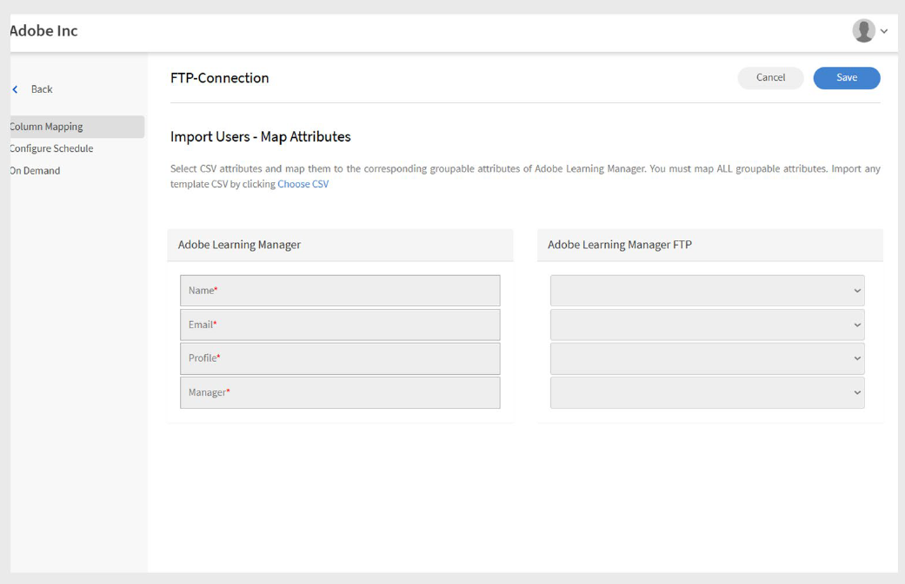
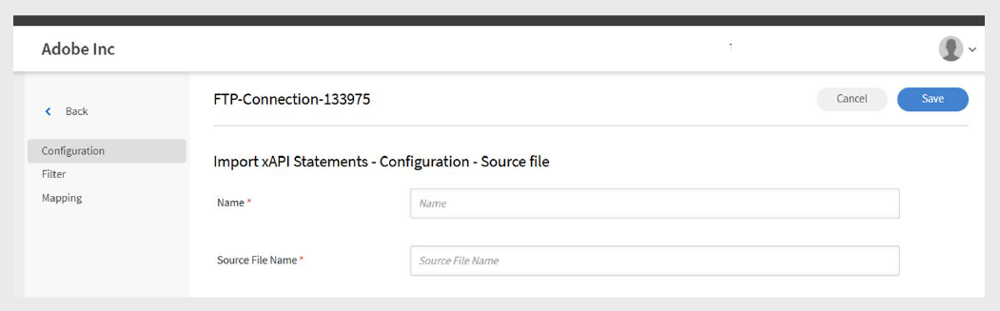

# Adobe Learning Manager 中的 FTP 連接器

## 簡介

FTP（檔案傳輸協定）是一種標準網路協定，用於透過網際網路或本地網路在用戶端與伺服器之間傳輸檔案。 它讓使用者能夠上傳、下載並管理遠端伺服器上的檔案。 為了安全檔案傳輸，常見的變體如 SFTP（SSH 檔案傳輸協定）和 FTPS（FTP Secure）。 FTP 在企業環境中被廣泛採用，用於自動化系統間的資料交換，例如在 Adobe Learning Manager 與外部平台間同步使用者或訓練資料。

本文件提供整合管理員逐步指引，說明如何在 Adobe Learning Manager 中設定及使用 FTP 連接器。 FTP 連接器使學習管理員與外部系統之間能透過安全的檔案傳輸協定自動進行資料交換。

你將學習如何設定 FTP 連線、映射資料欄位、排程自動使用者匯入或匯出，以及監控同步活動。 本指南支持與外部學習平台或人力資源系統的順利且安全整合。 你可以匯入內部使用者和 xAPI 語句，並匯出使用者技能、學習者成績單和 xAPI 資料。

整合管理員必須產生用於遷移使用者、使用者資料或學習內容的 CSV 檔案，並上傳至 Adobe Learning Manager FTP 帳號中的指定資料夾。 Adobe Learning Manager 接著依照既定的排程讀取、合併並匯入資料。

這些操作可以隨時進行，或是根據組織需求設定排程。

## FTP 整合的優點

- 減少資料管理中的人工工作與人為錯誤。
- 同時整合多個外部來源的資料。
- 支援隨選及預定資料作業。
- 允許在不同系統格式間進行詳細的欄位映射。

## 先決條件

在配置 FTP 連接器前，請確保您的環境符合以下要求：

- 具備 FTP 連接器權限的整合管理員角色。
- 穩定的網路連線，且有足夠的頻寬用於檔案傳輸。
- 防火牆設定允許在所需埠口進行 FTP 流量。
- 根據你的安全需求，必須有埠口存取

### 許可與存取

請確保你具備以下條件：

- 存取權以產生和管理 SSH 金鑰（若使用 SSH 認證）。
- 在指定的 FTP 資料夾中建立和更新 CSV 檔案的權限。

## 主要能力

### 使用 FTP 連接器進行資料匯入與匯出

Adobe Learning Manager 中的 FTP 連接器簡化了外部系統與您的 Adobe Learning Manager 帳戶之間的資料交換。 它支援預定及按需進行的進出口作業，減少人工作業，確保資訊準確且最新。

此方法支援與多個外部系統的整合。 如果不同系統會產生獨立的 CSV 檔案，Adobe Learning Manager 會合併資料並匯入為單一批次。

### 將資料匯入 Adobe Learning Manager

_使用者資料匯入_

將結構化 CSV 檔案上傳到指定的 FTP 資料夾，以匯入內部使用者資料。 Adobe Learning Manager 會根據你設定的排程讀取並處理這些檔案，以保持使用者資訊的即時性。

_多來源整合_

如果你使用多個外部系統，每個系統都可以產生自己的 CSV 檔案。 Adobe Learning Manager 將檔案合併，並以單一批次處理資料，方便管理來自不同來源的使用者紀錄。

_xAPI 匯入_

連接器也支援 xAPI（Experience API）語句。 從第三方學習系統匯入這些資料，以追蹤並報告跨多平台的學習活動。

### 從 Adobe Learning Manager 匯出資料

_Learner data export_

將使用者資料如技能進度、課程完成度及績效指標匯出至指定的 FTP 地點。 利用這些資料進行外部報告或分析。

_學習者成績單_

產生並匯出詳細的成績單，包含課程完成、證照及學習路徑，以支援合規與資格驗證。

### 屬性映射

將 CSV 檔案欄位映射到 Adobe Learning Manager 的使用者屬性。 你可以根據需要重複使用和更新映射設定，讓它更容易因應資料需求的變化而調整。

### 排程與自動化

排程將匯入與匯出任務定時執行，例如每日、每週或自訂間隔。 這確保了資料持續更新，無需人力操作。

## 設定 FTP 連接器

設定 FTP 連接器，以建立 Adobe Learning Manager 與外部系統之間的安全資料同步。

要配置 FTP 連接器：

1. 以整合管理員身份登入。
2. 選擇 **Adobe Learning Manager FTP** ，然後選擇 **「開始使用**」。

   
   _Adobe Learning Manager FTP 連接器介面，顯示「開始使用」按鈕_

3. 選擇 **「下一步**   」以進入 FTP 連接器設定精靈。

   
   _設定頁面會顯示「下一步」按鈕，繼續 FTP 連接器設定_

### 設定認證

Adobe Learning Manager 支援三種認證方式，每種方法都有不同的安全等級與複雜度要求。

#### 基本認證

此方法使用傳統的使用者名稱與密碼憑證來存取 FTP。 雖然實作較簡單，但安全性低於基於 SSH 的替代方案。

1. 選擇 **使用密碼**&#x200B;建立基本認證。
2. 請在提供的欄位輸入 FTP 使用者名稱和密碼。 在繼續前，請確認憑證輸入正確。

   
   _FTP 認證表單，包含使用者名稱和密碼欄位，顯示已選定的基本認證選項_

#### 現有的 SSH 金鑰認證

如果你已經建立了 SSH 金鑰對以進行安全驗證，請使用此方法。

1. 選擇 **使用現有的 SSH 金鑰**&#x200B;建立認證。
2. 將你的公鑰內容複製並貼上到提供的文字欄位中。 確保公鑰格式正確（通常以 ssh-rsa 或 ssh-ed25519 開頭）。

   
   _SSH 金鑰認證介面，包含用於公鑰輸入的文字欄位_

#### 產生新的 SSH 金鑰

使用此選項為此 FTP 連線建立新的 SSH 金鑰對。

1. 選擇 **建立驗證，產生新的 SSH 金鑰**。
2. 選擇 **產生 SSH 金鑰** 以建立新的金鑰對。 安全地下載並儲存產生的私鑰。 公鑰會自動設定用於 FTP 連線。

   
   _SSH 金鑰產生畫面，包含產生 SSH 金鑰按鈕及其他設定選項_

## 使用 FileZilla 連接 FTP

FileZilla 是 FTP 連線管理的選用工具。 當你需要手動上傳檔案、驗證目錄結構，或排除 Adobe Learning Manager 自動化流程外的連線問題時，也能使用它。

### FileZilla 安裝與設定

FileZilla 是一款免費、開源的 FTP 用戶端，提供使用者友善的檔案傳輸介面。

要將你的 FTP 連接到 FileZilla：

1. 從官方網站[&#128279;](https://filezilla-project.org/)下載並安裝 FileZilla。
2. 打開 **FileZilla**。
3. 選擇 **檔案** ，然後選擇 **網站管理員**。
4. 選擇 **新網站**。
5. 請輸入以下細節：
   - **FTP 網域：** 你想連接的 FTP 伺服器位址，例如 ftp.example.com。 你可以在 Adobe Learning Manager 的 FTP 連接器頁面找到你的主機網域。
   - **埠口：** 預設 FTP 埠口是 21。 不過，Adobe Learning Manager 使用 Port 22 來提供安全連線。
   - **FTP 使用者名稱：** 存取 FTP 伺服器所需的登入名稱。
   - **FTP 密碼：** 與你的 FTP 使用者名稱連結的密碼。
6. 選擇 **「連接**」。
7. 連接後，你可以在本地（左邊）和遠端（右邊）面板間拖放檔案。

## 請使用 Adobe Learning Manager 中的 FTP 連接器

### 使用 FTP 連接器匯入內部使用者

使用者匯入功能允許自動同步員工資料，從人力資源系統及其他外部來源同步至 Adobe Learning Manager。

### 地圖屬性

屬性映射建立外部資料與 Adobe Learning Manager 支援的資料結構之間的連結，確保資料落在正確的欄位。 此步驟是強制步驟。

要映射屬性：

1. 在 FTP 連接器&#x200B;**頁面選擇**「內部使用者&#x200B;**」。**
2. 選擇 **欄位映射**。
3. 在 **地圖屬性** 頁面：
   - **左側**&#x200B;顯示 Adobe Learning Manager 的必填欄位。
   - **右側**&#x200B;顯示 CSV 欄位名稱。一開始，這一側會顯示空白的下拉選單。
   - 選擇 **選擇 CSV** 以上傳範例 CSV 檔案。 這會顯示右側下拉選單，顯示你 CSV 的欄位名稱。 請參考 [這篇文章](https://experienceleague.adobe.com/zh-hant/docs/learning-manager/using/integration/migration-manual#csv)。
   - 將每個 Adobe Learning Manager 欄位與對應的 CSV 欄位對應。

   
   _屬性映射介面，左側顯示 Adobe Learning Manager 欄位，右側則是 CSV 欄位下拉選單_

4. 選擇 **儲存** 以完成映射。

儲存後，已設定的帳號會以管理員應用程式的資料來源&#x200B;**形式出現**。管理員可以排程匯入或觸發手動同步。

### 匯入 xAPI 語句

xAPI 語句匯入可透過將外部學習資料帶入 Adobe Learning Manager 來詳細追蹤學習活動。

_設定原始碼_

xAPI 原始碼設定建立了外部學習系統與 Adobe Learning Manager 活動追蹤之間的連結。

要設定來源：

1. 請前往 xAPI 設定區塊。
2. 在設定列表中選擇 **新增設定** 。

   
   _配置管理頁面，包含新增配置按鈕及現有配置清單_

3. 輸入 **名稱** 與 **來源檔名**：
   - **名稱：** 此 xAPI 來源的描述性識別碼（例如 LMS 整合或外部訓練系統）。
   - **來源檔名：** 將上傳到你的 FTP 資料夾的確切檔名（必須完全一致，包括副檔名）。

   
   _配置表單顯示名稱欄位與來源檔名欄位_

4. 選擇 **儲存** 以建立基本設定。

_新增篩選器（可選）_

篩選器允許你根據特定條件有選擇性地匯入 xAPI 語句。

要新增來源過濾器：

1. 在左側窗格選擇 **「篩選** 器」。
2. 選擇 **新增篩選器**。

   
   _帶有新增過濾器按鈕的篩選器設定頁面_

3. 請配置以下內容：
   - **名稱：** 過濾規則的描述性名稱。
   - **條件：** 比較運算子（等於、包含、大於等）。

   
   _篩選器建立對話框顯示名稱欄位與條件_

4. 選擇 **新增過濾器** 以新增更多過濾器。
5. 在「動作」欄位下選擇&#x200B;**「儲存**&#x200B;或&#x200B;**刪除**」。**&#x200B;**
6. 新增篩選器後，選擇 **儲存**。

_地圖欄位_

要映射欄位：

1. 在左側窗格選擇 **「映射** 」。
2. 在 **地圖** 頁面，你會看到左側是 JSON 欄位路徑，右側是 CSV 欄位名稱。

   
   _為匯入來源新增映射_

3. 預設情況下，將以下必填欄位映射：
   - **Actor.mbox：** 代表學習者（表演者）的電子郵件地址動作場面）。 它能唯一標示出執行該活動的人。
   - **verb.id：** 這是學習者所執行動作的識別碼，例如已完成、嘗試或通過。 它明確規定了學習者的行動。
   - **object.id：** 表示學習者互動的學習對象或活動，例如課程、模組或學習路徑。
4. 選擇 **新增映射** 以映射更多欄位。
5. 每個欄位請選擇適當的 **資料型態** （字串、數字、布林值或日期）。
6. 選擇 **儲存** 以完成映射。

## 排程匯入

自動排程確保資料同步一致且無需人工介入，維持最新的學習活動紀錄。

要排程匯入：

1. 在左側窗格選擇 **「設定排程** 」。

   
   _排程設定頁面顯示啟用選項與時序控制_

2. 選擇 **啟用使用此連線匯入的 xAPI 語句。**
3. 選擇 **啟用排程** 以設定自動匯入。
4. 請設定以下參數：
   - **開始日期：** 排定的進口開始時間。
   - **時間：** 進口執行的時間。
   - **重複** ：匯入應該多久執行一次（每日、每週、自訂間隔）。
5. 選擇 **儲存**。

## 按需運行（選用）

按需執行提供即時資料匯入，無需於常規作業。

何時使用隨選匯入：

- 排程前測試新配置
- 處理緊急或時效性資料更新
- 處理一次性資料遷移或修正。 故障排除匯入問題

手動匯入 xAPI 語句：

1. 在左側窗格選擇 **「隨選」** 。
2. 選擇 **執行**。

   
   _隨選執行頁面，附有執行按鈕_

## 查看執行狀態

狀態監控能主動管理進口作業並快速識別問題。

查看執行狀態：

1. 選擇 **執行狀態** 以查看所有匯入執行的清單。
2. 該頁面顯示：

   - **開始日期：** 進口作業開始的時間。
   - **時間：** 處理所需總時間。
   - **進口類型：** 是預定還是按需匯入。
   - **目前狀態：** 即時狀態資訊。
      - **進行中：** 目前正在進行的匯入
      - **完成：** 成功完成並有紀錄計數
      - **失敗：** 診斷資訊發生錯誤

## 故障排除匯入失敗

執行狀態區塊依時間順序完整總結所有匯入任務，讓管理員能監控操作並快速識別問題。

狀態指標：

- **成功：** 匯入完成且無錯誤。
- **警告標誌：** 表示執行過程中出現故障或問題。
- **進行中：** 匯入操作正在執行。
- **待處理：** 匯入已排定但尚未開始。

當發生故障時，系統會在匯入失敗的執行旁顯示警告指示。 選擇錯誤報告連結以下載詳細錯誤報告。
