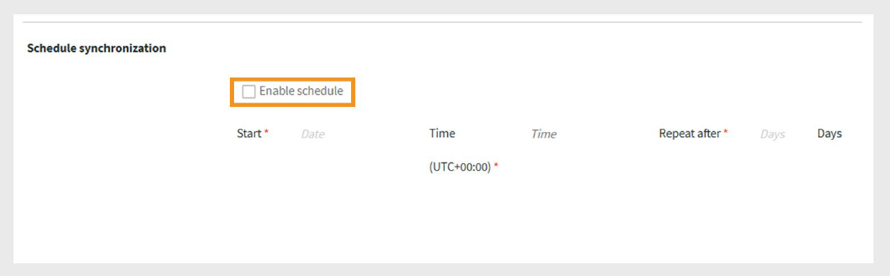

# Adobe Learning Manager 中的 Harvard ManageMentor 連接器

## 簡介

**Harvard ManageMentor 連接器**&#x200B;是為使用 Harvard ManageMentor 的企業客戶設計的。它讓學習者能直接從 Adobe Learning Manager 發現並存取 Harvard ManageMentor 課程。 一旦連接，系統可以定期擷取學習者的進度資料，並根據匯入的元資料在 Adobe Learning Manager 中建立課程。

本文說明如何在 Adobe Learning Manager 中設定及使用 Harvard ManageMentor 連接器。

透過此整合，整合管理員可以將公司的 Harvard ManageMentor 帳號連結至 Adobe Learning Manager，自動匯入課程並追蹤學習進度，無需從零開始建立新的培訓內容。

## 前置條件

在設定連接器前，請確保&#x200B;****&#x200B;您的帳戶已啟用遷移功能。

## 設定連接器

使用 Harvard ManageMentor 連接器，將 Harvard ManageMentor 的課程帶入 Adobe Learning Manager。 連結帳號後，你可以匯入課程細節並追蹤學習者的進度。

要設定連接器：

1. 以整合管理員身份登入。
2. 在首頁選擇 **Harvard ManageMentor** 。
3. 請從連接圖塊上的以下選項中選擇：
   - **入門**
   - **連結**
   - **管理連線**

   
   _Harvard ManageMentor 磁貼顯示三種設定選項_

## 建立新的連結

建立新的連結：

1. 在哈佛管理導師圖塊中選擇&#x200B;**「連接****」。**

   
   _選擇 Connect 以建立新的 Harvard ManageMentor 連線_

2. 在 **「連線名稱** 」欄位輸入該連線。
3. 選擇 **連接** 以建立連線。

   
   _在連線名稱欄位輸入名稱_

## 管理連線

設定好 Harvard ManageMentor 連接器後，你可以在 Adobe Learning Manager 中管理你的連線。 你可以手動或排程更改同步設定並執行同步。

### 啟用連線

啟用連線：

1. 在哈佛 ManageMentor 圖塊上選擇&#x200B;**「管理連結****」。**

   
   _管理連線以設定和排程資料匯入_

2. 選擇連線。
3. 從左側導覽窗格選擇 **「配置** 」。
4. 選擇 **啟用連線** ，然後選擇 **儲存**。

   
   _啟用 Harvard ManageMentor 連接器來匯入資料_

### 排程同步

要排程同步：

1. 在哈佛 ManageMentor 圖塊上選擇&#x200B;**「管理連結****」。**
2. 選擇連線。
3. 從左側導覽窗格選擇 **「配置** 」。
4. 在排程同步區塊中選擇&#x200B;**啟用排程****。**

   
   _排程將資料匯入 Harvard ManageMentor 至 Adobe Learning Manager_

5. 請選擇UTC的開始日期和時間。
6. 輸入同步應該重複的天數。
7. 選擇 **儲存**。

同步設定已經被保存下來。 連接器會依照排程執行，並將資料從 Harvard ManageMentor 匯入 Adobe Learning Manager。

## 按需同步執行

**按需同步**&#x200B;選項允許你手動將 Harvard ManageMentor 的資料匯入 Adobe Learning Manager。當你想立即更新學習者的活動資料，而不必等待下一次排程同步時，這非常有用。

要執行隨選資料匯入：

1. 在哈佛 ManageMentor 圖塊上選擇&#x200B;**「管理連結****」。**
2. 選擇連線。
3. 從左側窗格選擇 **「隨選執行** 」。
4. 選擇 **開始日期**。

   
   _執行按需請求，立即從 Harvard ManageMentor 匯入資料到 Adobe Learning Manager_

5. 請選擇以下選項之一：

   - **執行**&#x200B;時關閉 Adobe Learning Manager 存取權：若同步可能導致停機，建議使用。
   - **在執行**&#x200B;時啟用 Adobe Learning Manager 存取：建議以避免服務中斷。
6. 選擇 **執行** 以匯入從開始日期到現在的所有資料。

### 查看執行歷史

執行狀態頁面會依序列出所有同步執行。 若執行有錯誤，則會顯示警告圖示。 如果需要，你可以查看錯誤日誌，修正 CSV 檔案，並重新執行最新的同步。

查看執行歷史：

1. 在左側窗格選擇 **執行狀態** 。
2. 你可以看到以下欄位：
   - **跑**
   - **開始日期**
   - **持續時間**
   - **類型** （排程或隨選）
   - **狀態** （進行中或完成）

   
   _查看按需及排程匯入的執行狀態_

>[!NOTE]
>
>如果你刪除並重新建立連線，之前執行的歷史仍會顯示。 你只能重新執行最新的同步。

### Requirememt 進行同步

請確保以下檔案存在於 Harvard ManageMentor FTP 資料夾中：

- **hmm12_metadata.csv** 此檔案包含課程元資料。 請遵循正確的檔案命名格式。
- **client_hmm12_yyyyMMdd.csv** 此檔案為使用者動態。 日期格式應該符合 yyyyMMdd。

**範例檔案**

- [哈佛 ManageMentor 連接器的課程元資料檔案](https://experienceleague.adobe.com/docs/learning-manager/assets/hmm12-metadata.csv?lang=en)
- [哈佛 ManageMentor 連接器的使用者資料檔案](https://experienceleague.adobe.com/docs/learning-manager/assets/client-hmm12-20170304.csv?lang=en)
