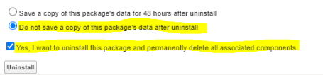

# 安裝 Salesforce 套件

## 概觀

Learning Manager 提供 Salesforce 應用程式套件。 安裝並設定後，銷售人員可在SFDC入口網站內執行訓練活動。 此應用程式讓 SFDC 用戶能探索新培訓、查看推薦，並直接在 SFDC 入口網站內即時閱讀。 用戶也能直接在 SFDC 入口網站內，收到管理員以報頭形式發送的公告。

### 在 Learning Manager 應用程式中設定

1. 以整合管理員身份登入你的學習管理員管理員帳號。
1. 點擊 **[!UICONTROL Applications]** > **[!UICONTROL Featured Apps]**。
1. 點擊 **[!UICONTROL Salesforce]**。
1. 在 Salesforce 應用程式頁面，請注意應用程式 ID（也稱為客戶端 ID）以及描述中提到的客戶端秘密。
1. 點擊 **[!UICONTROL Approve]** 後，你的應用程式必須成功通過審核。
1. 點擊 **[!UICONTROL Developer Resources]** > **[!UICONTROL Access Tokens for Testing and Development]**。
1. 在取得 OAuth Code 區塊中，客戶端 ID 和範圍必須設為 - admin，admin:read:write。點擊 **[!UICONTROL Submit]**。
1. 在「取得刷新令牌」中，輸入客戶端 ID 和客戶端秘密。 點擊 **[!UICONTROL Submit]** 並記錄刷新標記。

### 在 Salesforce 應用程式中建立帳號

1. 在 Salesforce 註冊頁面建立帳號。 你必須在開發者版或企業版中建立 Salesforce 帳號。  [開發者註冊網址](https://developer.salesforce.com/signup)。 請確保你必須使用你在 Learning Manager 上使用的電子郵件 ID 來註冊 Salesforce。
1. 請透過驗證電子郵件驗證你的帳號。
1. 建立密碼並登入 Salesforce。
1. 登入後注意 Salesforce 網址（例如，site.lightning.force.com）

### 安裝學習管理器套件

如果你想安裝這個套件，必須先在 Salesforce 中刪除現有的套件。 在卸載前，你必須啟用以下設定。 套用這些設定是必須的，否則你將無法安裝該套件。

*安裝學習管理器套件*

>[!NOTE]
>
>Adobe Learning Manager 應用程式僅支援 Salesforce Lightning 檢視。

1. 啟動  [Learning Manager 套件的網址](https://login.salesforce.com/packaging/installPackage.apexp?p0=04tDb000000FvU2)。
1. 在 **登入** 頁面，點擊 **[!UICONTROL Use Custom Domain]**。
1. 輸入套件網址並點擊 **[!UICONTROL Continue]**。 安裝頁面必須選擇「僅限管理員安裝」。 不要更改這個選項。
1. 點擊 **[!UICONTROL Install]**。 套件安裝完成後，點擊 **[!UICONTROL Done]**。 你會被導向已安裝套件頁面，並可以看到 Adobe Learning Manager 已安裝的套件。

1. 到應用程式啟動器（設定旁邊）搜尋 Adobe Learning Manager。
1. 要設定應用程式，請點擊 **[!UICONTROL Configure]**。
1. 點擊 **[!UICONTROL New]** 並補充以下細節：

   * **設定：** 輸入你選擇的名稱。
   * **ClientID**：輸入你從第一個區段取得的數值。
   * **ClientSecret：** 輸入你從第一部分取得的數值。
   * **RefreshToken：** 輸入你從第一節獲得的數值。
   * **LearningManagerBaseURL：** Learning Manager 所託管網站的網址。
   * **停用重定向：** 在學習管理員中停用導引至學習者首頁。

>[!NOTE]
>
>你只能建立單一設定。 如果你嘗試新增其他設定，會看到錯誤訊息。 設定會將 Salesforce 帳號與學習者帳號對應。

### 新增遠端站點設定

1. 在頁面右上角，點擊 **[!UICONTROL Setup]**。
1. 在 **快速搜尋**&#x200B;中搜尋遠端站點設定。
1. 點擊 **[!UICONTROL New Remote Site]**。
1. 請輸入細節：

   1. **遠端站點名稱：** 輸入你選擇的名稱。
   1. **遠端站點網址：** Learning Manager 所載站點的網址。

1. 啟動學習管理器。

### 將 Adobe 網域加入 Salesforce 受信任的網址

要將 Adobe 網域加入受信任的 URL，請遵循以下步驟：

1. 在 Salesforce 控制台，前往 **[!UICONTROL Setup]** > **[!UICONTROL Quick Find]**。
1. 搜尋 **[!UICONTROL Trusted URLs]** 並選擇 **[!UICONTROL New Trusted URL]**。
1. 在欄位 **[!UICONTROL API Name]** 輸入一個名字。
1. `*.adobe.com`輸入網址欄位。
1. 在 CSP 指令&#x200B;**中勾選所有勾選**&#x200B;框並儲存變更。
1. 編輯 Salesforce 應用程式的刷新令牌並儲存。
1. 重新啟動 Salesforce 應用程式。

### 啟用學習管理軟體的通知

1. 在右上角，點選 **設定**。
1. 搜尋自訂通知。
1. 點擊 **[!UICONTROL New]**。
1. 請輸入以下細節：

   1. **自訂通知名稱：** LearningManagerNotification
   1. **API 名稱：** LearningManagerNotification

1. 選擇&#x200B;**桌面版和**&#x200B;行動版&#x200B;**頻道**&#x200B;為支援頻道。

1. 點擊 **[!UICONTROL Save]**。
1. 要啟用行動裝置推播通知，請遵循以下步驟：

   1. 在手機安裝 Salesforce 行動應用程式。
   1. 用你的帳號登入應用程式。
   1. 請進入 **「設定** > **通知傳遞設定**」。
   1. 新增 iOS 和 Android 版的 Salesforce 吧。

### 從 Salesforce 卸載 Learning Manager

1. 在 Salesforce 應用程式中，點到已安裝套件。
1. 點擊 **[!UICONTROL Uninstall]**。

## 為 Salesforce 使用者設定學習管理員

學習管理器應用程式也開放給任何 Salesforce 帳號中的使用者使用。 Salesforce 管理員可以根據設定檔新增使用者。 Salesforce 的設定檔和 Learning Manager 裡的設定類似。 例如管理員、整合管理員、講師等等。 Salesforce 管理員也可以建立自訂的個人檔案。

### 簡介

作為 Salesforce 管理員，你可以將設定檔指派給使用者，或建立自訂設定檔。

>[!NOTE]
>
>使用者必須同時存在於 Salesforce 和 Learning Manager。

*為學習者指派一個設定檔*

新增學習者時，必須為學習者指派特定的設定檔。 然後進入該個人檔案並授予所需的存取權限。

學習者要查看學習管理員應用程式，必須啟用該應用程式給所有學習者使用。

下一步是提供存取學習管理員應用程式的權限。

*新增存取學習管理器應用程式的權限*

安裝套件後，會建立一個新的權限集，稱為 **Adobe Learning Manager 使用者**。 進入權限集，然後新增使用者。

選擇使用者並相應分配權限。 學習者現在可以使用學習管理員應用程式。

現在，選擇一個設定檔，例如「使用者的標準設定檔」，然後點擊該設定檔。 點選&#x200B;**[!UICONTROL Edit]**&#x200B;並在&#x200B;**自訂應用程式設定**&#x200B;區塊啟用 Adobe Learning Manager **的勾選框**。這讓應用程式對使用者來說更容易使用。

在 **自訂分頁設定** 區塊的 **學習者首頁** 下拉選單中，選擇 **[!UICONTROL Default On]**&#x200B;選項。

你必須讓應用程式對所有個人檔案都顯示。

點擊 **[!UICONTROL Save]** 後，所有個人檔案的學習者即可存取學習管理員應用程式。
