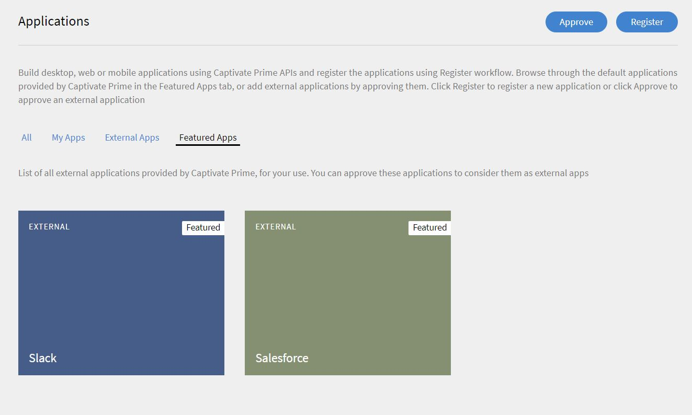
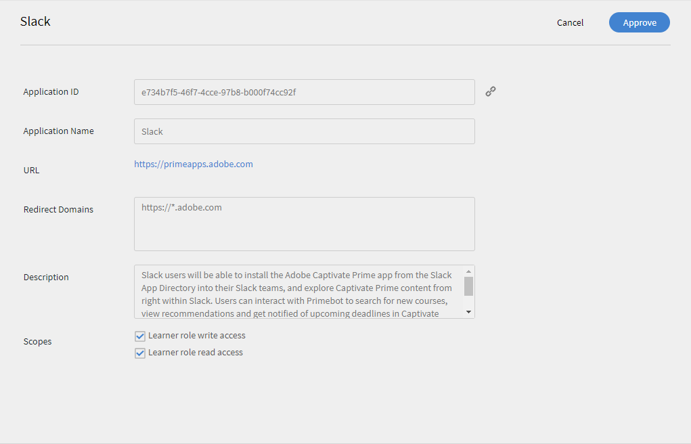

# Learning Manager與Slack整合

我們有 **已移除** **Slack** 作為Learning Manager中的聯結器。 您將無法再存取Slack聯結器。

身為Slack使用者，您可以從Adobe應用程式目錄將SlackLearning Manager應用程式安裝到Slack團隊中，並直接在Slack中探索Learning Manager內容。 您可以與Primebot互動以搜尋新課程、檢視建議，並在Learning Manager中收到近期截止日期的通知。 您也可以在Slack中註冊並直接開始學習。

Learning Manager的Azure執行個體不支援適用於Slack的Learning Manager應用程式。

## 安裝Adobe Learning Manager應用程式 {#installingadobecaptivateprimeapp}

學習者可以在Slack帳戶中安裝CP Prime應用程式。 若要安裝應用程式，請在Slack帳戶中開啟應用程式目錄並搜尋Learning Manager。 下載並安裝應用程式。 如果您的帳戶未核准應用程式，請聯絡整合管理員以取得核准。 如果已經核准，您將能夠登入。

## 核准學習者以整合管理員身分登入 {#approvinglearnersigninasanintegrationadmin}

身為整合管理員，若要核准學習者在Slack上使用Prime應用程式的許可權，請按照下列步驟操作。

1. 選取 **[!UICONTROL Applications]** 然後按一下 **[!UICONTROL Featured apps]** 標籤。

   

1. 按一下 **[!UICONTROL Slack]** 圖磚> Slack整合頁面隨即開啟。 按一下 **[!UICONTROL Approve]** 右上角的「 」以核准應用程式。

   

1. 返回 **[!UICONTROL Applications]** 頁面。 在核准後，Slack應該會出現在 **[!UICONTROL External Apps]** 標籤。
1. 學習者現在可以使用Slack登入其Prime帳戶。

## Primebot功能 {#primebotfunctionalities}

您現在可以開始與Primebot互動。 以下是機器人的功能。

1 — 命令

&#42;/prime&#42; 可用於有關您AdobeLearning Manager帳戶的一次性指定查詢。

可用的子命令有：

/prime尋找 `<query>`  — 搜尋課程、認證等。

/prime建議 — 顯示建議

/prime截止日期 — 顯示逾期和即將到來的截止日期

/prime註冊 — 顯示註冊

/prime技能 — 顯示技能

/prime通知 — 顯示通知

/prime目錄 — 顯示目錄

/prime邀請 —  [僅限管理員] 邀請目前團隊中的Slack使用者試用primebot

/prime設定檔 — 顯示設定檔

/prime登出 — 從此Slack團隊的Prime帳戶登出

/prime說明 — 顯示說明訊息

2 — 建議

您可以嘗試使用類似這樣的片語 `show my recommendations` 若要從AdobeLearning Manager帳戶取得建議課程、認證和學習計畫的個人化清單。

3 — 搜尋

您可以嘗試類似這樣的片語 `search for machine learning` 或 `search for artificial intelligence`. 您可以使用如下的短語來指定學習物件的型別 `search for machine learning certifications`， `search for artificial intelligence courses` 或 `search for adobe photoshop job aids`. 您也可以使用如下的片語在目錄中搜尋 `search for machine learning in Lynda catalog`.

4 — 截止日期

使用類似這樣的片語 `show my deadlines` 以從您的AdobeLearning Manager帳戶取得逾期和近期截止日期清單。 您可以使用如下的短語過濾掉逾期或即將到來的截止日期 `show my overdue deadlines` 或 `show my upcoming deadlines`.
