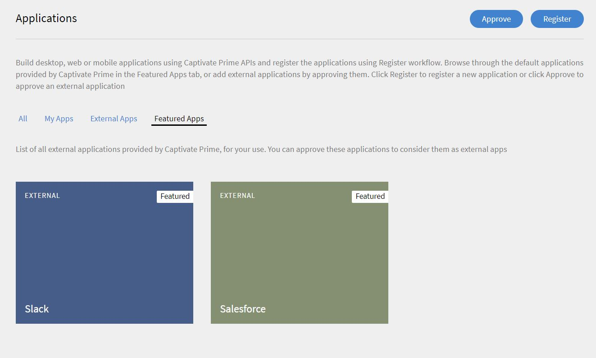
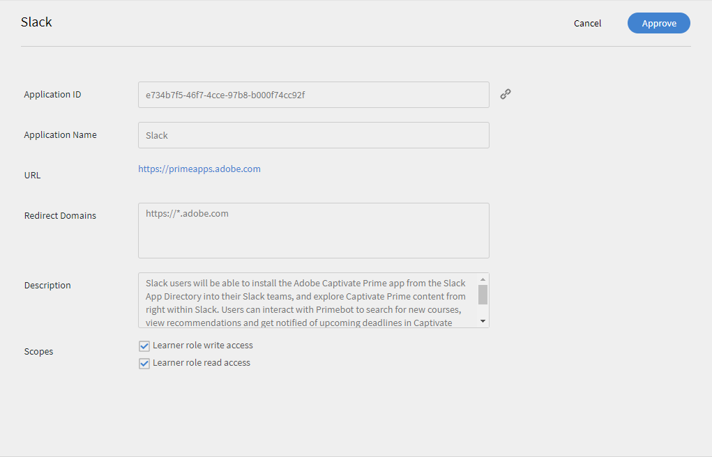

# Learning Manager 與 Slack 的整合

我們已經&#x200B;**移除****了 Slack** 作為 Learning Manager 連接器的功能。你將無法再使用 Slack 連接器。

作為 Slack 使用者，你可以將 Adobe Learning Manager 應用程式從 Slack 應用程式目錄安裝到你的 Slack 團隊中，並直接在 Slack 內探索學習管理員的內容。 你可以與 Primebot 互動，搜尋新課程、查看推薦，並在學習管理員中接收即將到來的截止日期通知。 你也可以直接註冊，直接從 Slack 裡面開始學習。

Slack 的 Learning Manager 應用程式在 Azure 的 Learning Manager 實例中不被支援。

## 安裝 Adobe Learning Manager 應用程式 {#installingadobecaptivateprimeapp}

作為學習者，你可以在你的 Slack 帳號中安裝 CP Prime 應用程式。 要安裝應用程式，請在你的 Slack 帳號中打開應用程式目錄並搜尋學習管理員。 下載並安裝應用程式。 如果你的帳號沒有批准該應用程式，請聯絡你的整合管理員申請批准。 如果已經核准，你就可以登入了。

## 核准學習者以整合管理員身份登入 {#approvinglearnersigninasanintegrationadmin}

作為整合管理員，要核准學習者使用 Slack 上的 Prime 應用程式權限，請遵循以下步驟。

1. 從左側窗格選取 **[!UICONTROL Applications]** 並點擊分 **[!UICONTROL Featured apps]** 頁。

   

1. 點擊 **[!UICONTROL Slack]** 磁貼> Slack 整合頁面就會開啟。 點擊 **[!UICONTROL Approve]** 右上角以核准申請。

   

1. 回到頁面 **[!UICONTROL Applications]** 。 一旦核准，Slack 應該會出現在分 **[!UICONTROL External Apps]** 頁中。
1. 學習者現在可以使用 Slack 登入他們的 Prime 帳號。

## Primebot 功能 {#primebotfunctionalities}

你現在可以開始與 Primebot 互動了。 以下是機器人的功能介紹。

1 - 指揮

&#42;/prime&#42; 可用於針對您的 Adobe Learning Manager 帳號進行一次性且針對性的查詢。

可用的子指令有：

/Prime 搜尋 `<query>` - 搜尋課程、證照等。

/Prime 推薦 - 節目推薦

/Prime Deadlines - 顯示逾期及即將到來的截止日期

/Prime 註冊 - 顯示註冊人數

/Prime 技能 - 展示技能

/prime 通知 - 顯示通知

/Prime 目錄 - 展覽目錄

/prime 邀請 - [管理員僅] 邀請現有團隊中的 Slack 用戶試用 primebot

/Prime 個人檔案- 顯示個人檔案

/prime 登出 - 在這個 Slack 團隊中登出你的 Prime 帳號

/prime help - 顯示說明訊息

2 - 推薦

你可以嘗試用類似的詞 `show my recommendations` 語，從你的 Adobe Learning Manager 帳號獲得一份個人化的推薦課程、證照和學習計畫清單。

3 - 搜尋

你可以試試像 `search for machine learning` 是 或 `search for artificial intelligence`。 你可以用像 `search for machine learning certifications`、 `search for artificial intelligence courses` 或 `search for adobe photoshop job aids`這樣的短語來指定學習對象的類型。 你也可以用像 `search for machine learning in Lynda catalog`. 這樣的詞組在目錄中搜尋。

4 - 截止期限

使用 phrase like `show my deadlines` 從你的 Adobe Learning Manager 帳號取得逾期和即將截止的截止日期清單。 你可以用像 `show my overdue deadlines` 或 `show my upcoming deadlines`這樣的詞語過濾逾期或即將到來的截止日期。
