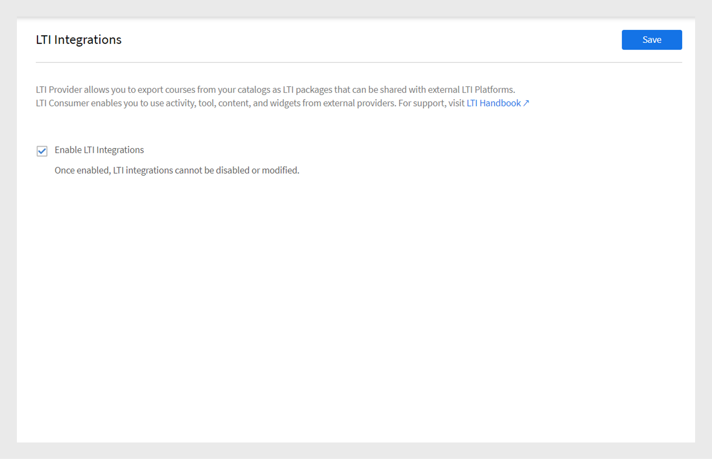
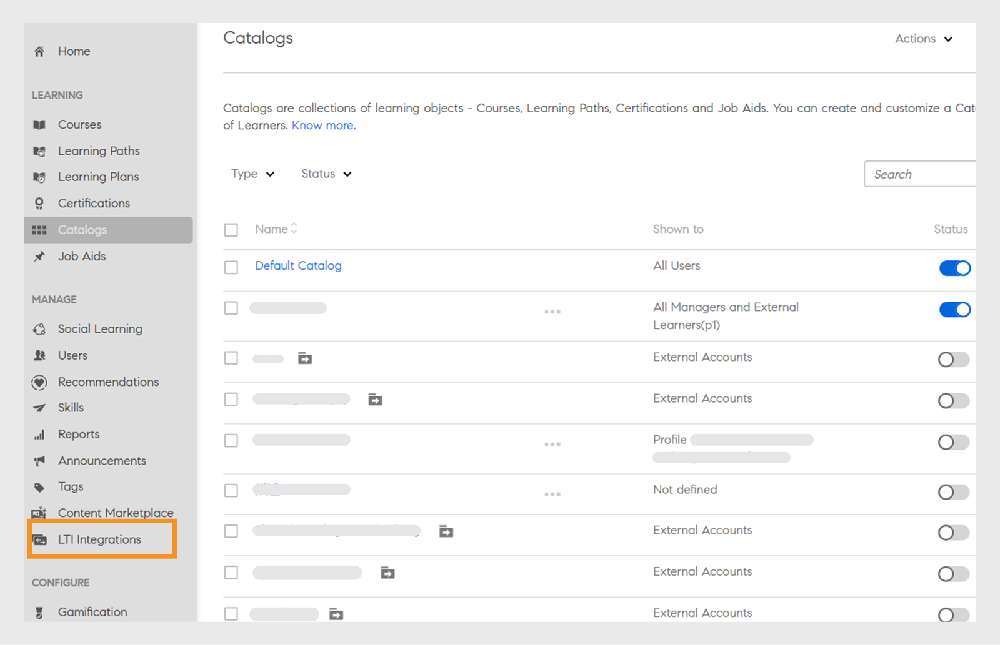
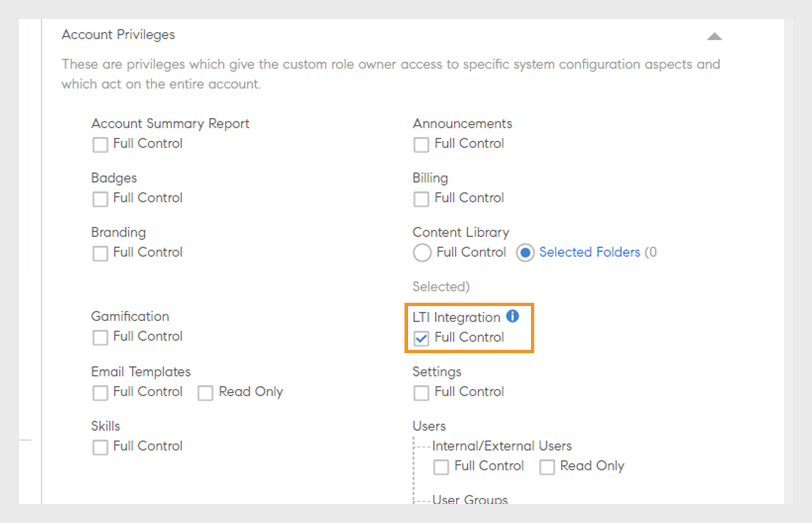
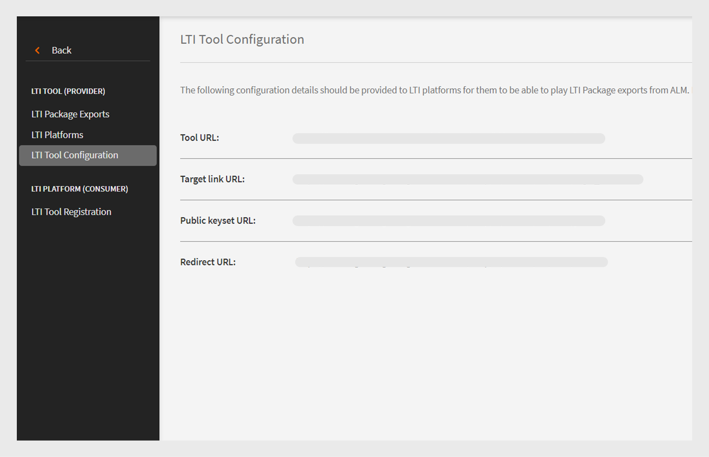
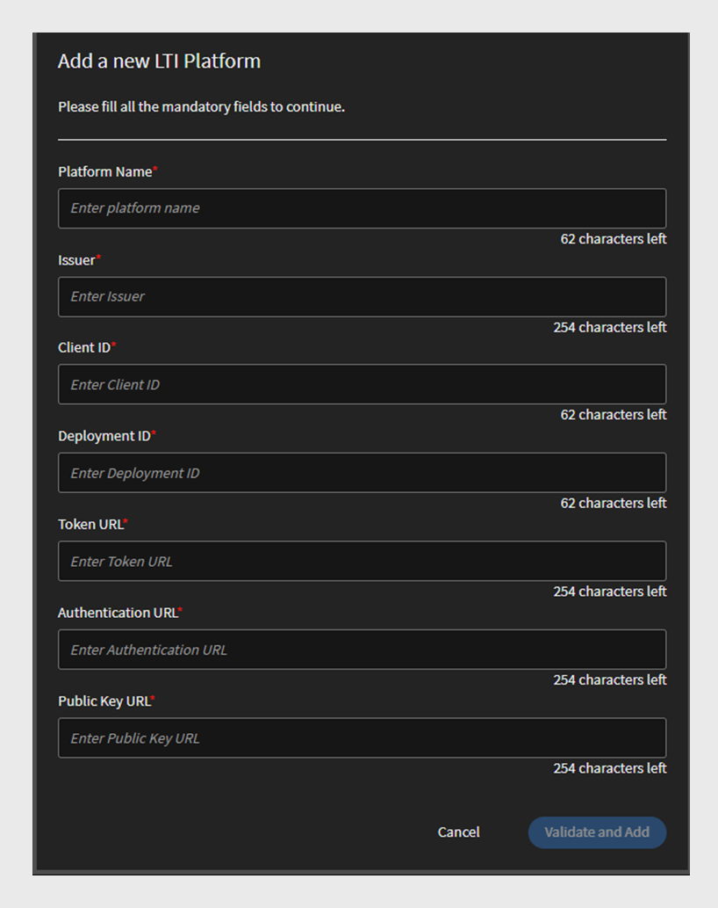
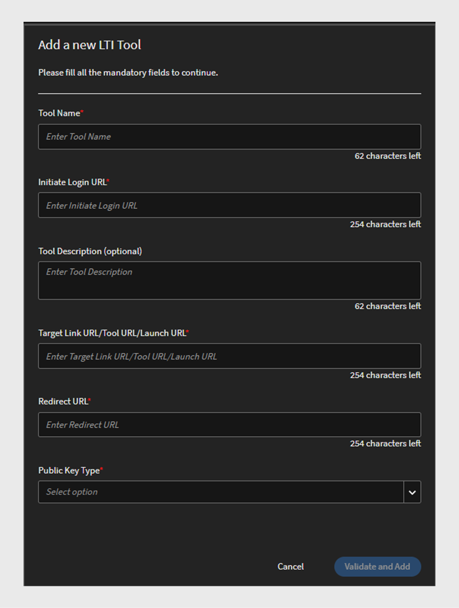
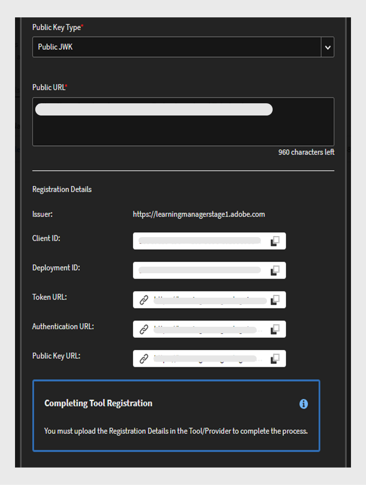
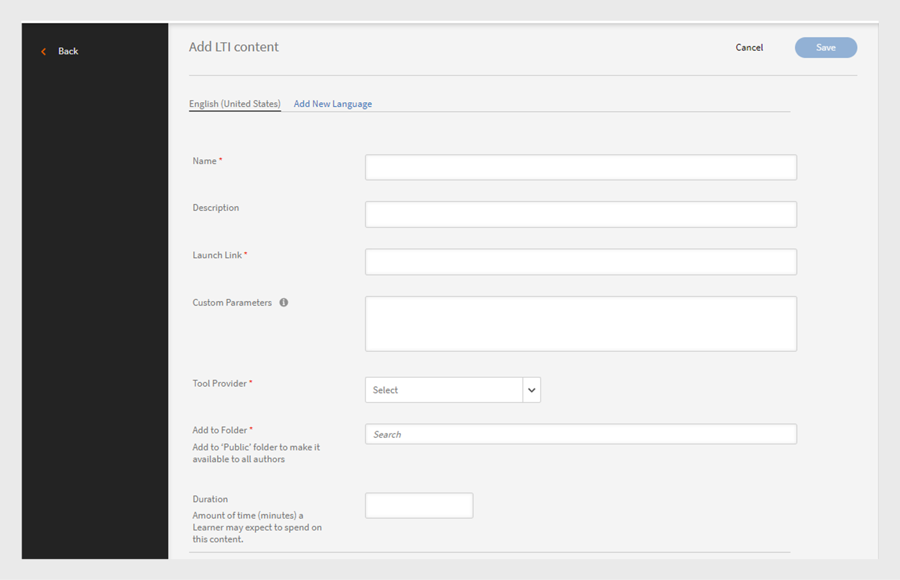
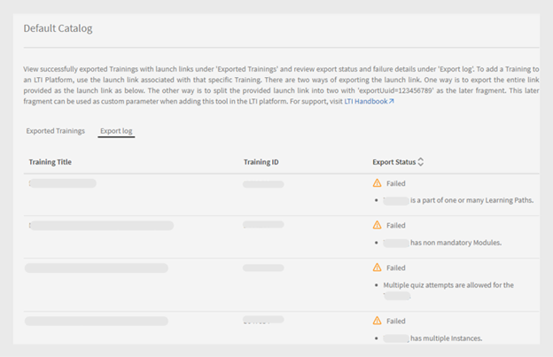
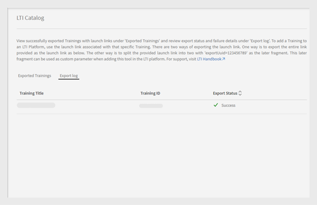

# LTI整合

## 什麼是LTI？

學習工具互通性(LTI)是整合教育環境中豐富學習應用程式的IMS標準。 使用者可以直接在其LMS內從外部內容提供者存取外部學習內容，而無需登入或導覽至不同的LMS。

## LTI與Adobe Learning Manager整合

Adobe Learning Manager現在支援LTI 1.3版，可讓其同時作為工具提供者和工具消費者。 此功能增強了Adobe Learning Manager與其他學習管理系統(LMS)之間的互通性。

**LTI做為工具提供者**： LTI做為工具提供者，可讓外部系統與LMS整合。 Adobe Learning Manager充當LTI工具提供者，可讓其他LMS平台直接在其LMS內從Adobe Learning Manager存取學習物件。

**LTI作為工具消費者**： LTI作為工具消費者，可讓LMS透過學習工具互通性(LTI)整合外部工具。 在此案例中，LMS是外部工具所提供服務的消費者。 Adobe Learning Manager充當LTI工具取用者，可將其整合協力廠商學習工具，讓Adobe Learning Manager學習者得以使用Adobe Learning Manager中協力廠商工具的學習物件。

## 在ALM中設定LTI聯結器

請依照下列步驟，在Adobe Learning Manager中啟用LTI整合：

1. 以&#x200B;**[!UICONTROL Integration Admin]**&#x200B;登入。
2. 在首頁上，選取&#x200B;**[!UICONTROL Applications]** > **[!UICONTROL Featured Apps]**。
3. 在&#x200B;**[!UICONTROL Applications]**&#x200B;頁面上選取&#x200B;**[!UICONTROL LTI Integrations]**。
4. 選取&#x200B;**[!UICONTROL Enable LTI Integrations]**&#x200B;選項並選取&#x200B;**[!UICONTROL Save]**。

_啟用LTI整合_

>[!NOTE]
>
>LTI整合選項一旦啟用即無法修改或停用。

這會在管理員帳戶中建立新的LTI整合側邊欄。

_LTI側欄_

已在&#x200B;**[!UICONTROL Custom Role]**&#x200B;區段的&#x200B;**[!UICONTROL Account privileges]**&#x200B;下新增新的自訂角色&#x200B;**[!UICONTROL LTI Integration]**。 管理員可以將此角色指派給使用者，讓他們存取&#x200B;**[!UICONTROL LTI Integration]**&#x200B;區段。 管理員也需要授予&#x200B;**[!UICONTROL Catalogs]**&#x200B;許可權給這些使用者，才能匯出課程。 此設定可讓您完整存取LTI與Catalogs區段以匯出課程。

_LTI整合自訂角色_

## Adobe Learning Manager作為LTI工具提供者

Adobe Learning Manager身為LTI提供者，可讓您從目錄將課程匯出為可與外部LMS平台共用的LTI套件。

### 建立並與外部LMS共用LTI憑證 — 管理工作流程

請依照下列步驟，與外部LMS共用LTI認證：

1. 以&#x200B;**[!UICONTROL Admin]**&#x200B;登入。
2. 在首頁上，選取&#x200B;**[!UICONTROL LTI Integration]** > **[!UICONTROL LTI Tool Configuration]**。 您可以在此頁面檢視組態證明資料。
3. 管理員可以與外部LMS共用這些認證，以進行LTI網站註冊。

   
   _LTI工具組態認證_

   * **[!UICONTROL Token URL]**： LMS要求存取權杖以驗證及授權與LTI工具通訊的URL。
   * **[!UICONTROL Target Link URL]**：從LMS啟動LTI工具時，使用者會重新導向的目的地URL。
   * **[!UICONTROL Public Keyset URL]**：提供用來驗證安全性權杖以進行安全通訊之公開金鑰的URL。
   * **[!UICONTROL Redirect URL]**：在LTI工具上完成動作後傳送使用者的URL，通常會將其重新導向回LMS。

### 外部LMS設定

外部LMS管理員會使用Adobe Learning Manager管理員共用的憑證來註冊Adobe Learning Manager並產生憑證。 這些憑證將會新增到Adobe Learning Manager，作為將Adobe Learning Manager設定為工具提供者的最後步驟。 以下是外部LMS產生的認證：

* **[!UICONTROL Issuer or Platform ID]**：傳送LTI啟動請求給工具提供者的LMS或平台的唯一識別碼。
* **[!UICONTROL Client ID]**： LMS為授權目的而指派給LTI工具的唯一識別碼。
* **[!UICONTROL Deployment ID]**：將特定LTI工具部署連結至LMS，以管理多個執行個體的識別碼。
* **[!UICONTROL Token URL]**： LMS要求存取權杖以驗證和授權與LTI工具互動的端點。
* **[!UICONTROL Authentication URL]**： LMS傳送使用者以驗證及起始LTI連線的URL。
* **[!UICONTROL Public Key URL]**： LTI工具用來驗證安全性權杖並確保安全通訊之公開金鑰的網址。

### 將Adobe Learning Manager新增為工具提供者 — 管理工作流程

請依照下列步驟，將Adobe Learning Manager新增為工具提供者：

1. 以&#x200B;**[!UICONTROL Admin]**&#x200B;登入。
2. 在首頁上，選取&#x200B;**[!UICONTROL LTI Integrations]** > **[!UICONTROL LTI Platforms]**。
3. 選取&#x200B;**[!UICONTROL Add]**&#x200B;並輸入外部LMS共用的認證。

   
   _新增LTI平台_

4. 新增所有這些值之後，請選取&#x200B;**[!UICONTROL Validate]**&#x200B;和&#x200B;**[!UICONTROL Add]**。

### 匯出LTI套件 — 管理工作流程

LTI工具可讓您從「目錄」匯出訓練內容，作為可下載的學習內容套件，並與外部學習管理系統(LMS)或使用學習工具互通性(LTI)標準的平台共用。

請依照下列步驟，從Adobe Learning Manager匯出課程：

1. 以&#x200B;**[!UICONTROL Admin]**&#x200B;登入。
2. 在首頁上，選取&#x200B;**[!UICONTROL LTI Integrations]** > **[!UICONTROL LTI Package Exports]**。
3. 選取&#x200B;**[!UICONTROL New package export]**。

   
   _匯出LTI封裝_

4. 從清單中選取所需的目錄。 您可以檢視目錄中的可用課程清單。
5. 選取所需課程並選取&#x200B;**[!UICONTROL Export as LTI]**。
6. 選取課程以檢視啟動連結。
7. 選取&#x200B;**[!UICONTROL Download Link]**&#x200B;圖示以下載封裝。 此套件是包含成功匯出的IMSCC檔案的zip檔案。

使用此Launch連結或IMSCC檔案，您可以將Adobe Learning Manager課程匯出至外部LMS。 學習者可以從學習管理系統使用Adobe Learning Manager課程。

>[!NOTE]
>
>如果管理員在建立啟動連結後編輯課程或更新模組，連結會自動更新。 但是，如果管理員在啟動連結建立後處分課程，則處分的課程將無法在LTI消費者中啟動。

## Adobe Learning Manager作為LTI消費者 — 管理工作流程

Adobe Learning Manager身為LTI消費者，可讓您使用外部LTI提供者的活動、工具、內容和Widget。
若要將Adobe Learning Manager新增為LTI消費者，您需要以下來自外部LTI提供者的憑證：

* 起始登入URL
* 目標連結網址
* 重新導向URL
* 公開金鑰型別

請依照下列步驟，將Adobe Learning Manager新增為LTI消費者：

1. 以&#x200B;**[!UICONTROL Admin]**&#x200B;登入。
2. 在首頁上，選取&#x200B;**[!UICONTROL LTI Integrations]** > **[!UICONTROL LTI Tool Registration]**。
3. 選取&#x200B;**[!UICONTROL Add]** > **[!UICONTROL New LTI Tool]**。

   >[!NOTE]
   >
   >您可以上傳.csv檔案來匯入多個LTI工具。

4. 從LTI提供者輸入上述認證。

   
   _新增LTI工具_

5. 完成後，請選取&#x200B;**[!UICONTROL Validate]**&#x200B;和&#x200B;**[!UICONTROL Add]**。
6. 您可以看到下列畫面：

   
   _註冊認證_

7. 與LTI提供者共用這些認證以進行註冊。 註冊完成後，您可以從LTI提供者取得Launch連結或IMSCC檔案，以匯入課程。

### 建立LTI內容 — 作者工作流程

LTI提供者會提供Launch連結或IMSCC檔案，讓您新增課程至Adobe Learning Manager。 請依照下列步驟從外部LMS新增課程：

1. 以&#x200B;**[!UICONTROL Author]**&#x200B;登入。
2. 選取&#x200B;**[!UICONTROL Content Library]** > **[!UICONTROL Add]** > **[!UICONTROL LTI Module]**。

   
   _新增LTI內容 — 作者_

3. 輸入&#x200B;**[!UICONTROL Name]**&#x200B;和&#x200B;**[!UICONTROL Description]**。
4. 從LTI提供者輸入&#x200B;**[!UICONTROL Launch Link]**&#x200B;和&#x200B;**[!UICONTROL Custom Parameters]**。
5. 從&#x200B;**[!UICONTROL Tool Provider]**&#x200B;下拉式功能表中選取您的[!UICONTROL LTI provider]。
6. 搜尋並選取&#x200B;**[!UICONTROL Add to Folder]**&#x200B;選項中的&#x200B;**[!UICONTROL Public]**。 如此一來，所有作者都能順利完成這些課程。
7. 選取&#x200B;**[!UICONTROL Save]**。
內容建立後，您就可以在建立課程時新增此內容。

### 使用LTI內容建立課程 — 作者工作流程

請依照下列步驟，建立包含LTI內容的課程：

1. 以&#x200B;**[!UICONTROL Author]**&#x200B;登入。
2. 在首頁上，選取&#x200B;**[!UICONTROL Courses]** > **[!UICONTROL Add]**。
3. 輸入課程的&#x200B;**[!UICONTROL Name]**&#x200B;和&#x200B;**[!UICONTROL Description]**。
4. 在&#x200B;**[!UICONTROL Modules]**&#x200B;選項中，選取&#x200B;**[!UICONTROL Add Modules]** > **[!UICONTROL Self Paced Module]**。
5. 選取您建立的&#x200B;**[!UICONTROL LTI Content]**&#x200B;並選取&#x200B;**[!UICONTROL Save]**。
6. 輸入必要的詳細資料，例如&#x200B;**[!UICONTROL Skills]**、**[!UICONTROL Authors]**&#x200B;和&#x200B;**[!UICONTROL Enrollment type]**。
7. 完成後，發佈課程。 Adobe Learning Manager學習者可向外部LTI提供者參加LTI課程。

## LTI匯出失敗案例

下列型別的課程無法匯出為LTI課程：

* **含有活動模組的課程**：包含特定活動型模組的課程。
* **包含多種傳遞型別的課程**：包含多種傳遞型別的課程包括自學進度模組、虛擬或教室模組、活動模組以及混合式學習。
* **具有先決條件的課程**：需要預先完成的課程。
* **具有多個註冊的課程**：包含多個註冊的課程
* **具有多個執行個體的課程**：提供多個傳遞執行個體的課程。

| 預設例項 | 一或多個非預設執行個體 | 期望 | 錯誤訊息 |
|---|---|---|---|
| 作用中 | 無 | 匯出 | 無 |
| 作用中 | 作用中 | 不匯出 | 多個執行個體 |
| 作用中 | 已淘汰 | 不匯出 | 多個執行個體 |
| 作用中 | 已刪除 | 匯出 | 無 |
| 已淘汰 | 無 | 不匯出 | 淘汰Def例項 |
| 已淘汰 | 作用中 | 不匯出 | 淘汰Def執行個體、多個執行個體 |
| 已淘汰 | 已淘汰 | 不匯出 | 淘汰Def執行個體、多個執行個體 |
| 已淘汰 | 刪除 | 不匯出 | 淘汰Def例項 |

* **有多個問題答案的課程**：啟用MQA的課程。
* **已啟用執行個體切換的課程**：允許學習者在執行個體之間切換的課程。
* **付費課程**：需要付費才能註冊的課程。
* **課程部分學習路徑、認證或學習計畫**：課程部分學習路徑或計畫。
* **非自助註冊型態的課程**：學習者自助註冊受限制的課程。
* **教室或虛擬教室課程**：具有教室或虛擬教室工作階段的課程。
* **含有非必要模組的課程**：含有選擇性或非必要模組的課程。

_匯出狀態_

## LTI限制

以下是LTI消費者和LTI提供者的LTI限制：

* 能夠匯出影響學習者課程消費體驗的混合課程。
* 能夠匯出具有教室、虛擬教室或活動模組的自控進度課程，這會影響學習者的課程體驗。
* 能夠匯出LinkedIn學習和Go1課程之類的共用課程。
* 能夠在ALM中啟動過去註冊日期的課程，這會影響學習者的課程存取和體驗。
* 學習者無法在iOS ALM行動應用程式上使用LTI課程，這會影響課程使用體驗。
* 學習者無法離線下載及存取ALM行動應用程式中的LTI課程，因為這些課程是由協力廠商平台提供。
* 管理員只能檢視啟用的目錄，無法檢視停用的目錄。
* ALM對名稱（63個字元）和電子郵件（64個字元）長度有限制，使得超過這些限制的外部LTI學習者無法存取。
* 課程完成同步或等級同步延遲是由協力廠商LTI系統所造成。
* 透過Teams應用程式或瀏覽器使用LTI課程的Teams學習者不會出現課程同步訊息，影響學習者通知。
* 使用者資料報表無法匯出透過LTI註冊的使用者的資料。
* 當作者在工具取用者中新增啟動連結，需要手動選取時，無法自動辨識工具提供者名稱。
* 大量工具透過CSV上傳需要重音字元的UTF-8編碼，以避免匯入錯誤。
* LTI帳戶管理員無法分享包含LTI模組的課程、學習路徑或認證。
* 當使用者為完成的ALM課程重新開啟播放器時，無法重新同步成績，這會影響學習者的分數更新，並需要手動重新觸發程式。
* ALM僅允許使用中及試用版使用者使用LTI課程。
* 在Moodle中啟用的等級同步會導致ALM播放器無法啟動，進而影響學習者的課程存取和體驗。
* LTI作用中欄位是單一值，不支援多個值。
* 移轉沒有核心內容的課程期間，匯出失敗時，無法使用失敗原因。
* 外部LTI課程成績未出現在學習者成績單中，並且L2測驗頁面上看不到分數，這會影響學習者的績效追蹤。

## 最佳實務

建議使用支援LTI的課程建立目錄，以防止匯出失敗，並讓匯出課程更輕鬆。

顯示成功匯出狀態的LTI目錄
