# LTI 整合

## 什麼是長期性情（LTI）？

學習工具互通性（LTI）是一項用於整合豐富學習應用於教育環境中的 IMS 標準。 使用者可直接在其 LMS 內存取外部內容提供者的外部學習內容，無需登入或切換至其他 LMS。

## LTI 與 Adobe Learning Manager 的整合

Adobe Learning Manager 現已支援 LTI 1.3 版本，使其能同時擔任工具提供者與工具使用者的角色。 此功能增強了 Adobe Learning Manager 與其他學習管理系統（LMS）之間的互通性。

**LTI 作為工具提供者**：LTI 作為工具提供者，允許外部系統與學習管理系統（LMS）整合。 Adobe Learning Manager 作為 LTI 工具提供者，讓其他 LMS 平台能直接在其 LMS 中存取 Adobe Learning Manager 的學習物件。

**LTI 作為工具使用者**：LTI 作為工具消費者允許 LMS 透過學習工具互通性（LTI）整合外部工具。 在這種情況下，LMS 是外部工具所提供的服務的消費者。 Adobe Learning Manager 作為 LTI 工具使用者，能整合第三方學習工具，讓 Adobe Learning Manager 學習者能在 Adobe Learning Manager 內使用第三方工具的學習物件。

## 在 ALM 中設定 LTI 連接器

請依照以下步驟啟用 Adobe Learning Manager 中的 LTI 整合：

1. 以 . 登入。**[!UICONTROL Integration Admin]**
2. 在首頁選擇 **[!UICONTROL Applications]** > **[!UICONTROL Featured Apps]**。
3. 在頁面&#x200B;**[!UICONTROL Applications]**&#x200B;上選擇&#x200B;**[!UICONTROL LTI Integrations]**。
4. 選擇選項 **[!UICONTROL Enable LTI Integrations]** 並選擇 **[!UICONTROL Save]**。

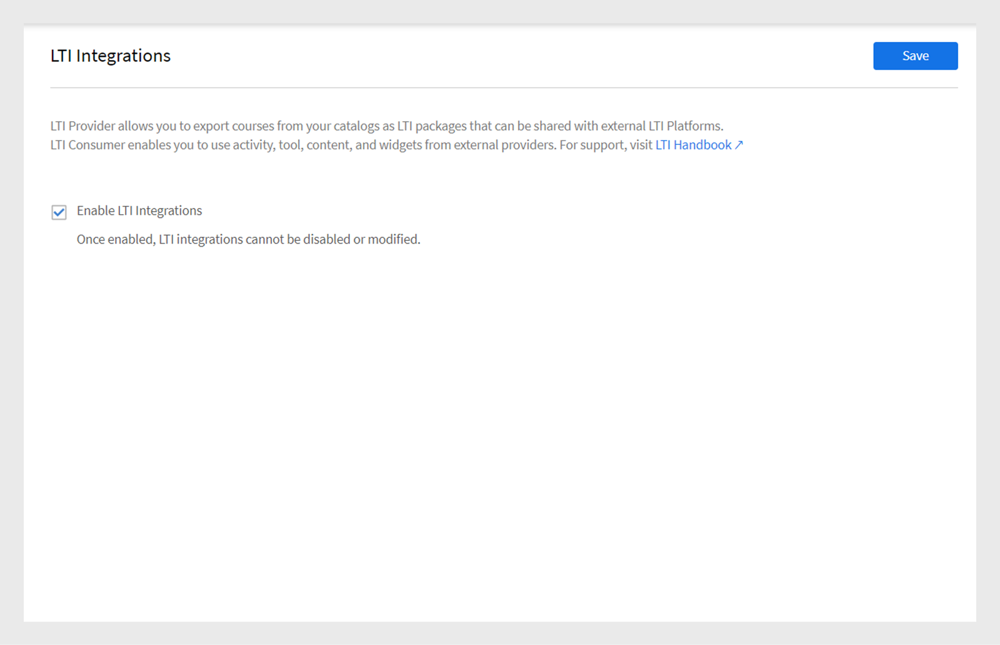
_啟用 LTI 整合_

>[!NOTE]
>
>啟用後，你無法修改或停用 LTI 整合選項。

這會在管理員帳號中建立新的 LTI 整合側邊欄。

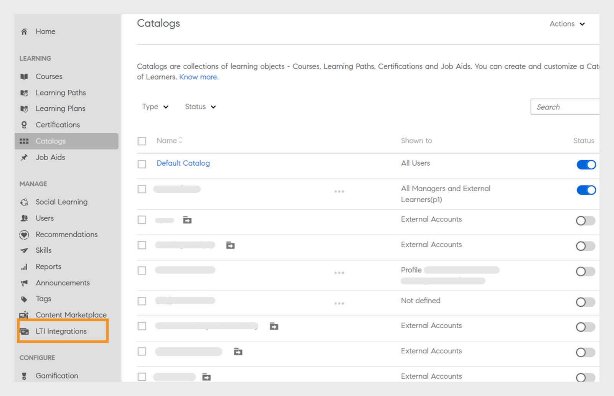
_LTI 側欄_

在該&#x200B;**[!UICONTROL Custom Role]**&#x200B;區塊下方&#x200B;**[!UICONTROL Account privileges]**&#x200B;新增了一個自訂&#x200B;**[!UICONTROL LTI Integration]**&#x200B;角色 。管理員可以將此角色指派給使用者，讓他們能存取該 **[!UICONTROL LTI Integration]** 區塊。 管理員也需要授權 **[!UICONTROL Catalogs]** 這些使用者匯出課程。 此配置提供完整存取LTI與目錄區段以匯出課程。

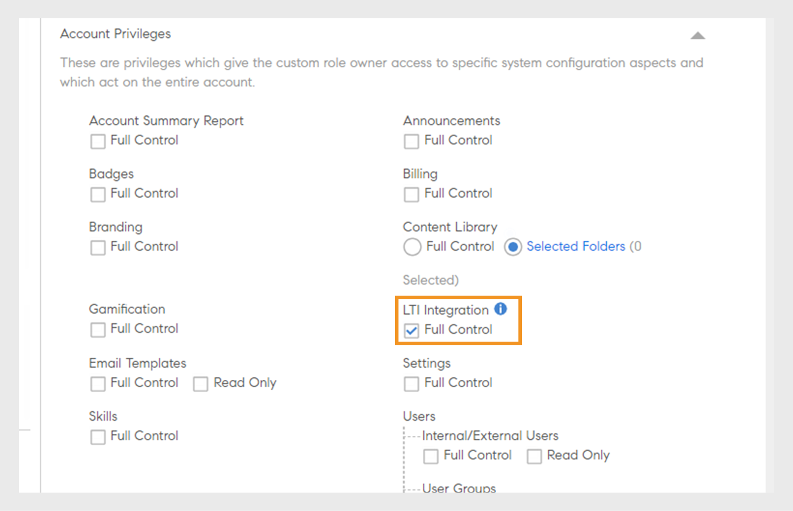
_LTI 整合自訂角色_

## Adobe Learning Manager 作為 LTI 工具提供者

作為 LTI 提供者，Adobe Learning Manager 允許你將課程目錄匯出為 LTI 套件，並與外部 LMS 平台共享。

### 建立並與外部 LMS 共享 LTI 憑證 - 管理工作流程

請依照以下步驟與外部 LMS 分享 LTI 憑證：

1. 以 . 登入。**[!UICONTROL Admin]**
2. 在首頁選擇 **[!UICONTROL LTI Integration]** > **[!UICONTROL LTI Tool Configuration]**。 您可以在此頁面查看設定憑證。
3. 管理員可以將這些憑證分享給外部 LMS 以進行 LTI 站點註冊。

   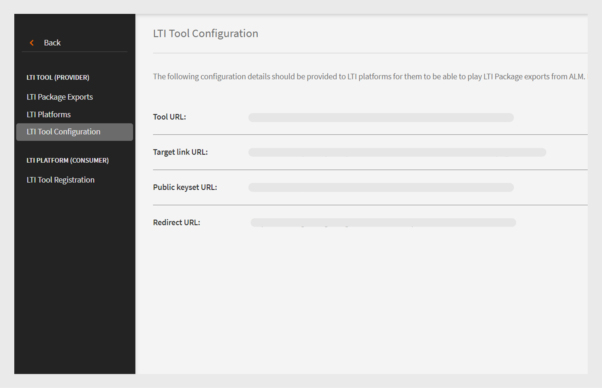
   _LTI 工具設定憑證_

   * **[!UICONTROL Token URL]**： LMS 請求存取權杖以驗證並授權與 LTI 工具通訊的 URL。
   * **[!UICONTROL Target Link URL]**：使用者從 LMS 啟動 LTI 工具時被重新導向的目的地網址。
   * **[!UICONTROL Public Keyset URL]**： 提供用於驗證安全憑證以安全通訊的公鑰的 URL。
   * **[!UICONTROL Redirect URL]**： 使用者完成 LTI 工具操作後被導向的網址，通常會將他們重新導向至 LMS。

### 外部 LMS 設定

外部 LMS 管理員利用 Adobe Learning Manager 管理員共享的憑證註冊 Adobe Learning Manager 並產生憑證。 這些憑證將作為 Adobe Learning Manager 作為工具提供者設立的最後一步，加入 Adobe Learning Manager。 以下是由 LMS 產生的外部憑證：

* **[!UICONTROL Issuer or Platform ID]**：一個用於將 LTI 啟動請求傳送給工具提供者的 LMS 或平台的唯一識別碼。
* **[!UICONTROL Client ID]**：LMS 為授權目的指派給 LTI 工具的唯一識別碼。
* **[!UICONTROL Deployment ID]**：一個連結特定 LTI 工具部署至 LMS 以管理多個實例的識別碼。
* **[!UICONTROL Token URL]**： LMS 請求存取權杖以驗證並授權與 LTI 工具互動的端點。
* **[!UICONTROL Authentication URL]**： LMS 派遣使用者進行驗證及啟動 LTI 連線的網址。
* **[!UICONTROL Public Key URL]**：提供LTI工具用來驗證安全憑證並確保安全通訊的公鑰的URL。

### 新增 Adobe Learning Manager 作為工具提供者 - 管理工作流程

請依照以下步驟將 Adobe Learning Manager 加入工具提供者：

1. 以 . 登入。**[!UICONTROL Admin]**
2. 在首頁選擇 **[!UICONTROL LTI Integrations]** > **[!UICONTROL LTI Platforms]**。
3. 選擇 **[!UICONTROL Add]** 並輸入外部 LMS 共享的憑證。

   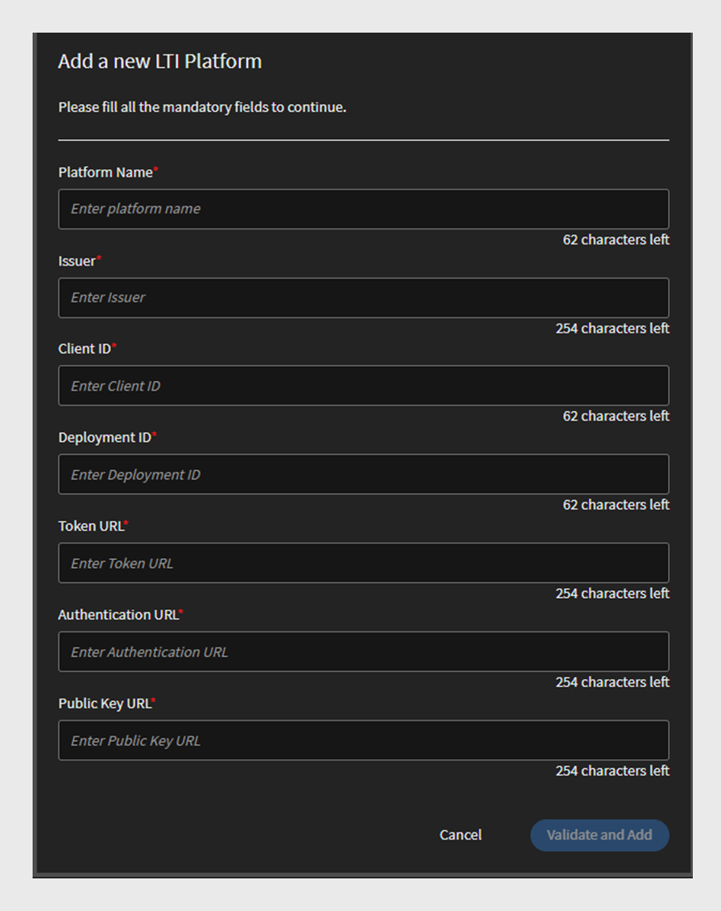
   _新增 LTI 平台_

4. 當所有這些值都相加後，選擇 **[!UICONTROL Validate]** 和 **[!UICONTROL Add]**。

### 匯出 LTI 套件 - 管理工作流程

LTI 工具允許您將訓練目錄中導出為可下載的學習內容套件，並可透過學習工具互通性（LTI）標準與外部學習管理系統（LMS）或平台分享。

請依照以下步驟從 Adobe Learning Manager 匯出課程：

1. 以 . 登入。**[!UICONTROL Admin]**
2. 在首頁選擇 **[!UICONTROL LTI Integrations]** > **[!UICONTROL LTI Package Exports]**。
3. 選擇 **[!UICONTROL New package export]**。

   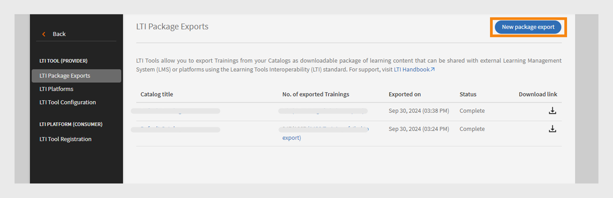
   _匯出LTI套件_

4. 從清單中選擇所需的目錄。 你可以在課程目錄中查看課程清單。
5. 選擇必修課程並選擇 **[!UICONTROL Export as LTI]**。
6. 選擇課程以查看啟動連結。
7. 選擇 **[!UICONTROL Download Link]** 圖示下載套件。 該套件是一個包含成功匯出 IMSCC 檔案的 zip 檔。

透過這個啟動連結或 IMSCC 檔案，你可以將 Adobe Learning Manager 課程匯出到外部的學習管理系統（LMS）。 學習者可以從他們的學習管理系統（LMS）中學習 Adobe Learning Manager 課程。

>[!NOTE]
>
>如果管理員在建立啟動連結後編輯課程或更新模組，該連結會自動更新。 然而，如果管理員在啟動連結建立後退休課程，該退休課程將無法在 LTI 消費者中啟動。

## Adobe Learning Manager 作為 LTI 消費者 - 管理工作流程

作為 LTI 消費者，Adobe Learning Manager 允許你使用外部 LTI 供應商的活動、工具、內容與小工具。要將 Adobe Learning Manager 新增為 LTI 使用者，您需要從外部 LTI 提供者提供以下憑證：

* 啟動登入網址
* 目標連結網址
* 重定向網址
* 公鑰類型

請依照以下步驟將 Adobe Learning Manager 加入 LTI 使用者：

1. 以 . 登入。**[!UICONTROL Admin]**
2. 在首頁選擇 **[!UICONTROL LTI Integrations]** > **[!UICONTROL LTI Tool Registration]**。
3. 選擇 **[!UICONTROL Add]** > **[!UICONTROL New LTI Tool]**。

   >[!NOTE]
   >
   >你可以透過上傳 .csv 檔案來匯入多個 LTI 工具。

4. 輸入上述LTI供應商的憑證。

   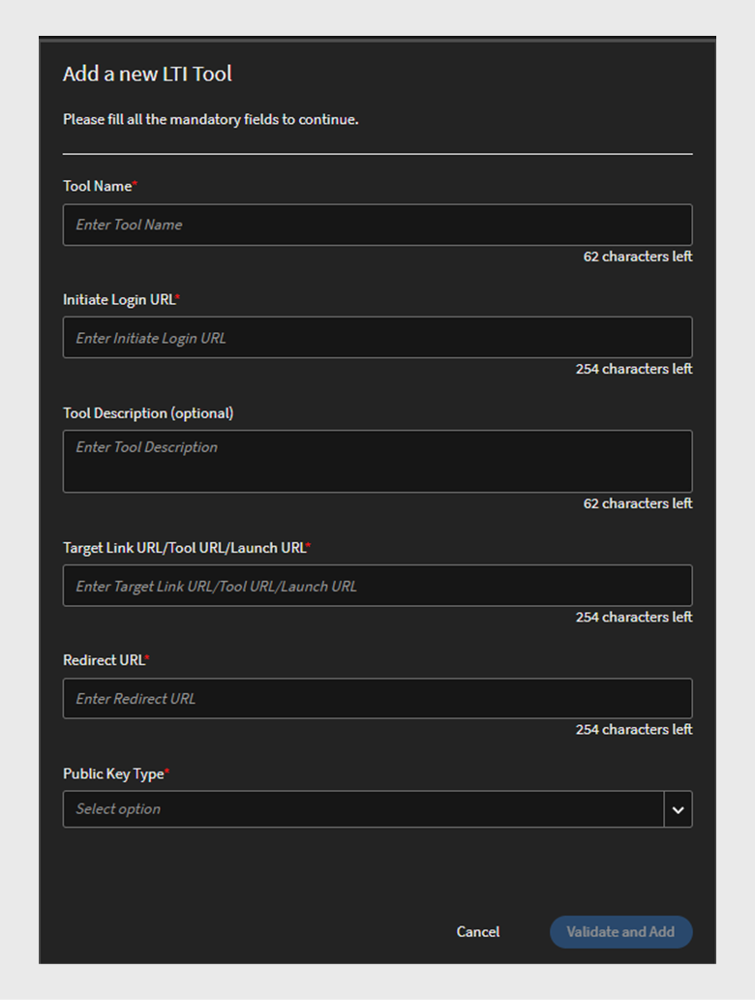
   _新增一個新的 LTI 工具_

5. 完成後，選擇 **[!UICONTROL Validate]** 和 **[!UICONTROL Add]**。
6. 你可以看到以下畫面：

   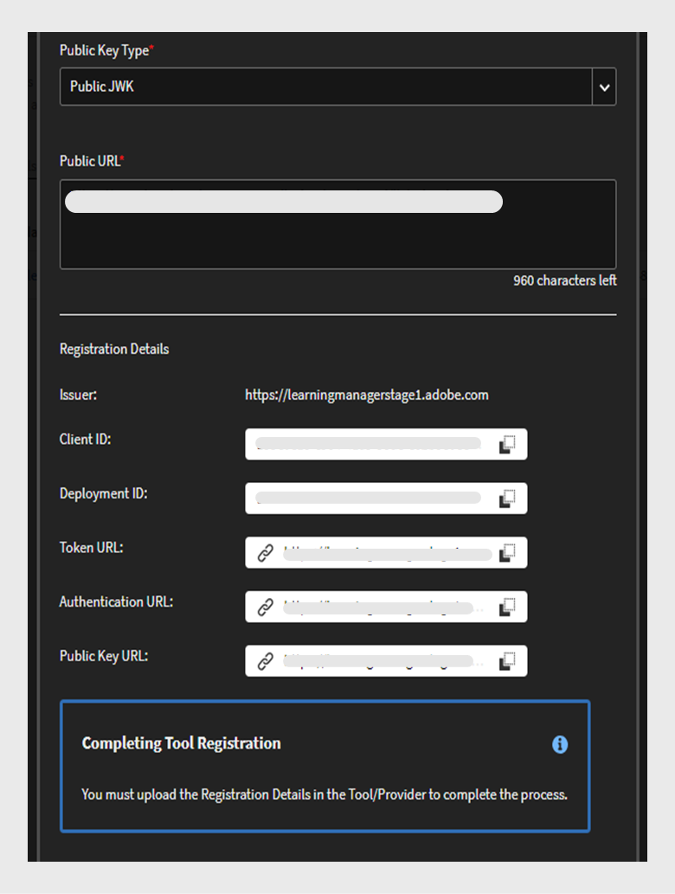
   _註冊資格_

7. 請將這些憑證分享給LTI提供者以進行註冊。 註冊完成後，你可以從LTI提供者取得啟動連結或IMSC檔案來匯入課程。

### 建立長期資訊量（LTI）內容 - 作者工作流程

LTI 提供者會提供啟動連結或 IMSCC 檔案，讓你將其課程加入 Adobe Learning Manager。 請依照以下步驟新增外部 LMS 課程：

1. 以 . 登入。**[!UICONTROL Author]**
2. 選擇 **[!UICONTROL Content Library]** > **[!UICONTROL Add]** > **[!UICONTROL LTI Module]**。

   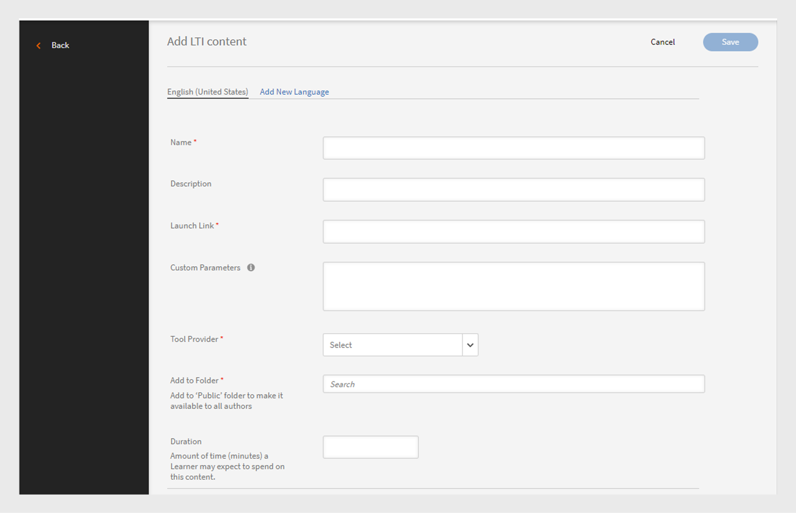
   _新增LTI內容-作者_

3. 輸入 **[!UICONTROL Name]** &amp; **[!UICONTROL Description]**。
4. 輸入 **[!UICONTROL Launch Link]** LTI **[!UICONTROL Custom Parameters]** 提供者的 和 。
5. 從&#x200B;**[!UICONTROL Tool Provider]**&#x200B;下拉選單選擇你的[!UICONTROL LTI provider]。
6. 搜尋並在選項中&#x200B;**[!UICONTROL Add to Folder]**&#x200B;選擇。**[!UICONTROL Public]**&#x200B;這讓所有作者都能修讀這些課程。
7. 選擇 **[!UICONTROL Save]**。內容建立完成後，你可以在課程創建時加入這些內容。

### 建立包含 LTI 內容的課程 - 作者工作流程

請依照以下步驟建立包含LTI內容的課程：

1. 以 . 登入。**[!UICONTROL Author]**
2. 在首頁選擇 **[!UICONTROL Courses]** > **[!UICONTROL Add]**。
3. 輸入 **[!UICONTROL Name]** 課程的 &amp; **[!UICONTROL Description]** 。
4. 在選項 **[!UICONTROL Modules]** 中，選擇 **[!UICONTROL Add Modules]** > **[!UICONTROL Self Paced Module]**。
5. 選擇你所建立的 並 **[!UICONTROL LTI Content]** 選擇 **[!UICONTROL Save]**。
6. 輸入所需細節，如 **[!UICONTROL Skills]**、 **[!UICONTROL Authors]**、 **[!UICONTROL Enrollment type]**。
7. 完成後，再發佈課程。 Adobe Learning Manager 的學習者可以從外部 LTI 供應商修讀 LTI 課程。

## LTI 匯出失敗情境

以下類型的課程無法匯出為長期培訓課程：

* **含活動模組**&#x200B;的課程：包含特定活動模組的課程。
* **多重授課方式**&#x200B;的課程：多重授課方式的課程包括自學模組、虛擬或教室模組、活動模組及混合式學習。
* **有先修課程**：要求先修課程的課程。
* **多重選課**：包含多選課的課程
* **多實例**&#x200B;課程：提供多重交付實例的課程。

| 預設實例 | 一個或多個非預設實例 | 期望 | 錯誤訊息 |
|---|---|---|---|
| 現役 | 沒有 | 出口 | 沒有 |
| 現役 | 現役 | 不要匯出 | 多重實例 |
| 現役 | 退休 | 不要匯出 | 多重實例 |
| 現役 | 已刪除 | 出口 | 沒有 |
| 退休 | 沒有 | 不要匯出 | 退休 Def 實例 |
| 退休 | 現役 | 不要匯出 | 退休 def 實例，多個實例 |
| 退休 | 退休 | 不要匯出 | 退休 def 實例，多個實例 |
| 退休 | 刪除 | 不要匯出 | 退休 Def 實例 |

* **多問答**&#x200B;課程：啟用MQA的課程。
* **啟用**&#x200B;實例切換的課程：允許學習者在實例間切換的課程。
* **付費課程**：需付費報名的課程。
* **學習路徑、認證或學習計畫**&#x200B;中的課程：學習路徑或計畫中的課程。
* **非自選類型的**&#x200B;課程：限制學生自行報名的課程。
* **課堂或虛擬課**&#x200B;堂課程：包含課堂或虛擬課堂的課程。
* **非必修模組**&#x200B;課程：包含選修或非必修模組的課程。

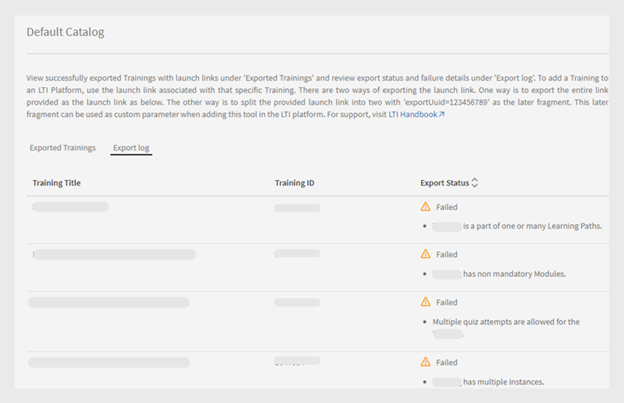
_出口狀況_

## LTI 限制

以下是LTI消費者與LTI提供者的LTI限制：

* 能夠匯出混合課程，影響學習者的課程使用體驗。
* 能夠匯出自學課程，包含教室、虛擬教室或活動模組，影響學習者的課程體驗。
* 能夠匯出像 LinkedIn Learning 和 Go1 這類共用課程。
* 能在ALM中啟動過去註冊日期的課程，這會影響學習者的課程使用權與體驗。
* 學習者無法在 iOS ALM 行動應用程式上使用長期學習課程，這會影響課程的使用體驗。
* 學習者無法在 ALM 行動應用程式離線下載及存取 LTI 課程，因為這些課程由第三方平台提供。
* 管理員只能查看已啟用的目錄，無法查看已停用的目錄。
* ALM 對名稱（63 個字元）和電子郵件（64 個字元）長度有限制，超出這些限制的外部 LTI 學習者無法取得。
* 課程完成同步或成績同步延遲是由第三方LTI系統造成。
* 透過 Teams 應用程式或瀏覽器使用 LTI 課程的 Teams 學習者不會顯示課程同步訊息，影響學習者通知。
* 使用者資料報告無法匯出透過 LTI 註冊的使用者的資料。
* 當作者在工具消費者中新增啟動連結時，工具提供者名稱不會自動被識別，因此需要手動選擇。
* 透過 CSV 批量上傳工具時，重音字元必須使用 UTF-8 編碼以避免匯入錯誤。
* LTI 帳戶管理員無法分享包含 LTI 模組的課程、學習路徑或認證。
* 當使用者重新開啟播放器以完成 ALM 課程時，無法重新同步成績，這會影響學習者的分數更新，且需要手動重新觸發。
* ALM 只允許活躍及試用用戶使用長期學習課程。
* Moodle 啟用的成績同步會阻止 ALM 播放器啟動，這會影響學習者的課程存取與體驗。
* LTI 的活動欄位為單一值，不支援多個值。
* 當課程遷移過程中匯出失敗時，無法提供失敗原因。
* 外部LTI課程成績不會出現在學習者成績單中，且L2測驗頁面上也無法顯示分數，影響學習者的表現追蹤。

## LTI 發射失敗案例

以下是外部 LTI 玩家無法啟動的課程，因為 ALM 在啟動連結建立後的最新變更：

* 有些課程是實例被退休的。
* 這些課程已經退休，且沒有ALM的註冊人數。
* 那些已經註冊在ALM但已經退休的課程。
* ALM 中已被刪除的課程。
* 已達報名上限的課程。

## 最佳實務

建議建立支援 LTI 課程的目錄，以防止匯出失敗並簡化匯出流程。

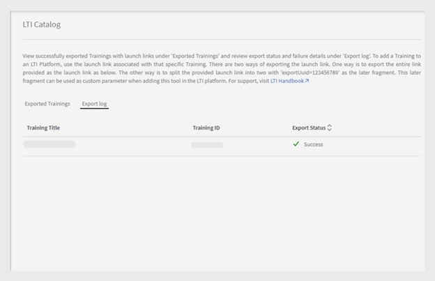LTI 目錄顯示成功匯出狀態
