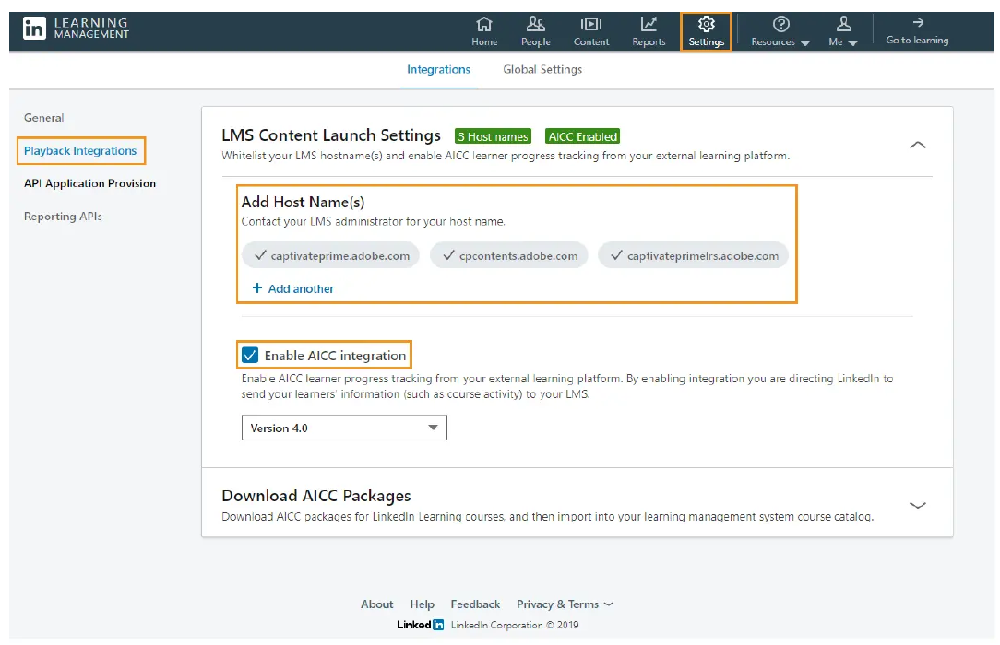
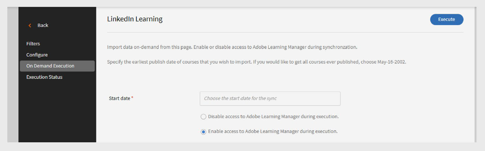

# Adobe Learning Manager 中的 LinkedIn Learning 連接器

## 引介

LinkedIn Learning 連接器讓你能無縫整合 LinkedIn Learning 內容與 Adobe Learning Manager。 透過這個連結器，組織能自動將 LinkedIn Learning 課程導入 Adobe Learning Manager，讓學習者能直接在平台上找到、註冊並完成 LinkedIn 課程。

設定完成後，學習者在 LinkedIn Learning 內容的進度會被 Adobe Learning Manager 追蹤，讓管理員能監控完成度與時間。 你可以排程自動內容同步、執行隨選匯入，並依語言、圖書館或自訂標籤篩選哪些課程進入系統。

>[!NOTE]
>
>當你從 LinkedIn Learning 匯入課程時，Adobe Learning Manager 會為每門課程產生獨特的 LO（學習物件）ID。 LinkedIn Learning 內容所花費的學習時間會由 LinkedIn 平台回報給 Adobe Learning Manager。 如果 LinkedIn 平台沒有傳送這些資料，Adobe Learning Manager 就無法記錄，所花費的時間會顯示為零。

## 設定 LinkedIn Learning 入口網站設定

要設定 LinkedIn Learning 入口網站設定：

1. 以管理員身份登入 **LinkedIn Learning LMS** 。
2. 從上方導覽面板選擇 **管理員** 。
3. 點選設定&#x200B;**&#x200B;**&#x200B;標籤。
4. 從左側導覽中，選擇 **播放整合**，然後選擇 **整合** 標籤。
5. 展開 **LMS內容啟動設定**。
6. 新增以下主機名稱：

   - learningmanager.adobe.com
   - learningmanagerlrs.adobe.com
   - cpcontents.adobe.com
7. 選擇 **啟用 AICC 整合**。

   
   _選擇啟用 AICC 整合以設定 LinkedIn Learning 連接器_

## 在 Adobe Learning Manager 中連結 LinkedIn Learning

要設定 LinkedIn Learning 連接器：

1. 以整合管理員身份登入 Adobe Learning Manager。
2. 將滑鼠移到 **LinkedIn** 學習圖塊上，選擇 **「連結**」。

   
   _選擇 Connect 以設定 LinkedIn Learning 連接器_

3. 在連線設定頁面：
   - 輸入 A **連接名稱**。
   - 輸入 **應用程式金鑰** 和 **秘密金鑰**。

   
   _輸入連線名稱、應用程式金鑰和秘密金鑰來設定 LinkedIn Learning 連接器_

   >[!NOTE]
   >
   >企業管理員可以透過在 LinkedIn Learning Admin 入口網站建立應用程式來產生這些金鑰。

4. 選擇 **儲存** 以新增連線。

要編輯現有連線，請在 LinkedIn Learning **圖塊中選擇**「管理連結&#x200B;**」。**

>[!IMPORTANT]
>
>**&#x200B;**&#x200B;在設定這個連接器之前，必須先啟用你的帳號遷移功能。

## 管理連線與同步

管理 LinkedIn Learning 連接器：

1. 選擇 **「管理連線** 」並選擇連線。
2. 從左側窗格選擇 **「設定**」。
3. 選擇 **啟用連線**。

   
   _在配置 LinkedIn Learning 連接器頁面中選擇啟用連線_

4. 選擇 **編輯** 以更新憑證。 用 **重置** 來還原編輯。
5. 要自動同步，請選擇 **啟用排程**。
6. 設定開始日期、時間和頻率（例如每三天）。
7. 選擇 **儲存**。

### 隨選同步

要執行按需同步：

1. 在左側窗格選擇 **「隨選執行** 」。
2. 輸入 **開始日期**。
3. 在執行過程中，請選擇以下任一選項以 **啟用** 或 **停用 Adobe Learning Manager 的存取** 權限：
   - **在執行**&#x200B;時啟用 Adobe Learning Manager 存取：使用者不會有停機時間。
   - **執行**&#x200B;時停用 Adobe Learning Manager 存取：同步時應用程式無法使用。

   
   _選擇隨選執行來執行匯入_

4. 選擇 **執行** ，從該日期起匯入 LinkedIn Learning 的用戶動態與資料。

要監控所有同步執行：

在左側窗格選擇 **執行狀態** ，可查看所有同步的歷史、持續時間、類型（排程或隨選）及當前狀態（進行中、已完成）。

>[!NOTE]
>
>如果你刪除並重新建立連線，之前的執行會被保留，並顯示在 **執行狀態**&#x200B;中。 你只能重播最近的同步。

## 篩選 LinkedIn Learning 內容

在設定連結時，你可以篩選要匯入哪些 LinkedIn Learning 課程。

要設定你的過濾器：

1. 在左側窗格選擇 **「篩選** 器」。
2. 在篩選訓練&#x200B;**中**&#x200B;選擇所需的選項。
   - **無篩選** – 匯入所有課程。
   - **語言** – 依特定語言篩選課程。
   - **圖書館** – 依 LinkedIn Learning 圖書館篩選課程。
3. 如果依 **語言**&#x200B;篩選，請選擇你想要的語言。 例如，英語&#x200B;**&#x200B;**&#x200B;和&#x200B;**西班牙語**。
4. 在 **「匯入培訓」**&#x200B;中，選擇課程將匯入的位置。
5. 選擇如何組織匯入的課程。
6. 根據以下&#x200B;**選項，選擇以下任一隔離訓練選項**：

   - **語言** – 依語言分類。
   - **圖書館** ——逐組。
7. 在「匯入標籤」**中**，選擇你想套用到匯入課程的標籤類型。

   - **語言**
   - **圖書館**
   - **主題**
   - **主題**
   - **自訂標籤**
8. 在 **自訂標籤** 欄位，輸入你想要指派的自訂標籤。 用逗號分隔多個標籤。

   
   _選擇篩選選項以匯入 LinkedIn Learning 連接器的資料_

9. 如果您希望學習者能夠退選這些課程，部分 **使用者可以退選**。
10. 選擇 **儲存** 以套用你的篩選條件並匯入設定。
