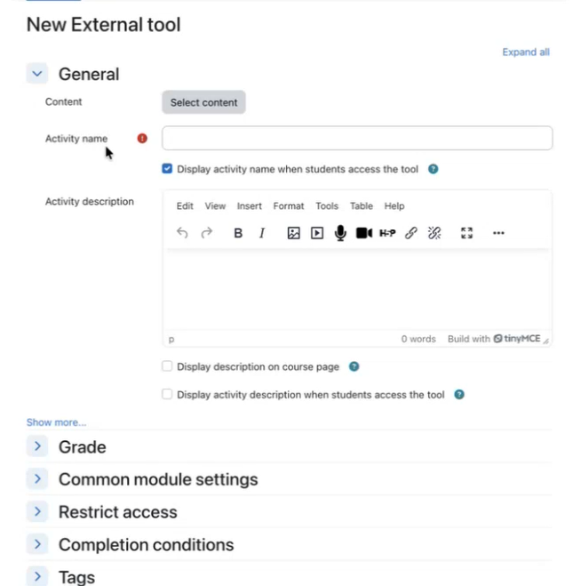
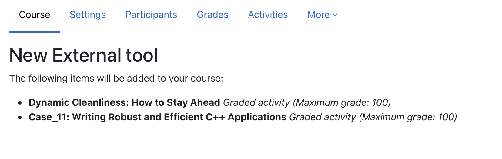
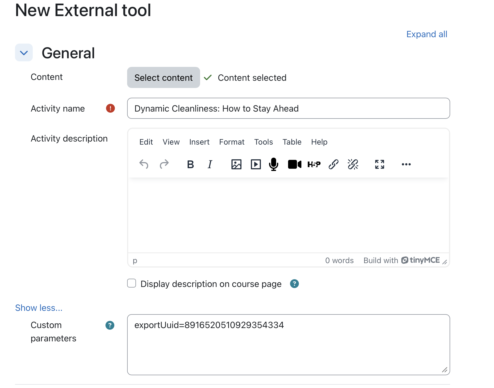

# Adobe Learning Manager 中的 LTI 深度連結

## 概觀

**以下章節是給管理員用的**

LTI 深度連結是一項 LTI 優勢功能，允許講師或課程作者直接瀏覽、選擇並嵌入 Adobe Learning Manager （ALM） 的特定學習項目到外部的 LTI 工具使用者或平台（如 Canvas 或 Moodle）課程中。

LTI 深度連結簡化了將課程加入學習平台（如 Moodle）的流程。 在目前的工作流程中，作者必須手動複製課程網址，包括匯出 UUID 參數，然後在設定課程連結時將所需細節貼上到 LMS。 此步驟必須在每一門課程和每個名次中重複。 例如，若同一課程需在10個不同位置新增，作者必須重複複製貼上10次。 這種手動方式增加了工作量，也增加了設定錯誤的風險。

深度連結透過讓 LMS 在設定時自動處理課程選擇，並提供適當的開銷來選擇內容，從而消除這些負擔。

在此模型中：

* 外部 LMS 中的講師與作者會啟動專門的深度連結選擇體驗，讓使用者瀏覽 ALM。
* 系統會將 ALM 的深度連結物件回傳至外部 LMS，使所選項目能嵌入其課程編寫工作流程中。
* 學生在主要學習管理系統中使用深度連結內容，無縫啟動 ALM 所載教材。

## 問題陳述

ALM 目前支援 LTI 1.3 整合，但若缺乏完整的深度連結工作流程，講師與作者無法有結構化的方式：

* 從模態啟動專屬的深度連結選擇體驗。
* 只瀏覽應該在特定平台上暴露的學習物件。
* 從平台中選擇特定的學習對象。
* ALM 將該學習物件回傳給平台，使其能直接嵌入課程中。

若無此功能：

* 內容選擇為手動或分散式
* 除非明確過濾，否則所有帳號內容都可能被無意中暴露
* 工具與提供者的整合較難操作化
* 課程作者無法以一致且受規範的工作流程嵌入外部 LTI 內容

## 目標

此功能的主要目標包括：

1. 在 LTI 工具提供者中啟用 LTI 深度連結
   * 支援從 ALM 到 LTI 工具提供者的深度連結啟動。
2. 提供受控的內容選擇工作流程
   * 在深度連結選擇時，僅顯示經核准且相關的目錄與內容。
3. 允許講師與作者選擇學習對象
   * 提供可搜尋且可篩選的使用者介面，以選擇符合資格的學習物件。
4. 回傳有效的深連結回應給 ALM
   * 利用 deep_link_return_url 參數將使用者重新導向至平台，並具備所需的深度連結有效載荷。
5. 支援平台專屬目錄曝光
   * 允許管理員控制哪些目錄會暴露在哪個 LTI 平台。

## 角色與其角色

LTI 深度連結工作流程包含以下角色：

| 角色設定 | 說明 |
|---|---|
| 講師或作家 | 建立或管理課程，並啟動深度連結選擇流程以嵌入外部內容。 |
| 整合管理 | 註冊並管理 LTI 工具，並啟用及配置深度連結行為。 |
| 學習者 | 啟動並消費透過深度連結工作流程新增的內容。 |

*每個角色對應深度連結工作流程中從設定到消費的不同步驟。*

## 資料與參數需求

深度連結在 ALM 與 LTI 平台之間交換以下參數：

| 參數 | 目的 |
|---|---|
| `deep_link_return_url` | 回傳端點，用於將所選的深連結物件回傳至 ALM |
| `accepted_types` | 定義平台接受的資源類型 |
| `accept_multiple` | 顯示是否允許多重資源選擇;可依工具配置 |
| `auto_create` | 表示平台能自動建立連結的資源條目 |

*這些參數控制被揭露的內容，以及選擇如何返回給 ALM。*

## 建立深度連結

### 前置條件

1. 你應該以整合管理員身份登入。
2. 在設定 LTI 整合時，請選擇「支援深度連結」的勾選框。
3. 在欄位提供網址，讓使用者或作者直接前往選擇。
4. 選擇「儲存變更」。

   相同的啟動網址被重複使用，以簡化設定與使用。

   行為由 LTI 訊息類型決定。 當訊息類型為 `content_consumption`時，使用者會被導向球場玩家。 當訊息類型為 `content_selection`時，使用者會被導向深度連結流程，作者可直接選擇所需內容，無需手動複製課程專屬識別碼。

   儲存修改後，選擇「 **選擇內容** 」標籤。 （該 **選擇內容** 標籤只有在勾選此勾選框後才會啟用。）

**以下部分是給作者的。**

作為作者，你可以從 **「選擇內容** 」視窗中選擇內容。 選擇內容視窗顯示&#x200B;**&#x200B;**&#x200B;課程目錄&#x200B;**、**&#x200B;課程數量&#x200B;**及**&#x200B;匯出日期&#x200B;**。**

1. 去你的外部整合工具。

   

2. 選擇目錄&#x200B;**&#x200B;**，並透過勾選每門課程旁的勾選框，選擇你想深度連結的課程。如果你新增多門課程，會出現確認視窗讓你確認。

   

   

3. 選擇 **新增內容**。 選擇 **新增內容** 會自動填入所有欄位。 你可以在自訂參數欄位查看匯出的 UUID。 若您在前一步選擇了多個課程，會顯示確認訊息。

   

4. 此時，若想選擇其他課程或更改，可以選擇&#x200B;**取消並返回**&#x200B;至「選擇內容&#x200B;**」標籤，或**&#x200B;選擇「儲存並返回&#x200B;**課程」或「**&#x200B;儲存並顯示&#x200B;**&#x200B;**」。深度連結會被加入目的地。

   
