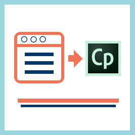
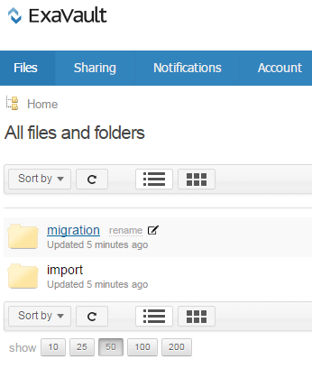
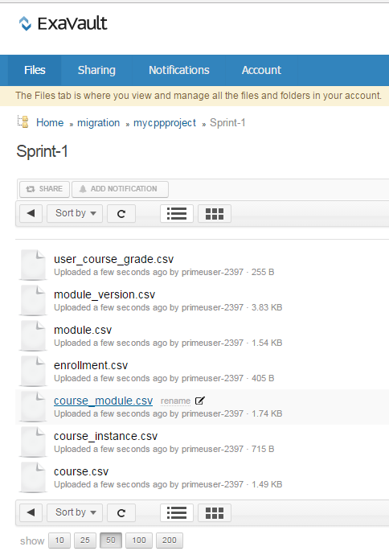
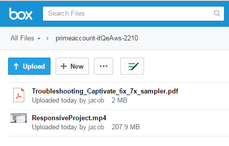
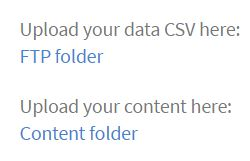
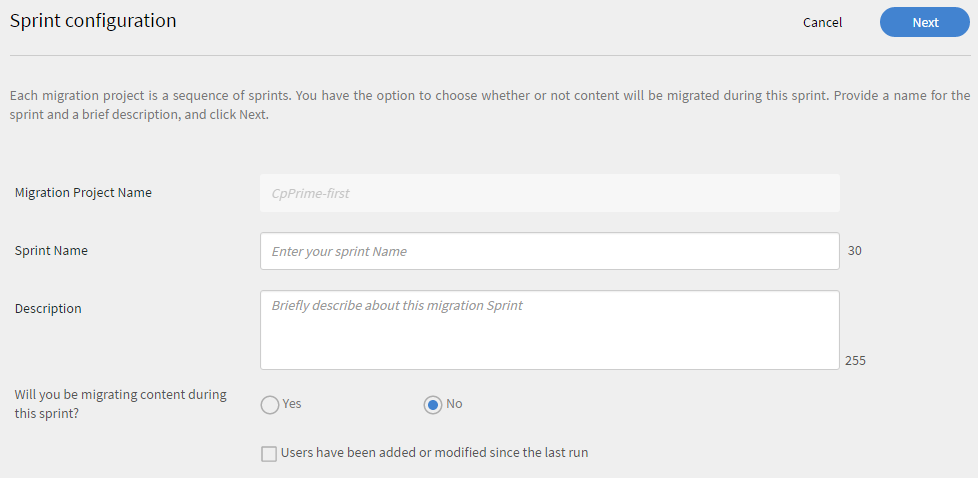
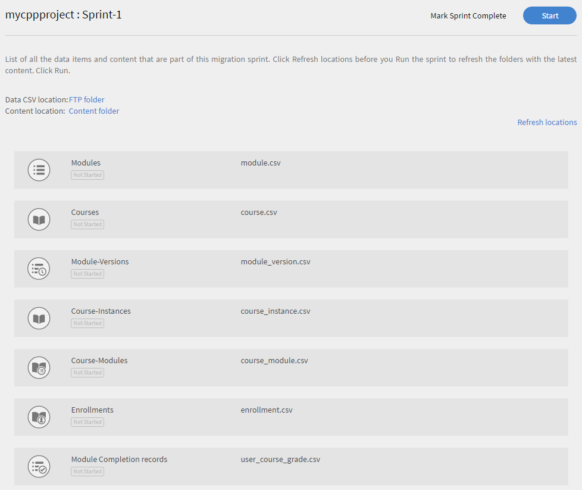
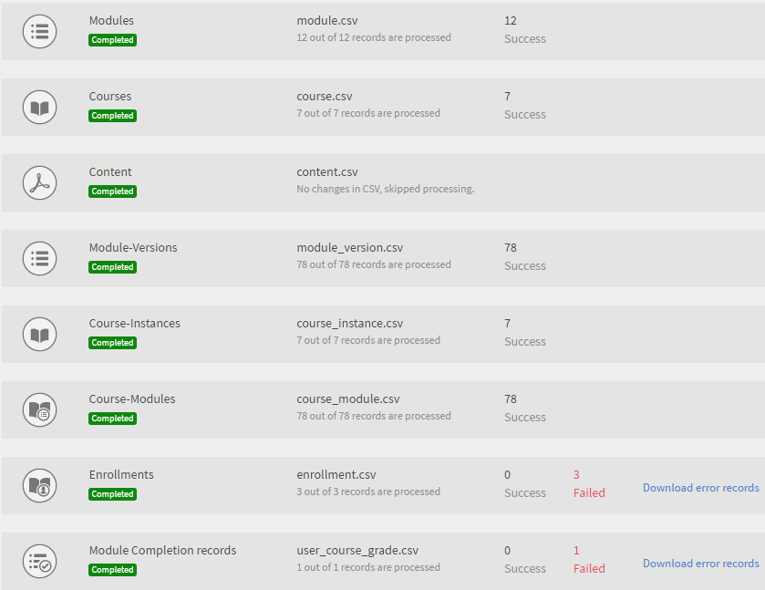
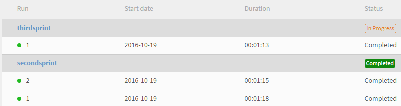

# 移轉手冊

整合管理員參考手冊，協助您將現有學習管理系統移轉至Learning Manager學習管理系統

## 概觀 {#overview}

<table>
 <tbody>
  <tr>
   <td></td>
   <td>
    
<a href="https://business.adobe.com/products/learning-manager/adobe-learning-manager.html">AdobeLearning Manager</a> 是雲端託管、以學習者為中心的自助學習管理解決方案。 Adobe可讓擁有現有學習管理系統(LMS)的企業將組織的訓練資料和訓練內容移轉至Learning Manager LMS應用程式。 
</td>
  </tr>
 </tbody>
</table>

### 使用案例 {#usagescenario}

一般而言，大型企業會有其內部學習管理系統或任何供應商提供的舊版學習管理系統。 LMS包含企業培訓內容和培訓資料。 作為企業，購買Learning Manager時，您可能會想要將現有的LMS內容和資料移至Learning Manager，以便運用現代且直覺式LMS的優勢，而不會遺失組織的任何舊資料。

Learning Manager提供必要的工具和規格，好讓貴組織的整合管理員可設定及執行移轉工作。

截至今日，組織管理員可聯絡Adobe支援團隊以存取Learning Manager的移轉功能。 若要在帳戶中啟用移轉功能，您可以聯絡AdobeLearning Manager支援團隊。

## 移轉程式 {#apidescription}

本章節將說明移轉的先決條件、移轉程式中的關鍵步驟、移轉衝刺、規格、資料和內容移轉步驟，如下所示：

### 先決條件 {#prerequisites}

Learning Manager團隊期望貴組織的整合管理員在進行移轉程式前先執行下列工作：

* 整合管理員會從現有的LMS中擷取資料和內容，並將資料轉換為Learning Manager定義的檔案格式。
* Learning Manager不支援在移轉過程中匯入使用者，並期望組織使用聯結器匯入使用者。 Adobe Systems預計這些聯結器會在移轉程式之前設定。 請參閱 [Learning Manager聯結器說明](connectors.md) 以取得詳細資訊。

Learning Manager建議管理員在將資料和內容移轉至Learning Manager生產環境前，先在試用帳戶中嘗試移轉程式。

### 移轉程式的關鍵步驟 {#keystepsofmigrationprocess}

將內容和資料從現有LMS移轉至Learning Manager的關鍵步驟如下：

1. 整合管理員或合作夥伴會評估需要移轉的現有LMS資料和內容。
1. 整合管理員會評估Learning Manager為擷取資料和內容所提供的工具和規格。
1. 整合管理員會根據舊版LMS所提供的功能，撰寫程式碼或執行手動工作，以匯出舊版LMS的訓練資料和內容。
1. 培訓資料和內容可用後，整合管理員會分析並對應資料和內容，以符合Learning Manager移轉規格。
1. 整合管理員使用Learning Manager提供的工具，依下列順序進行移轉：

   1. 將學習者轉移到Learning Manager
   1. 將培訓內容轉移到Learning Manager和
   1. 最後，將訓練資料傳輸至Learning Manager。

企業可以開始使用Learning Manager LMS以及舊版內容。

### 移轉物件的範圍 {#scopeofmigrationobjects}

您只能移轉下列學習物件的內容：

* 模組
* 徽章
* 課程
* 模組版本
* 課程例項
* 課程模組
* 技能
* 技能等級
* 技能課程
* 認證
* 認證課程
* 憑證認可
* 學習計畫
* 學習計畫課程
* 學習計畫執行個體
* 學習計畫課程例項
* 工作輔助
* 工作輔助版本
* 工作輔助課程
* 工作輔助技能
* 註冊
* 認證註冊
* 學習計畫註冊
* 工作輔助註冊
* 使用者課程成績

### 移轉的重要概念 {#keyconceptsofmigration}

Learning Manager移轉程式的重要概念可簡單說明以供快速參考，如下所示：

**移轉專案**

在Learning Manager中，移轉專案包含一或多個短跑。 您的帳戶也可以有多個移轉專案。 您在Learning Manager中的移轉程式會從建立移轉專案開始。

**衝刺(sprint)**

Learning Manager移轉程式中的Sprint會定義您選擇從現有LMS移轉的一組移轉專案。 移轉專案可以是課程模組、學習者記錄或一組課程。 衝刺中可以有多個學習資料專案。 您可以在每個衝刺中執行移轉工作。

**衝刺執行**

Sprint Run是啟動Sprint移轉工作的程式。 您可以在「執行」的任何時間點停止衝刺執行。

**衝刺重新執行**

您可以在移轉衝刺完成後，隨時重新執行它。 當您想要將資料附加至衝刺專案，並再次移轉至應用程式或修正CSV中的錯誤時，會發生重新執行或重新執行衝刺的狀況。

**CSV規格**

Learning Manager提供了一組 [標準CSV規格](migration-manual.md#main-pars_header_140933605). 最佳實務是在開始移轉程式前先通過這些CSV規格。 貴組織的整合管理員可以分析現有的資料格式，並對應這些格式以符合Learning Manager提供的CSV範本專案。

**移轉專案標籤**

Adobe Systems建議您使用一組關鍵字作為標籤，以便在Learning Manager應用程式中輕鬆識別移轉專案。 這些標籤可讓您在任何指定時間點，在Learning Manager應用程式中識別內部專案。

**無內容模組**

Learning Manager可讓您上傳不含內容的模組。 Adobe Systems將其視為Learning Manager中的無內容模組。 若您想從現有LMS移轉部分舊資料而不需要任何內容，您可以上傳不含URL參考的module_version.csv檔案。

## CSV規格和範例CSV {#csv}

您可以在下方找到可用於對應現有LMS移轉資料的標準CSV規格。 按一下csv-specifications和sample-csv以下載zip檔案。 下載的csv-specifications.zip包含七個Excel工作表檔案。 這些Excel工作表檔案是包含說明的規格，可讓您瞭解如何填滿.csv檔案。 對應的.csv檔案應包含每個欄位的資料，其格式應符合這些.xlsx檔案中的說明。

<table border="1" cellspacing="0" cellpadding="0" width="100%">
 <tbody>
  <tr>
   <th>
    
<b>Sl.no</b>
</th>
   <th>
    
<b>檔案名稱</b>
</th>
   <th>
    
<b>內容說明</b>
</th>
   <th>
    
附註
</th>
  </tr>
  <tr>
   <td>
    
1
</td>
   <td>
    
module.xlsx
</td>
   <td>
    
module.csv的中繼資料
</td>
   <td> </td>
  </tr>
  <tr>
   <td>
    
2
</td>
   <td>
    
badge.xlsx
</td>
   <td>
    
badge.xlsx的中繼資料
</td>
   <td> </td>
  </tr>
  <tr>
   <td>
    
3
</td>
   <td>
    
course.xlsx
</td>
   <td>
    
course.csv的中繼資料
</td>
   <td>
    
提及指定課程的一個作者名稱，因為有時多個作者名稱在移轉後無法正確顯示在應用程式中。 
</td>
  </tr>
  <tr>
   <td>
    
4
</td>
   <td>
    
module_version.xlsx 
</td>
   <td>
    
module_version.csv的中繼資料
</td>
   <td>
    
請務必提供您上傳內容的Box帳戶資料夾的URL路徑。 
</td>
  </tr>
  <tr>
   <td>
    
5
</td>
   <td>
    
course_instance.xlsx
</td>
   <td>
    
course_instance.csv的中繼資料 
</td>
   <td> </td>
  </tr>
  <tr>
   <td>
    
6
</td>
   <td>
    
session.xlsx
</td>
   <td>
    
session.csv的中繼資料
</td>
   <td>
    
確保工作階段csv中的每個專案都與至少一個教室/虛擬教室模組相關聯
</td>
  </tr>
  <tr>
   <td>
    
7
</td>
   <td>
    
course_module.xlsx
</td>
   <td>
    
course_module.csv的中繼資料
</td>
   <td> </td>
  </tr>
  <tr>
   <td>
    
8
</td>
   <td>
    
skill.xlsx
</td>
   <td>
    
skill.csv的中繼資料
</td>
   <td> </td>
  </tr>
  <tr>
   <td>
    
9
</td>
   <td>
    
skill_level.xlsx
</td>
   <td>
    
skill_level.csv的中繼資料
</td>
   <td> </td>
  </tr>
  <tr>
   <td>
    
10
</td>
   <td>
    
skill_course.xlsx
</td>
   <td>
    
skill_course.csv的中繼資料
</td>
   <td> </td>
  </tr>
  <tr>
   <td>
    
11
</td>
   <td>
    
certification.xlsx
</td>
   <td>
    
Certification.csv中繼資料
</td>
   <td> </td>
  </tr>
  <tr>
   <td>
    
12
</td>
   <td>
    
certification_course.xlsx
</td>
   <td>
    
certification_course.csv中繼資料
</td>
   <td> </td>
  </tr>
  <tr>
   <td>
    
13
</td>
   <td>
    
certification_commit.xlsx
</td>
   <td>
    
certification_commit.csv的中繼資料
</td>
   <td> </td>
  </tr>
  <tr>
   <td>
    
14
</td>
   <td>
    
learning_program.xlsx
</td>
   <td>
    
learning_program.csv的中繼資料
</td>
   <td> </td>
  </tr>
  <tr>
   <td>
    
15
</td>
   <td>
    
learning_program_course.xls 
</td>
   <td>
    
learning_program_course.csv的中繼資料 
</td>
   <td> </td>
  </tr>
  <tr>
   <td>
    
16
</td>
   <td>
    
learning_program_instance.xlsx 
</td>
   <td>
    
learning_program_instance.csv的中繼資料
</td>
   <td> </td>
  </tr>
  <tr>
   <td>
    
17
</td>
   <td>
    
learning_program_instance_course_instance.xlsx 
</td>
   <td>
    
learning_program_instance_course_instance.csv的中繼資料
</td>
   <td> </td>
  </tr>
  <tr>
   <td>
    
18
</td>
   <td>
    
job_aid.xlsx
</td>
   <td>
    
job_aid.csv的中繼資料
</td>
   <td>
    
每個已移轉的job_aid都需要有一或多個job_aid版本。
</td>
  </tr>
  <tr>
   <td>
    
19
</td>
   <td>
    
Job_aid_version.xlsx
</td>
   <td>
    
job_aid_version.csv的中繼資料
</td>
   <td> </td>
  </tr>
  <tr>
   <td>
    
20
</td>
   <td>
    
job_aid_course.xlsx
</td>
   <td>
    
job_aid_course.csv的中繼資料
</td>
   <td> </td>
  </tr>
  <tr>
   <td>
    
21
</td>
   <td>
    
job_aid_skills.xlsx
</td>
   <td>
    
job_aid_skills.csv的中繼資料
</td>
   <td> </td>
  </tr>
  <tr>
   <td>
    
22
</td>
   <td>
    
enrollments.xlsx
</td>
   <td>
    
Enrollments.csv的中繼資料
</td>
   <td> </td>
  </tr>
  <tr>
   <td>
    
23
</td>
   <td>
    
certification_enrollement.xlsx
</td>
   <td>
    
certification_enrolement.csv的中繼資料
</td>
   <td> </td>
  </tr>
  <tr>
   <td>
    
24
</td>
   <td>
    
learning_program_enrollment.xlsx
</td>
   <td>
    
learning_program_enrollment.csv的中繼資料  
</td>
   <td> </td>
  </tr>
  <tr>
   <td>
    
25
</td>
   <td>
    
job_aid_enrollment.xlsx
</td>
   <td>
    
job_aid_enrollment.csv的中繼資料
</td>
   <td> </td>
  </tr>
  <tr>
   <td>
    
26
</td>
   <td>
    
user_course_grade.xlsx
</td>
   <td>
    
 
      user_course_grade.csv的中繼資料
</td>
   <td>
    
在.csv檔案中提供所需的學習者記錄資料（即使並非強制性）。 若無此資訊，即使.csv經過移轉處理，Learning Manager應用程式可能不會反映任何資料。 sample-csvs.zip檔案包含七個.csv檔案，其命名慣例與上述類似。
</td>
  </tr>
 </tbody>
</table>

Learning Manager僅支援UTF 8和32位元格式的日期和時間值。 如果您在日期超出範圍的CSV檔案中提及日期2038-07-17T08，則在移轉期間可能會收到錯誤:53:21.000Z或1980-04-17T08:13:25.322赫
[sample-csvs.zip](assets/sample-csvs.zip) [csv_specifications.zip](assets/csv-specifications.zip)在匯入期間，您必須注意下列CSV檔案的相依性：

* module_version.csv依存於module.csv
* course_instance.csv依存於course.csv
* course_module.csv取決於course.csv、module.csv和module_version.csv
* course_instance.csv依存於course.csv
* session.csv取決於course.csv和module.csv
* enrollment.csv依存於course.csv
* user_course_grade.csv取決於course.csv和module.csv
* skill_course.csv依存於course.csv
* skill_level.csv取決於skill.csv
* learning_program_instance.csv取決於learning_program和learning_program_course.csv
* learning_program_course.csv取決於learning_program.csv
* learning_program_enrollment.csv取決於learning_program和learning_program_instance.csv
* learning_program_instance_course_instance.csv取決於learning_program.csv、learning_program_instance.csv和course_instance.csv
* certification_course.csv取決於certification.csv和course.csv
* certification_commit.csv取決於certification.csv和certification_course.csv
* certification_enrollment.csv取決於certification.csv、certification_course.csv和certification_enrollment.csv

## 移轉程式 {#migrationprocedure}

開始移轉程式之前，請務必注意下列幾點：

* 在任一指定時間點，帳戶中只能有一個作用中的移轉專案。 在專案中，在任何指定時間點，只能有一個作用中的衝刺。
* 您無法復原已在移轉程式中的執行。 不過，您可以使用Learning Manager每項功能中的現有刪除選項來復原任何資料或內容移轉。
* 移轉專案一開始，就會進入「移轉中」狀態。 移轉期間，除了整合管理員角色外，其他角色無法登入Learning Manager。

### 建立FTP和Box帳戶 {#creatingftpandboxaccounts}

規劃您的移轉專案非常重要。 建議您將專案分成多個衝刺，並清楚識別您要在每個衝刺中移轉的專案。 在每次衝刺後進行一些驗證，以對在那個衝刺中移轉的資料有信心，而不是在專案結束時進行一個宏大的驗證階段，可能也是個不錯的主意。 在移轉專案中啟動Sprint之前，您需要分別在FTP和Box伺服器上傳資料和內容CSV檔案。 如果您沒有自訂FTP和Box的帳戶，您可以建立它們。

<!--**Create FTP account**-->

<!--Click **[!UICONTROL Request for CSV FTP folder]**. A pop-up dialog appears prompting you to enter your e-mail id. Go through online instructions and create an FTP account. As soon as you create your account, you can view your migration project and sprint project folders in FTP. 

A sample snapshot of project files and folder of FTP is shown below for your reference. -->

<!---->

**建立Box帳戶**

使用與建立FTP資料夾類似的程式，建立內容上傳資料夾。 按一下左窗格中的「移轉」 ，然後按一下顯示的頁面底部的「要求內容上傳資料夾」 。

您會收到來自Box的電子郵件，其中包含共用資料夾的連結。 如果您沒有Box帳戶，請按一下[註冊]並建立帳戶。 登入指示會傳送至整合管理員電子郵件ID。

**將資料（.csv檔案）上傳至FTP資料夾或Box資料夾**

建立FTP或Box帳戶是建立移轉專案的先決條件。 因此，在這個階段，您可以在Learning Manager應用程式中建立移轉專案和Sprint。  請參閱 **資料與內容移轉程式** 區段建立移轉專案。

在FTP或Box帳戶中，按一下您的專案資料夾名稱，然後按一下Sprint名稱。 在sprint資料夾中，您可以上傳要移轉的.csv資料檔案。 若要上傳，請按一下FTP或Box伺服器頂端的「上傳檔案」按鈕，並拖放.csv檔案。 上傳至FTP後的範例快照如下所示，以供您參考。

<!---->

您可以回到學習管理器移轉專案，按一下 **[!UICONTROL Refresh]** 和檢視移轉Sprint中列出的所有.csv資料型別。

**將培訓內容上傳至內容資料夾**

將現有LMS的訓練內容上傳至您的Box帳戶。 如果您已建立移轉專案和衝刺，則Box帳戶會填入移轉專案和衝刺名稱。 您可以透過相同路徑上傳內容。 請參閱 **資料與內容移轉程式** 區段建立移轉專案。

您可以拖放內容檔案或按一下 **[!UICONTROL Upload]** 並從您的案頭選取檔案。 如果內容的檔案大小很大，上傳檔案時可能會遇到一些時間延遲。 根據檔案的大小，將檔案上傳至您的Box帳戶所花費的時間會有所不同。

上傳內容至Box帳戶後的範例快照如下所示，以供您參考：

*Box帳戶中的檔案*

檔案上傳至Box帳戶後，請務必在module_version.csv檔案中提及此Box內容檔案的相對路徑。 這是指示模組內容路徑的強制步驟。

當您登入FTP和Box伺服器並上傳內容後，CSV位置會隨即顯示，如下方Learning Manager的快照所示。

*Box帳戶中的CSV位置*

## 資料與內容移轉程式 {#dataandcontentmigrationprocedure}

將企業LMS資料和內容移轉至Learning Manager的程式說明如下：

開始移轉之前，請先詳閱移轉程式的先決條件。 請參閱 [CSV規格和範例CSV](migration-manual.md#main-pars_header_140933605) 以及準備CSV以移轉資料和內容。

1. 以整合管理員身分登入Learning Manager應用程式並按一下 **[!UICONTROL Migration]** 在左窗格中。

   移轉專案首頁即會顯示。 如果貴組織已建立移轉專案，您可以在此頁面檢視所有移轉專案的清單。

1. 按一下 **[!UICONTROL New]** ，建立移轉專案。 或者，您可以按一下 **[!UICONTROL Create a migration project]** 頁面上的連結以建立移轉專案。 建立移轉專案頁面隨即顯示。

   如果您尚未建立FTP資料夾，系統會提示您在該帳戶中建立FTP資料夾。 這是開始建立移轉專案之前的必要步驟。

   
   *建立FTP資料夾*

   提供移轉專案的專案名稱、專案標籤、課程目錄及說明。 按一下 **[!UICONTROL Create]**.

   您的移轉資料專案會使用此移轉專案標籤識別。 如果您沒有任何特定的課程目錄，請從下拉式清單中選擇預設目錄。 您使用移轉專案移轉的所有課程都將包含在此階段選擇的目錄中。 如果您未選擇任何目錄，則所有移轉的課程都會成為預設目錄的一部分。

1. 此時會顯示「衝刺」組態頁面，如下列快照中所示。 您必須建立快速衝刺作為移轉專案的一部分。 選擇「衝刺」名稱，並提供衝刺的簡短說明。 如果您要移轉內容作為此衝刺的一部分，可以選擇「是」。 按一下 **[!UICONTROL Next]**.

   
   *衝刺移轉*

   選取具有標題的核取方塊 **自上次執行以來，已新增或修改使用者**，將使用者清單與Learning Manager應用程式同步。 如果您要將內容和資料移轉至Learning Manager應用程式，則可能不需要這樣做。 但是，如果在先前的衝刺移轉與最新的衝刺移轉之間有時間間隔，則最佳實務是您選擇同步化使用者清單。 此步驟可讓Learning Manager資料庫與LMS使用者同步。

   移轉enrollment.csv和user_course_grade.csv時，建議執行此同步化步驟。 此步驟可讓Learning Manager資料庫與您的移轉資料庫保持同步，並確保所有要在Sprint中移轉記錄的使用者都可在移轉資料庫中使用。

1. 您可以使用上傳的資料和內容開始Sprint移轉。 按一下 **[!UICONTROL Refresh]** 啟動「快速執行」之前的連結，以便將FTP和內容資料夾與Learning Manager應用程式同步。

   
   *開始衝刺移轉*

   按一下 **[!UICONTROL Start]** 位於頁面的右上角。 您可以按一下 **[!UICONTROL Stop]** 在Sprint移轉程式期間的任何時間點，中止該sprint移轉。

   移轉狀態會顯示在每個衝刺資料專案與內容上。 檢查移轉衝刺執行中成功和失敗的專案數。

   如果您要上傳模組內容，請確定module_version.csv中已提供內容資料夾的路徑。 如果您未完成此步驟，移轉期間可能會發生錯誤。 例如，如果您要上傳自學式模組內容（例如視訊），則需在module_version.csv中指定相對Box URL路徑。 針對活動模組內容，您可以指定URL名稱。

   以下提供進度對話方塊的範例快照供您參考。 如快照中所示，您可以檢視針對每個移轉資料專案處理的記錄數，以及成功和失敗專案的狀態。 按一下「下載失敗專案的錯誤記錄」 ，以下載並檢視錯誤記錄。 您可以修正CSV中的問題，並在FTP中再次上傳。

   
   *檢視衝刺進度*

   如果要檢視移轉專案的所有衝刺清單，請按一下左窗格上的「衝刺」清單。 您可以檢視所有衝刺的清單、每個衝刺所執行的「執行」數目、開始日期、持續時間和完成狀態，如下面的範例快照所示。

   
   *檢視衝刺清單*

1. 上傳最新更新的CSV後，您可以按一下頁面右上角的「重新執行」 。 重新執行會再次處理所有資料專案，忽略沒有任何變更的專案。 當您對快速載入中的資料專案移轉感到滿意後，可以按一下頁面頂端的按鈕，將快速載入的移轉標示為完成。 您稍後可以啟動含有更多資料專案的新衝刺。 一旦Sprint被標籤為完成，您就無法再重新執行。 同樣地，在移轉專案中，您可以有任意數目的衝刺。 在您滿意所有Sprint的移轉狀態後，您可以按一下「 」，將「移轉」專案標示為「完成」 **將專案標籤為完成** 連結（在「衝刺清單」頁面上）。

   將移轉專案標籤為完成之前，您必須確保專案的所有衝刺都已完成。 一旦您將移轉專案標籤為完成，您就無法返回在該專案中建立任何沖刺，或對該專案進行任何修改。 您必須建立另一個移轉專案，並新增衝刺。

## 移轉驗證 {#registration}

從組織的舊版LMS移轉學習資料和內容後，您可以使用各種學習物件功能來驗證匯入的資料和內容。 例如，您可以以管理員身分登入Learning Manager應用程式，並驗證匯入模組與課程資料與內容的可用性。

## 移轉中的改良 {#retrofittinginmigration}

此整合功能可讓您將學習物件的歷史資料從舊版學習管理系統改成在Learning Manager中建立的有效課程。

您可以在下方找到可用於對應現有LMS移轉資料的標準CSV規格。 按一下csv-specifications和sample-csv以下載zip檔案。 下載的csv-specifications.zip包含四個Excel工作表檔案。 這些Excel工作表檔案是包含說明的規格，可讓您瞭解如何填滿.csv檔案。 對應的.csv檔案應包含每個欄位的資料，其格式應符合這些.xlsx檔案中的說明。

1-enrollment.xlsx — 包含retrofit_enrollment.csv檔案所需中繼資料的說明。

2-certification_enrollment.xlsx — 包含retrofit_certification_enrollment.csv檔案所需中繼資料的說明。

3-learning_program_enrollment.xlsx — 包含retrofit_learning_program_enrollment.csv檔案所需中繼資料的說明。

4-user_course_grades.xlsx — 包含retrofit_user_course_grades.csv檔案所需中繼資料的說明。
[csv-specifications.zip](assets/csv-specifications.zip)

## 疑難排解移轉問題 {#troubleshootingmigrationissues}

[按一下這裡](../../kb/troubleshooting-migration.md) 瞭解整合管理員在將資料和內容從現有LMS移轉至Learning Manager應用程式時面臨問題的因應措施/解決方案。

## 使用者管理提示 {#usermanagement}

在此主題中，您可以找到一些秘訣，以瞭解Learning Manager對使用者的考量和管理方式。 這些概念可協助您更好地管理使用者，同時使用CSV匯入、聯結器和Learning Manager的移轉功能。

## Learning Manager Id {#captivateprimeids}

Learning Manager為使用者提供兩種型別的唯一ID：

* 電子郵件ID
* UUID （通用唯一Id）

Learning Manager支援UUID，讓組織可靈活控制使用者帳戶。 作為管理員，如果您的帳戶中有使用者的UUID，您可以修改該帳戶的使用者電子郵件ID。

**組織中UUID的使用案例**

假設員工A加入名為Learning Manager的公司作為承包商。 合約期間，Learning Manager公司不得以A@example.com提供公司電子郵件ID，公司可只考慮員工的個人電子郵件帳戶，如A@gmail.com。 完成6個月的合約期後，如果同一位員工A加入Learning Manager成為全職員工，則Learning Manager可能會想要將他的電子郵件ID變更為公司的電子郵件ID：A@example.com。

在上述案例中，擁有使用者帳戶的UUID存取權將使公司Learning Manager受益。 Learning Manager公司可輕鬆將員工A的個人電子郵件ID取代為正式電子郵件ID。 與此帳戶相關的員工記錄不會受此變更影響。

## 單一使用者識別 {#singleuseridentification}

Learning Manager可識別及記住單一使用者新增至其中的方法，例如使用自助註冊、使用CSV上傳，或使用使用者介面或透過API新增單一使用者。

* 如果使用使用者介面(UI)或透過API新增單一使用者，您可以使用UI或透過API刪除此類單一使用者。
* 您可以使用CSV上傳流程更新單一使用者，但您需要記住，這些單一使用者將被視為CSV使用者，而CSV工作流程適用於此類使用者。

## 指派管理員角色 {#assigningmanagerrole}

您不能直接在Learning Manager中將經理角色指派給任何使用者。 使用者X只有在您將該帳戶中任何使用者（例如Y）的「經理」屬性設為X時，才能成為Learning Manager經理。

在X是使用者（例如A、B和C）的管理員的案例中，如果X離開組織，則您需要確保將A、B和C的「管理員」屬性設定為新的「管理員」。 或者，您也可以暫時將這些使用者的Manager屬性設定為ROOT，並在稍後使用新的Manager名稱進行指派。

如需有關本主題的詳細資訊，請參閱下列說明內容：

* [上傳CSV常見問題集](/help/migrated/administrators/add-users-in-bulk.md)
* [新增使用者的功能說明](/help/migrated/administrators/feature-summary/add-users-user-groups.md)

