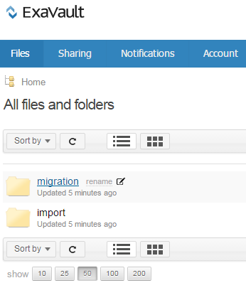
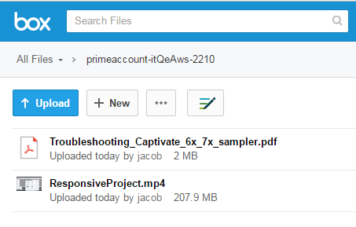
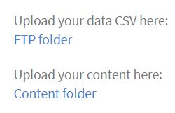
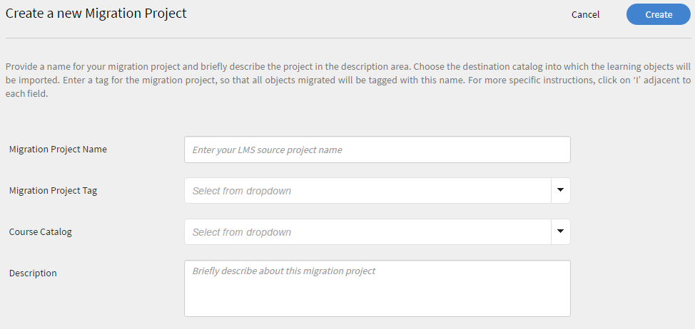
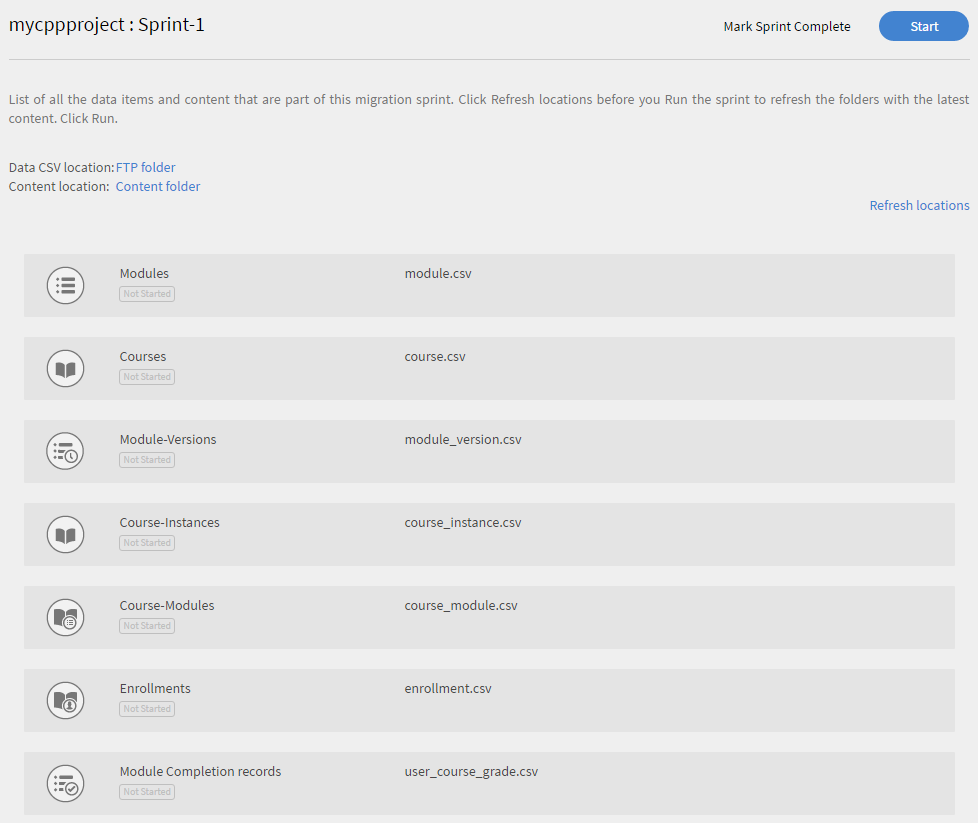
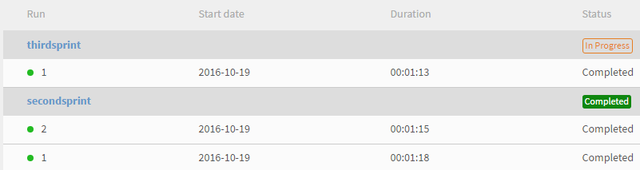

# 遷移手冊

為想要將現有 LMS 遷移至 Learning Manager LMS 的整合管理員參考手冊

<!-- ## Overview {#overview} -->

## 使用情境 {#usagescenario}

一般而言，大型企業自有的學習管理系統（LMS）或任何廠商都會提供舊有的學習管理系統（Learning Management Systems）。 LMS 包含您的企業培訓內容與培訓資料。 作為企業，當您購買學習管理器時，可能會想將現有的 LMS 內容與資料遷移至 Learning Manager，這樣您就能利用現代且直覺式的學習管理系統（LMS）優勢，同時不損失組織的舊有資料。

Learning Manager 提供必要的工具與規格，使組織的整合管理員能設定並執行遷移任務。

截至目前，組織管理員可透過聯絡 Adobe 支援團隊存取 Learning Manager 的遷移功能。 要啟用您的帳戶遷移功能，您可以聯繫 Adobe Learning Manager 客服團隊。

## 遷移過程 {#apidescription}

遷移的先決條件、遷移過程中的關鍵步驟、遷移衝刺、規格、資料與內容遷移步驟，皆在本節中說明如下：

### 重要移民警示

你應該知道遷移時間很大程度上取決於資料的品質和大小。 若在入職期間需要遷移，請提前規劃此活動，並與 Adobe Learning Manager 入職團隊密切合作，避免延誤。

### 先決條件 {#prerequisites}

學習管理團隊期望貴組織的整合管理員在進行遷移流程前完成以下任務：

* 整合管理員會從現有的 LMS 中擷取資料與內容，並將資料轉換為 Learning Manager 定義的檔案格式。
* Learning Manager 不支援遷移過程中匯入使用者，並期望組織透過連接器匯入使用者。 Adobe 系統期望這些連接器在遷移前已設定好。 更多資訊請參閱 [學習管理工具](connectors.md) 連結說明。

Learning Manager 建議管理員在將資料與內容遷移至 Learning Manager 生產環境前，先在試用帳號中嘗試遷移流程。

### 遷移流程的關鍵步驟 {#keystepsofmigrationprocess}

將內容與資料從現有 LMS 遷移至 Learning Manager 的關鍵步驟如下：

1. 整合管理員或合作夥伴會評估需要遷移的現有 LMS 資料與內容。
1. 整合管理員評估學習管理員所提供的資料與內容擷取工具與規格。
1. 整合管理員負責撰寫程式碼或手動工作，根據舊 LMS 的功能，將訓練資料與內容匯出。
1. 一旦訓練資料與內容可用，整合管理員會分析並映射資料與內容，以符合學習管理工具的遷移規範。
1. 整合管理員使用 Learning Manager 提供的工具，依以下順序進行遷移：

   1. 將學習者轉接到 Learning Manager
   1. 將培訓內容轉移到 Learning Manager 並
   1. 最後，將訓練資料轉移到 Learning Manager。

組織可以開始使用 Learning Manager LMS 以及舊有內容。

### 遷移物件的範圍 {#scopeofmigrationobjects}

你只能遷移以下學習對象的內容：

* 模組
* 徽章
* 河道
* 模組版本
* 球場實例
* 課程模組
* 技能
* 技術水準
* 技能課程
* 認證
* 認證課程
* 認證提交
* 學習計畫
* 學習課程
* 學習程式實例
* 學習程式課程實例
* 就業補助
* 工作輔助版本
* 職業輔助課程
* 職業輔助技能
* 招生情況
* 認證註冊
* 學習課程註冊
* 就業援助登記
* 使用者課程成績

### 遷移的關鍵概念 {#keyconceptsofmigration}

以下簡要說明了學習經理遷移流程的一些關鍵概念，方便您快速參考：

**遷移計畫**

在學習管理器中，遷移專案包含一個或多個衝刺。 你也可以為你的帳號設定多個遷移專案。 你在 Learning Manager 中的遷移流程，從建立一個遷移專案開始。

**短距離賽**

在 Learning Manager 的遷移流程中，Sprint 定義了一組你選擇從現有 LMS 遷移的遷移項目。 遷移項目可以是課程模組、學習者紀錄，或是一組課程。 你可以在一個衝刺中同時擁有多個學習資料項目。 你可以在每個衝刺中執行遷移工作。

**短距離賽**

Sprint Run 是啟動 Sprint 遷移工作的過程。 你可以在跑步過程中隨時停止衝刺跑。

**衝刺重播**

遷移衝刺完成後，你可以在任何時間點重新執行。 這種重複執行或重執行衝刺的情況，發生在你想將資料附加到衝刺項目中並再次遷移到應用程式，或修正 CSV 中的錯誤時。

**CSV 規範**

Learning Manager 提供一套 [標準的 CSV 規範](migration-manual.md#main-pars_header_140933605)。 最佳做法是在開始遷移流程前，先仔細閱讀這些 CSV 規範。 您組織的整合管理員可以分析現有的資料格式，並將其映射到學習管理員提供的 CSV 範本項目。

**遷移專案標籤**

Adobe Systems 建議你在學習管理軟體中使用一組關鍵字作為標籤，以便輕鬆識別你的遷移專案。 這些標籤讓你能在學習管理軟體的內部任何時刻識別你的專案。

**無內容模組**

學習管理員允許你上傳沒有內容的模組。 Adobe Systems 將其視為 Learning Manager 中的一個無內容模組。 如果你想從現有 LMS 遷移部分舊有資料，且不需要任何內容，你可以上傳 module_version.csv 檔而不使用網址參考。

## CSV 規範與範例 CSV {#csv}

以下是您可以用來與現有 LMS 遷移資料對應的標準 CSV 規格。 點擊 csv-specifications 和 sample-csvs 下載壓縮檔。 下載的csv-specifications.zip包含七個Excel表格檔案。 這些 Excel 表格檔案是帶有說明的規格，讓你了解如何填寫.csv檔案。 對應的.csv檔案應以這些.xlsx檔案中所解釋的格式，包含每個欄位的資料。

<table border="1" cellspacing="0" cellpadding="0" width="100%">
 <tbody>
  <tr>
   <th>
    <p><b>Sl.no</b></p></th>
   <th>
    <p><b>檔案名稱</b></p></th>
   <th>
    <p><b>內容說明</b></p></th>
   <th>
    <p>註釋</p></th>
  </tr>
  <tr>
   <td>
    <p>1</p></td>
   <td>
    <p>module.xlsx</p></td>
   <td>
    <p>module.csv的元資料</p></td>
   <td> </td>
  </tr>
  <tr>
   <td>
    <p>2</p></td>
   <td>
    <p>badge.xlsx</p></td>
   <td>
    <p>badge.xlsx的元資料</p></td>
   <td> </td>
  </tr>
  <tr>
   <td>
    <p>3</p></td>
   <td>
    <p>course.xlsx</p></td>
   <td>
    <p>course.csv 的元資料</p></td>
   <td>
    <p>在遷移後，請標明一位作者姓名，因為遷移後申請表中有時會顯示多位作者姓名。 </p></td>
  </tr>
  <tr>
   <td>
    <p>4</p></td>
   <td>
    <p>module_version.xlsx </p></td>
   <td>
    <p>module_version.csv 的元資料</p></td>
   <td>
    <p>請確保你提供 Box 帳號資料夾的網址路徑，該資料夾是你上傳內容的來源。 </p></td>
  </tr>
  <tr>
   <td>
    <p>5</p></td>
   <td>
    <p>course_instance.xlsx</p></td>
   <td>
    <p>course_instance.csv的元資料 </p></td>
   <td> </td>
  </tr>
  <tr>
   <td>
    <p>6</p></td>
   <td>
    <p>session.xlsx</p></td>
   <td>
    <p>session.csv的元資料</p></td>
   <td>
    <p>確保 session csv 中的每個項目至少與一個教室/虛擬教室模組相關聯</p></td>
  </tr>
  <tr>
   <td>
    <p>7</p></td>
   <td>
    <p>course_module.xlsx</p></td>
   <td>
    <p>course_module.csv 的元資料</p></td>
   <td> </td>
  </tr>
  <tr>
   <td>
    <p>8</p></td>
   <td>
    <p>skill.xlsx</p></td>
   <td>
    <p>skill.csv 的元資料</p></td>
   <td> </td>
  </tr>
  <tr>
   <td>
    <p>9</p></td>
   <td>
    <p>skill_level.xlsx</p></td>
   <td>
    <p>skill_level.csv 的元資料</p></td>
   <td> </td>
  </tr>
  <tr>
   <td>
    <p>10</p></td>
   <td>
    <p>skill_course.xlsx</p></td>
   <td>
    <p>skill_course.csv的元資料</p></td>
   <td> </td>
  </tr>
  <tr>
   <td>
    <p>11</p></td>
   <td>
    <p>certification.xlsx</p></td>
   <td>
    <p>Certification.csv 的元資料</p></td>
   <td> </td>
  </tr>
  <tr>
   <td>
    <p>12</p></td>
   <td>
    <p>certification_course.xlsx</p></td>
   <td>
    <p>certification_course.csv的元資料</p></td>
   <td> </td>
  </tr>
  <tr>
   <td>
    <p>13</p></td>
   <td>
    <p>certification_commit.xlsx</p></td>
   <td>
    <p>certification_commit.csv 的元資料</p></td>
   <td> </td>
  </tr>
  <tr>
   <td>
    <p>14</p></td>
   <td>
    <p>learning_program.xlsx</p></td>
   <td>
    <p>learning_program.csv的元資料</p></td>
   <td> </td>
  </tr>
  <tr>
   <td>
    <p>15</p></td>
   <td>
    <p>learning_program_course.xls </p></td>
   <td>
    <p>learning_program_course.csv 的元資料 </p></td>
   <td> </td>
  </tr>
  <tr>
   <td>
    <p>16</p></td>
   <td>
    <p>learning_program_instance.xlsx </p></td>
   <td>
    <p>learning_program_instance.csv 的元資料</p></td>
   <td> </td>
  </tr>
  <tr>
   <td>
    <p>17</p></td>
   <td>
    <p>learning_program_instance_course_instance.xlsx </p></td>
   <td>
    <p>learning_program_instance_course_instance.csv 的元資料</p></td>
   <td> </td>
  </tr>
  <tr>
   <td>
    <p>18</p></td>
   <td>
    <p>job_aid.xlsx</p></td>
   <td>
    <p>job_aid.csv 的元資料</p></td>
   <td>
    <p>每個遷移的job_aid都必須有一個或多個job_aid版本。</p></td>
  </tr>
  <tr>
   <td>
    <p>19</p></td>
   <td>
    <p>Job_aid_version.xlsx</p></td>
   <td>
    <p>job_aid_version.csv的元資料</p></td>
   <td> </td>
  </tr>
  <tr>
   <td>
    <p>20</p></td>
   <td>
    <p>job_aid_course.xlsx</p></td>
   <td>
    <p>job_aid_course.csv 的元資料</p></td>
   <td> </td>
  </tr>
  <tr>
   <td>
    <p>21</p></td>
   <td>
    <p>job_aid_skills.xlsx</p></td>
   <td>
    <p>job_aid_skills.csv的元資料</p></td>
   <td> </td>
  </tr>
  <tr>
   <td>
    <p>22</p></td>
   <td>
    <p>enrollments.xlsx</p></td>
   <td>
    <p>enrollments.csv 的元資料</p></td>
   <td> </td>
  </tr>
  <tr>
   <td>
    <p>23</p></td>
   <td>
    <p>certification_enrollement.xlsx</p></td>
   <td>
    <p>certification_enrollement.csv 的元資料</p></td>
   <td> </td>
  </tr>
  <tr>
   <td>
    <p>24</p></td>
   <td>
    <p>learning_program_enrollment.xlsx</p></td>
   <td>
    <p>learning_program_enrollment.csv的元資料<br><br></p></td>
   <td> </td>
  </tr>
  <tr>
   <td>
    <p>25</p></td>
   <td>
    <p>job_aid_enrollment.xlsx</p></td>
   <td>
    <p>job_aid_enrollment.csv 的元資料</p></td>
   <td> </td>
  </tr>
  <tr>
   <td>
    <p>26</p></td>
   <td>
    <p>user_course_grade.xlsx</p></td>
   <td>
    <p><br>
      user_course_grade.csv的元資料</p></td>
   <td>
    <p>即使非強制，也要在 .csv 檔案中提供所需的學習者紀錄資料。 沒有這些資訊，即使.csv被處理進行遷移，學習管理員應用程式也可能無法反映任何資料。 sample-csvs.zip檔案包含七個.csv檔案，命名規則與上述相似。</p></td>
  </tr>
  <tr>
   <td>
    <p>27</p></td>
   <td>
    <p>user_skill.xlsx</p></td>
   <td>
    <p><br>
      user_skill.csv的元資料</p></td>
   <td>
    <p> </p></td>
  </tr>
 </tbody>
</table>

Learning Manager 僅支援 UTF 8 和 32 位元格式的日期與時間值。 如果您在 CSV 檔案中提及日期，且日期超出範圍為 2038-07-17T08:53:21.000Z 或 1980-04-17T08:13:25.322Z，遷移時可能會出錯。

* [sample-csvs.zip](assets/sample-csvs.zip)
* [csv_specifications.zip](assets/csv-specifications.zip)

你在匯入時需要注意以下對 CSV 檔案的依賴性：

* module_version.csv取決於module.csv
* course_instance.csv取決於course.csv
* course_module.csv依賴於course.csv、module.csv和module_version.csv
* course_instance.csv取決於course.csv
* session.csv取決於course.csv和module.csv
* enrollment.csv取決於course.csv
* user_course_grade.csv取決於course.csv和module.csv
* skill_course.csv取決於course.csv
* skill_level.csv取決於skill.csv
* learning_program_instance.csv取決於learning_program和learning_program_course.csv
* learning_program_course.csv取決於learning_program.csv
* learning_program_enrollment.csv取決於learning_program和learning_program_instance.csv
* learning_program_instance_course_instance.csv取決於learning_program.csv、learning_program_instance.csv和course_instance.csv
* certification_course.csv取決於certification.csv和course.csv
* certification_commit.csv取決於certification.csv和certification_course.csv
* certification_enrollment.csv取決於certification.csv、certification_course.csv和certification_enrollment.csv

### 學習程式課程順序於遷移 CSV 中

在早期版本的遷移規範中，learning_program_course.csv 檔案包含一個排序欄位，暗示你可以在遷移過程中控制學習程式內課程的順序。

Adobe Learning Manager 不再使用此欄位。 學習程式中的課程順序無法透過遷移 CSV 來控制，系統也會忽略順序欄位中提供的任何值，即使你將 orderEnforced **設**&#x200B;為 true。

為避免混淆，官方 CSV 規範中已移除訂單欄位。 如果你還有現有的腳本或工具能產生這欄，你可以放心地把它丟掉;它不影響學習程式的建立或顯示方式。

## 遷移程序 {#migrationprocedure}

在開始遷移程序前，請注意以下幾點非常重要：

* 同一帳戶在任何時間點只能有一個遷移專案處於活躍狀態。 在專案中，任何時間點只能有一個衝刺同時啟用。
* 你無法撤銷已經在遷移過程中的 Run。 不過，你可以利用 Learning Manager 每個功能中現有的刪除選項來撤銷任何資料或內容遷移。
* 一旦遷移計畫開始，就會進入「正在遷移」的狀態。 遷移期間，除了整合管理員角色外，無法登入學習管理員。

### 建立 FTP 與 Box 帳號 {#creatingftpandboxaccounts}

規劃您的遷移專案非常重要。 建議你將專案拆分成多個衝刺，並清楚指出你想在每個衝刺中遷移的內容。 甚至可以在每個衝刺後做一些驗證，這樣可以對該衝刺中遷移的資料有信心，而不是在專案結束時一次性進行一次大型驗證。 在你開始使用 Sprint 作為遷移專案的一部分之前，你需要分別在 FTP 和 Box 伺服器上傳資料和內容的 CSV 檔案。 如果你沒有自訂 FTP 和 Box 的帳號，也可以自行建立。

<!--**Create FTP account**-->

<!--
Click **[!UICONTROL Request for CSV FTP folder]**. A pop-up dialog appears prompting you to enter your e-mail id. Go through online instructions and create an FTP account. As soon as you create your account, you can view your migration project and sprint project folders in FTP. 

A sample snapshot of project files and folder of FTP is shown below for your reference. 
-->

<!---->

**建立 Box 帳號**

建立內容上傳資料夾的過程與 FTP 資料夾建立類似。 在左側窗格點選「遷移」，然後在頁面底部點擊「請求」以取得出現的內容上傳資料夾。

你會收到 Box 寄來的電子郵件，裡面有連結到共用資料夾。 如果你沒有盒子帳號，請點擊註冊並建立帳號。 登入指令會寄送到整合管理員的電子郵件 ID。

**將資料（.csv檔案）上傳到 FTP 資料夾或 Box 資料夾**

建立 FTP 或 Box 帳號是建立遷移專案前的先決條件。 在這個階段，你可以在 Learning Manager 建立遷移專案和衝刺應用程式。  請參考 **本頁的資料與內容遷移程序** 章節以建立遷移專案。

在 FTP 或 Box 帳號中，點選你的專案資料夾名稱，然後點選 Sprint 名稱。 在 sprint 資料夾裡，你可以上傳你打算遷移的 .csv 資料檔案。 要上傳，請在 FTP 或 Box 伺服器上方點擊「上傳檔案」按鈕，然後將.csv檔案放入。 以下為上傳至 FTP 後的範例快照，供參考。

<!---->

你可以回到 Learning Manager 遷移專案，點擊 **[!UICONTROL Refresh]** 並查看遷移 Sprint 中列出的所有 .csv 資料型態。

**將訓練內容上傳至內容資料夾**

將你現有LMS的培訓內容上傳到你的Box帳號。 如果你已經建立了遷移專案和衝刺，Box 帳號會自動填入遷移專案和衝刺名稱。 你可以在同一路徑上傳內容。 請參考 **本頁的資料與內容遷移程序** 章節以建立遷移專案。

你可以拖放內容檔案，或是從桌面點擊 **[!UICONTROL Upload]** 並選取檔案。 如果你的內容檔案大小很大，上傳檔案可能會有些延遲。 根據檔案大小，上傳到你的 Box 帳號所需的時間也會有所不同。

以下是上傳內容後 Box 帳號的範例快照，供參考參考：



*Box 帳戶中的檔案*

檔案上傳到 Box 帳號後，請確保在檔案中註明這個 Box 內容檔案的相對路徑module_version.csv。 這是你必須指示模組內容路徑的必備步驟。

一旦你登入 FTP 和 Box 伺服器並上傳內容，CSV 位置就會如下方 Learning Manager 快照所示顯示。



*Box 帳戶中的 CSV 位置*

## 替代與等效車輛的遷移

### 概觀

本主題概述基於 CSV 的資料模型及遷移行為，以在系統中引入學習對象（LO）等價性。

### 現有 CSV 檔案（上下文）

這些 CSV 已經存在於平台上，並提供主要的學習對象、模組與完成上下文（非詳盡清單）：

* user_course_grade.csv
* 模組版本
* module.csv
* course.csv
* course_module.csv

這些檔案仍可原樣使用，且不會因新等價功能而改變，但它們構成了等價運作的基礎資料。

### 替代 CSV 檔案

新增兩種 CSV 以支援 LO 替代關係及相關使用者補全功能。

#### 1. equivalence_relationships.csv

定義來源與目標學習對象（LO）之間的等價映射，LO可以是課程或學習路徑（LP）。

**架構：**

* 資料來源
* sourceloType（課程/LP）
* 目標識別
* 目標Lotype（課程/LP）
* 日期已創建
* 關係狀態（活躍/刪除）
* 日期已修改

**目的：**

* 代表兩個 LO 之間的等價關係。
* relationshipStatus 控制該關係目前是處於活躍狀態還是已刪除。
* dateCreated 與 dateModified 支援審核。

#### equivalence_user_completion.csv

擷取與equivalence_relationships.csv定義關係對齊的等效LO的使用者層級完成資訊。

**架構：**

* 使用者ID
* 資料來源
* sourceloType（課程/LP）
* 目標識別
* 目標Lotype（課程/LP）
* 日期完成

**目的：**

* 明確記錄應根據等價關係及現有來源 LO 補全推斷的 **目標 LO 補全** 。
* 作為 **與遷移等效資料相關的使用者完成資料的權威來源** 。

### 遷移規則與行為語意

#### &#x200B;1. 新等效 CSV 不支援後裝

* 所有與等價性相關的資料必須透過遷移方式帶入。
* 系統不支援以下情境：
   * LO 資料（課程/LP）是透過使用者介面建立的，且
   * 等價關係之後僅透過 CSV 匯入。

這意味著：

* 支援的模式是：LO 定義及其等價關係被管理為連貫遷移流程的一部分。
* 不支援 UI 創建的 LO 僅以 CSV 的等效性來後期調整的混合流程。

#### &#x200B;2. 遷移關係後不會有追溯性完成或未完成

當透過遷移（即經由 equivalence_relationships.csv）引入等價關係時：

* 系統不會僅基於該關係進行追溯性完成或未完成計算。
* 相反地，所有必要的用戶完成資料必須透過equivalence_user_completion.csv明確提供。

**暗示：**

* equivalence_user_completion.csv 是任何應在遷移時因等價而應被識別的完備的唯一真實來源。
* 平台不會試圖從現有課程進度推斷或補足這些完成課程。

#### &#x200B;3. 遷移後新完備的行為

如果：

* 透過遷移建立了等價關係，且
* 學習者之後會完成來源 LO（遷移後），

然後：

* 系統會為目標 LO 觸發交替補全，也就是說，對於新的源補全，等價行為會恢復正常。

**主要區別：**

* **遷移時：** 完成必須透過equivalence_user_completion.csv。
* **遷移後：** 原生執行時邏輯會在原始 LO 新完成時處理交替補全。

#### &#x200B;4. 對高階學習物件的影響

透過 CSV 輸入的替代補全（即透過 equivalence_user_completion.csv）會觸發高階 LO 的重新計算。

高階LO可能包括：

* 學習路徑

**技術層面：**

* equivalence_user_completion.csv 的匯入並非「靜默」操作：它啟動了與正常執行時完成相同的重新計算/整合邏輯。
* 整合或排程此遷移的系統必須規劃重計算的負載與時機。

## 替代機的 Webhook

當學習者透過替代註冊或關聯完成課程時，Adobe Learning Manager 會產生一個專用的 webhook 事件，與標準課程完成的 webhook 不同，讓整合能為替代完成套用不同的處理邏輯。 Webhook 事件也會產生，用於追溯完成與不完成，涵蓋課程狀態的歷史變更，包括由關係更新所驅動的，確保外部系統與學習者當前完成狀態同步。

欲了解替代機組的 webhooks 資訊，請參閱 [替代機組的 Webhook](/help/migrated/integration-admin/feature-summary/webhooks.md#webhooks-for-alternates)

## 資料與內容遷移程序 {#dataandcontentmigrationprocedure}

將企業LMS資料與內容遷移至Learning Manager的流程說明如下：

在開始遷移前，先完成遷移流程的先決條件。 請參閱 [本頁的 CSV 規範與範例 CSV](migration-manual.md#main-pars_header_140933605) 章節，並準備 CSV 進行資料與內容遷移。

1. 以整合管理員身份登入學習管理員應用程式，並點擊 **[!UICONTROL Migration]** 左側窗格。

   遷移專案首頁已顯示。 如果您的組織已經建立了遷移專案，您可以在此頁面查看所有遷移專案的清單。

1. 點擊 **[!UICONTROL New]** 頁面右上角以建立遷移專案。 或者，你也可以點擊 **[!UICONTROL Create a migration project]** 頁面上的連結來建立遷移專案。 「建立遷移專案」頁面會出現。

   如果你還沒建立 FTP 資料夾，系統會提示你在帳號中建立 FTP 資料夾。 這是你開始建立遷移專案前必須做的步驟。

   
   *建立 FTP 資料夾*

   提供遷移專案的名稱、專案標籤、課程目錄及說明。 點擊 **[!UICONTROL Create]**。

   您的遷移資料項目會使用此遷移專案標籤來識別。 如果你沒有特定的課程目錄，請從下拉選單選擇預設課程目錄。 你透過遷移專案遷移的所有課程，都會包含在這個階段選擇的課程目錄中。 如果你沒有選擇任何目錄，所有遷移的課程都會成為預設目錄的一部分。

1. Sprint 設定頁面如以下快照所示。 你需要在遷移專案中建立一個衝刺。 選擇衝刺名稱並簡要描述衝刺。 如果你想將內容遷移作為這個衝刺的一部分，可以選擇「是」。 點擊 **[!UICONTROL Next]**。

   
   *衝刺遷移*

   選擇標題為 **「使用者自上次執行**&#x200B;以來已新增或修改」的勾選框，以同步使用者清單與學習管理員應用程式。 如果你是將內容和資料遷移到 Learning Manager 應用程式，這可能就不需要了。 但如果你之前的 sprint 遷移和最新的 sprint 遷移之間有時間延遲，那麼最佳做法是選擇同步使用者清單。 此步驟可讓學習管理工具資料庫與你的 LMS 使用者同步。

   此同步步驟建議在enrollment.csv與user_course_grade.csv遷移時使用。 此步驟使學習管理資料庫與您的遷移資料庫同步，並確保所有在 Sprint 中需遷移的使用者皆可在遷移資料庫中使用。

1. 你可以用上傳的資料和內容開始 Sprint 遷移。 在開始 Sprint Run 前點擊 **[!UICONTROL Refresh]** 連結，將 FTP 和 Content 資料夾同步到 Learning Manager 應用程式。

   
   *啟動衝刺遷移*

   點擊 **[!UICONTROL Start]** 頁面右上角。 你可以在 Sprint 遷移過程中的任何時候點擊 **[!UICONTROL Stop]** 以中止遷移。

   遷移狀態會顯示在每個衝刺資料項目和內容上。 檢查遷移衝刺執行中成功與失敗項目的數量。

   如果你要上傳模組內容，請確保內容路徑資料夾在module_version.csv中提供。 若漏此步驟，遷移過程中可能會出錯。 例如，如果你要上傳自學模組內容（如影片），你需要在 module_version.csv 中指定相對的 Box URL 路徑。 對於活動模組內容，你可以指定網址名稱。

   以下提供進度對話的範例快照供參考。 如快照所示，您可以查看每個遷移資料項目處理的紀錄數量，以及成功與失敗項目的狀態。 點擊「下載錯誤紀錄」以下載並查看錯誤日誌。 你可以在 CSV 裡修正問題，然後再用 FTP 上傳。

   
   *查看衝刺進度*

   如果你想查看遷移專案的所有衝刺清單，請點選左側窗格的衝刺清單。 你可以查看所有衝刺清單、每個衝刺執行的跑數、開始日期、持續時間及完成狀態，如下方範例快照所示。

   
   *查看衝刺列表*

1. 上傳最新更新的 CSV 後，你可以點擊頁面右上角的「ReRun」。 Rerun 再次處理所有資料項目，忽略那些沒有變動的項目。 當你對 sprint 中資料項目的遷移感到滿意後，可以點擊頁面頂端的按鈕標記春季遷移完成。 你可以之後再用更多資料項目開始新的衝刺。 一旦衝刺被標記為完成，就不能再重跑一次。 同樣地，在遷移專案中，你可以有任意數量的衝刺。 當您對所有 Sprint 的遷移狀態感到滿意後，可以在 Sprint 清單頁面點擊 **「標記專案完成** 」連結，將遷移專案標記為完成。

   在標記遷移專案為完成前，你必須確保專案的所有衝刺都已完成。 一旦你標記遷移專案為完成，就無法回頭在該專案中建立任何衝刺或修改該專案。 你必須建立另一個遷移專案，並加入衝刺。

## 遷移驗證 {#registration}

在從組織的舊有學習管理系統遷移學習資料與內容後，您可以利用各種學習物件功能驗證匯入的資料與內容。 例如，你可以以管理員身份登入學習管理應用程式，並驗證匯入模組與課程資料及內容的可用性。

## 使用 API 進行遷移

Adobe Learning Manager （ALM） 提供遷移功能，可從外部系統擷取資料或內容，主要用於從舊有 LMS 平台遷移。

然而，有些組織可能要求此流程必須按固定時間表（例如每晚或每週）進行，而非一次性匯入。

舉例來說，你會看到一個虛構的客戶（NovaFX）如何與虛構的外部供應商（SquareCorp）整合，並自動化排程遷移。 整合允許：

* SquareCorp 課程會在 ALM 中以學習物件的形式出現，供 NovaFX 學習者使用。
* NovaFX 直接在 ALM 中追蹤 SquareCorp 主辦課程的學習進度。

### 整合需求

SquareCorp 必須提供：

* 課程元資料資訊：一個 API 用於分享 NovaFX 可存取的課程元資料。
* 進度資料資訊：一個 API，定期分享學習者的進度與完成度資訊。

### 主要定義

* **活躍專案：** 若專案為「進行中」或「初始化」，即為活躍。
* **主動衝刺：** 若衝刺為「進行中」或「初始化」，即為活躍。

### 自動化衝刺執行

建立一個應用程式或腳本，依照排程執行以下任務：

1. 從 SquareCorp 取得課程元資料、使用者註冊數據及學習者成績。
2. 產生 CSV 檔案。
3. 把檔案上傳到 Box 或 FTP。
4. 用遷移 API 觸發衝刺。

### API 細節

#### 開始遷移跑

**Endpoint：** POST /primeapi/v2/bulkimport/startrun

參數：

* **lockaccount（布林值）：** 參數決定執行開始時是否鎖定帳戶。 預設情況下，它被設為 false。 建議用戶避免使用此參數，除非有正當理由鎖定帳號。
* **catalogid（整數）：** 此參數允許你在遷移時選擇目的地目錄。 通常在建立遷移專案時設定，但可針對個別執行進行調整。 當目錄編號變更時，未來運行中新增的學習物件會被放入最近選擇的目錄中。 若需回溯遷移專案建立時所選目錄，也必須明確指定。
* **migrationProjectId（整數）：** 當帳號啟用多個啟用 API 的執行時，觸發特定遷移專案所需的參數。

#### 檢查是否能開始同步

確保內容能同步到 sprint 資料夾。 除非此 API 成功回傳回應物件，否則請勿將內容或元資料檔案複製至 FTP 資料夾。

**端點：** GET /primeapi/v2/bulkimport/cansync

參數：

* **遷移專案識別碼（整數）：** 當帳號啟用多次啟用 API 執行時，此參數是觸發特定遷移專案所必需的。

<b>回應成功</b>

```
{  
    "status": "OK",  
    "title": "BULKIMPORT_CAN_SYNC_NOW",  
    "source": {  
        "info": "Yes"  
    }  
} 
```

<b>回應成功</b>

```
{ 
    "status": "BAD_REQUEST", 
    "title": "BULKIMPORT_ERROR_CANNOT_SYNC", 
    "source": { 
        "info": "Error, No active projects" 
    } 
} 
```

<b>可能的 API 回應</b>

| 動作 | 類型 | 訊息 |
| ------------------------------------- | ------- | ------------------------------------------------------------------------------------- |
| BULKIMPORT_RUN_INITIATED_SUCCESSFULLY | 成功 | 運行成功啟動 |
| BULKIMPORT_ERROR_CANNOT_INITATE_RUN | 錯誤 | 正在進行中 |
| BULKIMPORT_ERROR_CANNOT_INITATE_RUN | 錯誤 | 目前有多個正在進行的專案 |
| BULKIMPORT_ERROR_CANNOT_INITATE_RUN | 錯誤 | 短跑不只一個 |
| BULKIMPORT_ERROR_CANNOT_INITATE_RUN | 錯誤 | 無活躍計畫 |
| BULKIMPORT_ERROR_CANNOT_INITATE_RUN | 錯誤 | 沒有主動衝刺 |
| BULKIMPORT_ERROR_CANNOT_INITATE_RUN | 錯誤 | 所提供的目錄要麼不是有效的 ID，要麼不屬於主帳號 |
| BULKIMPORT_CAN_SYNC_NOW | 資訊 | 現在可以同步了 |
| BULKIMPORT_ERROR_CANNOT_SYNC | 錯誤 | 正在進行中 |
| BULKIMPORT_ERROR_CANNOT_SYNC | 錯誤 | 目前有多個正在進行的專案 |
| BULKIMPORT_ERROR_CANNOT_SYNC | 錯誤 | 短跑不只一個 |
| BULKIMPORT_ERROR_CANNOT_SYNC | 錯誤 | 無活躍計畫 |
| BULKIMPORT_ERROR_CANNOT_SYNC | 錯誤 | 沒有主動衝刺 |
| BULKIMPORT_ERROR_CANNOT_SYNC | 錯誤 | 資料夾中沒有有效的檔案 |

### 樣本積分流

1. 檢查 cansync API。
2. 產生並上傳 CSV 檔案。
3. 用 startrun API 觸發衝刺。
4. 監控回應並處理錯誤。

### 限制

遷移 API 不提供在 sprint 執行後直接檢查輸出 CSV 檔案中遷移相關錯誤的功能。 不過，這些錯誤可在 sprint 執行後，透過存取整合管理員使用者介面，在 CSV 檔案中以列形式檢視。

### 透過 API 進行遷移驗證

遷移 API `runStatus`允許整合管理員追蹤透過 API 觸發的遷移進度。

`runStatus` API 也提供直接連結，讓完成的執行時下載 CSV 格式的錯誤日誌。下載連結會持續七天，日誌則保留一個月。

**樣本捲度**

**終點**

```
GET /bulkimport/runStatus
```

**參數**

* **migrationProjectId**：（必填）。 遷移專案的唯一識別碼。 遷移專案用於將資料與內容從現有的學習管理系統（LMS）轉移至 Adobe Learning Manager。 每個遷移專案可包含多個衝刺，這些衝刺是較小的遷移任務單元。

* **sprintId**：（必填）。 遷移專案中衝刺的唯一識別碼。 衝刺是遷移任務的子集，包含特定學習項目（例如課程、模組、學習者紀錄）需從現有 LMS 遷移到 Adobe Learning Manager。 每個衝刺都可以獨立執行，允許分階段遷移。

* **sprintRunId**：（必需）。 一種用於追蹤遷移專案中特定衝刺執行的唯一識別碼。 它與 sprint 中定義項目的實際遷移流程相關聯。 sprintRunId 有助於監控、排除故障並管理遷移作業。

**回應**

```
{
  "sprintId": 2510080,
  "sprintRunId": 2740845,
  "migrationProjectId": 2509173,
  "startTime": 1746524711052,
  "endTime": 1746524711052,
  [
    {
      "id": 2609923,
      "lastHeartbeatTime": 1746524711052,
      "objectName": "content",
      "jobState": "COMPLETED",
      "errorCsvLink": "",
      "errorLogLink": "migration/5830/2509173/2510080/2740845/content_err.csv",
      "sequenceNumber": 1
    },
    {
      "id": 2609922,
      "lastHeartbeatTime": 1746524713577,
      "objectName": "course",
      "jobState": "WAITING_IN_QUEUE",
      "errorCsvLink": "",
      "errorLogLink": null,
      "sequenceNumber": 2
    }
  ]
}
```

此外， `startRun` API 回應現在包含遷移專案 ID、衝刺 ID 和衝刺執行 ID，這些都是查詢新狀態端點所必需的。

```
curl -X GET --header 'Accept: text/html' 'https://learningmanager.adobe.com/primeapi/v2/bulkimport/runStatus?migrationProjectId=001&sprintId=10001&sprintRunId=7'
```

產生以下回應。 回應內容包括：

* `migrationId`
* `sprintId`
* `sprintRunId`

**回應**

```
{
  "status": "OK",
  "title": "BULKIMPORT_RUN_INITIATED_SUCCESSFULLY",
  "source": {
    "info": "Success",
    "migrationInfo": {
      "migrationProjectId": "001",
      "sprintId": "10001",
      "sprintRunId": "7"
    }
  }
}
```

## 遷移中的改裝 {#retrofittinginmigration}

此整合功能允許您將舊有學習管理系統的學習物件歷史資料後，調整到在學習管理員中建立的活躍課程中。

以下是您可以用來與現有 LMS 遷移資料對應的標準 CSV 規格。 點擊 csv-specifications 和 sample-csvs 下載壓縮檔。 下載的csv-specifications.zip包含四個Excel表格檔案。 這些 Excel 表格檔案是帶有說明的規格，讓你了解如何填寫.csv檔案。 對應的.csv檔案應以這些.xlsx檔案中所解釋的格式，包含每個欄位的資料。

1-enrollment.xlsx-包含retrofit_enrollment.csv檔案所需元資料的描述。

2-certification_enrollment.xlsx-包含retrofit_certification_enrollment.csv檔案所需元資料的描述。

3-learning_program_enrollment.xlsx-包含retrofit_learning_program_enrollment.csv檔案所需元資料的描述。

4-user_course_grades.xlsx-包含retrofit_user_course_grades.csv檔案所需元資料的描述。
[csv-specifications.zip](assets/csv-specifications.zip)

>[!NOTE]
>
>UUID（通用唯一 ID）也是遷移 csv 中的一個欄位。


## 遷移問題故障排除 {#troubleshootingmigrationissues}

請參閱本文[](../../kb/troubleshooting-migration.md)，了解整合管理員在將資料與內容從現有 LMS 遷移至 Learning Manager 應用程式時所遇到問題的解決方法。

## 使用者管理技巧 {#usermanagement}

在這個主題中，你可以找到一些建議，幫助你了解 Learning Manager 中使用者是如何被考慮和管理的。 這些概念能幫助你更好地管理使用者，同時使用 CSV 匯入、連接器以及 Learning Manager 的遷移功能。

## 學習管理器 ID {#captivateprimeids}

學習管理員為使用者提供兩種獨特的 ID：

* 電子郵件識別碼
* UUID（通用唯一ID）

Learning Manager 支援 UUID，為組織在管理使用者帳號時提供彈性。 作為管理員，如果你在某個帳號裡有使用者的 UUID，你可以修改該帳號使用者的電子郵件 ID。

**組織中 UUID 的使用情境**

假設一個情境，員工A以承包商身份加入一家名為Learning Manager的公司。 在合約期間，Learning Manager 公司可能不會提供公司```A@example.com```電子郵件 ID，取而代之的是，公司可能只考慮員工的個人電子郵件帳號，例如。 ```A@gmail.com```合約期滿六個月後，如果同一位員工A以全職員工身份加入學習經理，學習經理可能會想將他的電子郵件ID改為公司電子郵件地址： ```A@example.com```。

擁有使用者帳號的 UUID 存取權，將有利於上述情況下的公司學習經理。 Learning Manager 公司可以輕鬆地將員工 A 的個人電子郵件 ID 替換成官方電子郵件 ID。 與此帳戶相關的員工紀錄不受此變更影響。

## 單一使用者識別 {#singleuseridentification}

學習管理員會識別並記住單一使用者的加入方式，例如透過自我註冊、CSV 上傳，或透過使用者介面或 API 新增的單一使用者。

* 如果透過使用者介面（UI）或 API 新增單一使用者，你可以透過 UI 或 API 刪除這類使用者。
* 你可以使用 CSV 上傳流程更新單一使用者，但需記得這些單一使用者被視為 CSV 使用者，且 CSV 工作流程適用於這些使用者。

## 經理角色指派 {#assigningmanagerrole}

你不能直接在學習管理員中指派經理角色給任何使用者。 使用者 X 只有在你將該帳戶中任一使用者（例如 Y）的管理者屬性設為 X 時，才能成為學習經理經理。

在 X 是使用者管理者（例如 A、B、C 的管理者）的情況下，如果 X 離開組織，你必須確保 A、B、C 的管理者屬性設定為新的管理者。 或者，你也可以暫時將這些使用者的 Manager 屬性設為 ROOT，之後再指派新的 Manager 名稱。

欲了解更多相關資訊，請參閱以下說明內容：

* [上傳 CSV 的常見問題](/help/migrated/administrators/feature-summary/add-users-user-groups.md#bulk-upload-internal-users/)
* [新增使用者的功能說明](/help/migrated/administrators/feature-summary/add-users-user-groups.md)

## API 變更

2026 年 4 月的 Adobe Learning Manager 版本針對公共 API 進行了針對性的強化，包括替代與等效方案、時間窗內容存取、內容導向測驗嘗試、非登入學習者體驗，以及就業援助管理。 這些更新設計上大致保持向下相容性，同時允許更精確且可擴充的整合模式。

關於 API 變更，請參閱 [API 變更](/help/migrated/api-changes-alm.md)。
