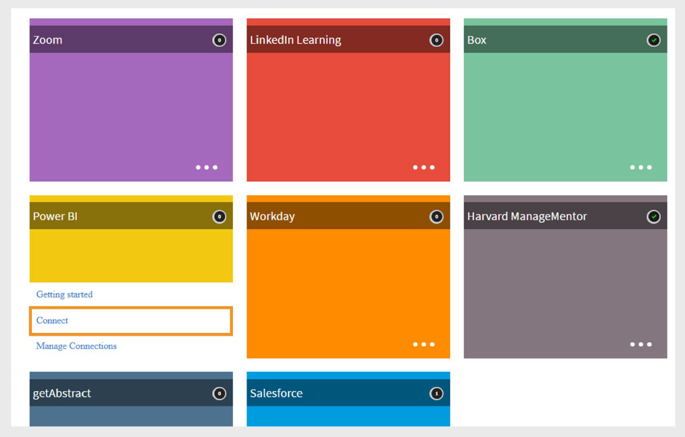

# Adobe Learning Manager 中的 Power BI 連接器

## 簡介

Power BI 連接器允許你將 Adobe Learning Manager 與 Microsoft Power BI（商業授權）整合，讓你能分析、視覺化並分享你的學習資料。

透過此整合，整合管理員能自動將即時資料集（如學習者逐字稿、使用者技能及 xAPI 活動報告）匯出至選定的 Power BI 工作區。

連接後，你可以使用 Power BI 的完整功能來建立自訂儀表板和報表。 這有助於您的組織更深入了解學習者的進展、技能成就與訓練成效，並根據即時學習數據做出明智決策。

>[!NOTE]
>
>Adobe Learning Manager 僅支援與商業版 Microsoft Power BI 的整合。 不支援與政府雲端版本的整合。

## 先決條件

- 僅支援商業授權&#x200B;**的** Microsoft Power BI。
- 確保你有權限建立 Power BI 應用程式和工作空間。
- 取得你的 **租戶名稱**、 **應用程式客戶端ID**、 **應用程式客戶端秘密**，以及 **工作區ID** （可選）。

## 設定 Power BI 連接器

要將 ALM 與 Power BI 連接：

1. 以整合管理員身份登入 Adobe Learning Manager。
2. 將滑鼠移到 **Power BI** 連接器圖塊上，選擇 **「連接**」。

   
   _選擇「連接」以設定 Power BI 連接器_

3. 請輸入以下細節：

   - 客戶識別碼
   - 客戶秘密
   - 租戶名稱
   - 工作區識別碼（可選）

   
   _輸入必要的細節以設定 Power BI_

4. 選擇 **「連接**」。

## 註冊 Power BI 應用程式

要註冊 Power BI 應用程式：

1. 前往 [註冊 Power BI 應用程式](https://app.powerbi.com/embedsetup)。
2. 為您的組織&#x200B;**選擇**&#x200B;嵌入，並登入您的 Microsoft 帳號。
3. 輸入你的應用程式名稱。
4. 在應用程式類型中選擇&#x200B;**伺服器端網頁應用程式**。****
5. 在重 **定向網址** 區塊，選擇 **使用自訂網址** ，並輸入 [此網址](https://learningmanager.adobe.com/ctr/app/azure/_callback)：（如需，依照您的環境替換網域。）
6. 在「主頁網址&#x200B;**」**&#x200B;欄位輸入[此網址](https://learningmanager.adobe.com/)。
7. 在&#x200B;**權限區塊中，選擇**「Read All Data set **」及**「Read and Write all Data set ****」。
8. 聯絡你的 Power BI 管理員取得 **租戶名稱**。
9. 如果你沒有工作區 ID，請在 Power BI 建立一個工作區（需要 Power BI Pro），並從 URL 複製 ID。
10. 選擇 **註冊應用程式** ，並儲存 **用戶端 ID** 和 **用戶端秘密** 以便日後使用。

>[!NOTE]
>
>如果你之後需要重新授權連線，請建立一個新的 Power BI 應用程式，並使用適合你環境的正確導向網址。

## 匯出報表至 Power BI

設定連線後，您可以匯出以下報告：

- **學習者成績單**
- **使用者技能**
- **xAPI 活動報告**
- **統一報告** （多個報告的組合）

### 學習者成績單

#### 排程匯出

1. 在左側面板選擇 **「學習者成績單** 」。
2. 在匯出頁面選擇 **啟用排程** 。
3. 選擇 **開始日期** 和 **時間**。
4. 定義 **匯出應該重複的間隔** （每日、每週等）。

   
   _啟用學習者成績單的排程匯出功能_

5. 選擇 **儲存**。

#### 按需出口

- 你可以手動產生報告，方法是指定 **開始日期** 並執行按需匯出。
- 報告將包含從指定日期至今的數據。

### 使用者技能

#### 排程匯出

1. 在左側面板選擇 **使用者技能** 。
2. 在匯出頁面選擇 **啟用排程** 。
3. 選擇 **開始日期** 和 **時間**。
4. 定義 **匯出應該重複的間隔** （每日、每週等）。

   
   _啟用使用者技能報告的排程匯出功能_

5. 選擇 **儲存**。

#### 按需出口

- 你可以手動產生報告，方法是指定 **開始日期** 並執行按需匯出。
- 報告將包含從指定日期至今的數據。

### 管理 xAPI 活動報告

**xAPI 語句** 也可以匯出到 Power BI。

#### 設定 xAPI 匯出

1. 選擇 **匯出 xAPI 活動報告**。
2. 在左側窗格選擇 **「配置** 」。

   - 填寫 JSON 路徑欄位以符合你的 CSV 欄位。
   - 選擇 **新增** 以包含更多路徑。
   - 使用 **編輯功能** 來更新欄位。
3. 選擇 **儲存**。

#### 排程匯出

1. 選擇 **設定排程**。
2. 選擇 **啟用 xAPI 語句匯出，使用此連線**。
3. 設定 **開始日期**、 **時間**&#x200B;和 **間隔**。
4. 選擇 **儲存**。

#### 按需出口

1. 選擇&#x200B;**隨選。**
2. 請指定 **開始日期**。
3. 選擇 **執行**。

>[!NOTE]
>
>如果學習記錄庫（LRS）中的某些 xAPI 語句沒有設定 JSON 路徑，它們的值在 Power BI 中會顯示為 N/A。

#### 查看執行狀態

- 使用 **執行狀態** 查看匯出歷史，包括開始時間、持續時間及狀態。
- 警告圖示表示失敗的跑動。 點擊連結下載錯誤報告。CSV。

### 統一報告

**統一報告結合** 以下資料：

- 學習者成績單
- 遊戲化
- 回饋報告
- 登入/存取
- 使用者技能
- 使用者報告
- 訓練報告

這有助於你透過在 Power BI 中合併資料，建立更強大的儀表板。

#### 建立統一的報表配置

1. 選擇 **統一報表** ，然後選擇 **設定**。
2. 在資料集名稱&#x200B;**欄位輸入**&#x200B;唯一名稱。
3. 請在「選擇報告匯出&#x200B;**」中**&#x200B;選擇一個或多個您想納入此資料集的報告。

   - 學習者成績單
   - 登入/存取
   - 訓練報告
   - 遊戲化
   - 使用者技能
   - 回饋報告
   - 使用者報告
4. 使用「 **新增使用者群組篩選」** 欄位，選擇你想匯出哪些使用者群組的資料。 預設情況下， **選擇「所有使用者** 」。
5. 請使用 **新增內容目錄篩選** 欄位，依內容目錄篩選報告。
6. 篩選表顯示哪些報告支援 **使用者群組**、 **目錄**&#x200B;或 **時間** 篩選器。

   
   _建立統一報表的設定_

7. 選擇報告與篩選後，請在右上角選擇 **儲存** 。

#### 依狀態篩選學習者成績單

- **全部：** 所有日期範圍內的紀錄
- **已完成：** 僅完成學習活動
- **進行中：** 僅限持續活動
- **未開始：** 排除尚未開始的紀錄
- **未登記：** 包含未登記紀錄

## 下載 Power BI 範本

Adobe 提供現成的 Power BI 範本，幫助你快速開始。

- 下載範本、匯入報告，並依需求自訂。
- 使用範本打造引人入勝的儀表板，無需從零開始。

## 學習路徑相關設定

學習路徑&#x200B;**在**&#x200B;報告中的呈現方式取決於你的管理員設定：

- **現有連結：**

   - 若 **關閉學習路徑** ，則不會包含相關的列或欄。
   - 若啟用，報告中包含已註冊學習者的學習路徑（高階階段）。

- **新連結：**

   - 若關閉學習路徑，欄位會顯示：

      - **嵌入式路徑：** 學習計畫名稱。
      - **嵌入路徑 ID：** 學習計畫的 ID。
      - **嵌入式課程 ID：** 學習路徑內課程的 ID。
   - 若啟用 **，類型** 欄位在相關時會使用學習路徑（高階）。
   - 新連線則在30天後生效。

### 在哪裡查看你的資料**

所有匯出的資料都會出現在你的 Power BI 帳號下的資料集。 利用這些工具來建立自訂儀表板和視覺化。
