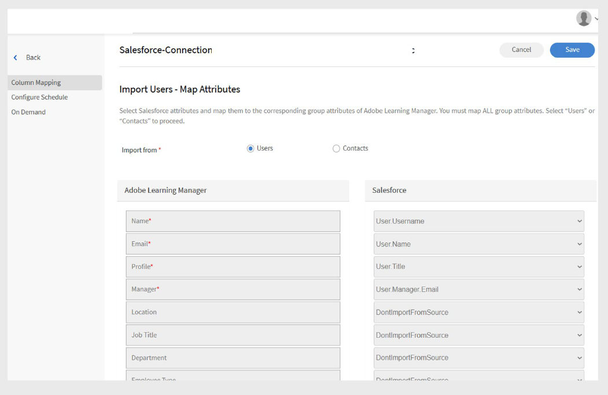

# Adobe Learning Manager 的 Salesforce 連接器

## 簡介

Salesforce 連接器整合您的 Salesforce 與 Adobe Learning Manager （ALM） 帳號，實現自動化使用者匯入、資料同步及學習紀錄匯出。 本指南說明如何設定連接器、管理使用者資料，以及在 Salesforce 中整合學習洞察。

Adobe Learning Manager 的 Salesforce 連接器透過自動匯入使用者、支援自訂資料映射及將學習紀錄匯出至 Salesforce 實現流暢整合。

遵循本指南，您將學會如何：

- 建立 Salesforce 與 Adobe Learning Manager 之間的安全連線。
- 設定 Salesforce 自動匯入使用者匯入流程。
- 有效地將 Salesforce 欄位對應到 Adobe Learning Manager 的屬性。
- 將學習紀錄匯出回 Salesforce 以提供全面報告。
- 設定篩選與排程以達成目標資料同步。

## 什麼是 Salesforce 連接器？

Salesforce 連接器是一個強大的整合工具，能在你的 Salesforce CRM 與 Adobe Learning Manager 之間建立無縫橋樑。 此連接器透過自動同步使用者資訊、聯絡資料及學習紀錄，省去手動輸入資料。

## 主要能力

### 屬性映射

它有助於建立 Salesforce 欄位與 Adobe Learning Manager 使用者屬性之間的彈性連結。 你可以將標準欄位如姓名、電子郵件和管理者映射到學習管理員中的對應屬性。 連接器也支援兩個平台的自訂欄位，包含必要的欄位驗證以維持資料準確性，並允許你儲存映射設定以供未來匯入重用。

### 自動使用者匯入

它透過自動化匯入流程簡化使用者的入職與維護，消除手動 CSV 檔案管理。

- 直接從 Salesforce 使用者物件匯入，無需中間檔案格式。
- 使用者設定檔變更的即時同步。
- 支援標準使用者與外部聯絡人。

### 自動排程匯入

配置自動同步排程，維持資料的即時性，無需人工介入。 可選擇每日、每週或自訂間隔排程選項。

- 全球組織的時區配置。
- 尖峰/非尖峰排程以優化系統效能。

### 使用者過濾器

- 針對特定用戶族群套用篩選標準，並優化資料同步效率。
- 針對特定訓練計畫的基於角色的篩選。
- 區域實施中的地理或地點篩選
- 使用 Salesforce 的標準與公式進行自訂欄位篩選。

## 先決條件

在設定 Salesforce 連接器前，請確保您的環境符合以下要求：

- [Salesforce 組織網址](https://myorg.salesforce.com)
- Salesforce和Adobe Learning Manager的管理員登入憑證。
- 系統管理員或 Salesforce 中的等效權限。
- 啟用 Adobe Learning Manager 帳號並取得適當授權

## 配置 Salesforce 連接器

Adobe Learning Manager 中的 Salesforce 連接器讓整合管理員能自動化 Salesforce 與 Adobe Learning Manager 之間使用者資料與學習紀錄的同步。

要建立 Salesforce 連接器：

1. 以整合管理員身份登入。
2. 選擇 **Salesforce** ，然後再選擇 **Connect**。

   
   _Adobe Learning Manager 連接器頁面顯示 Salesforce 連接器並標示 Connect 按鈕_

3. 輸入你的 Salesforce 組織網址，並選擇 **「連結**」。 這會帶你進入 Salesforce 登入頁面。

   
   _Salesforce 登入表單，顯示使用者名稱和密碼輸入欄位_

4. 請用你的使用者名稱和密碼登入。 完成任何額外的認證步驟，例如雙重驗證或回答安全問題。

   成功認證後，連接器總覽頁面會出現，確認系統間已建立的連線。

   
   _Salesforce 連接器總覽頁面顯示成功連線狀態_

### 地圖屬性

理解屬性映射 屬性映射建立 Salesforce 資料欄位與 Adobe Learning Manager 使用者屬性之間的重要連結，確保使用者資訊能在系統間準確傳輸。

#### 地圖需求

- 所有必要的 Adobe Learning Manager 欄位都必須對應到 Salesforce 欄位
- 映射設定可重複使用且跨多匯入持續存在

要映射屬性：

1. 請前往 Salesforce 連接器總覽頁面。
2. 選擇 **「內部使用者** 」，然後選擇 **「配置映射**」。
3. 請從以下其中一項選擇：

   - **使用者：** 員工或內部團隊成員使用的標準 Salesforce 帳號
   - **聯絡人：** 外部個人，如客戶、合作夥伴或供應商。

4. 將 Adobe Learning Manager 的活躍欄位與地圖頁面上的 Salesforce 欄位匹配。 **管理者**&#x200B;欄位必須對應到使用者管理員的電子郵件欄位。

   
   _欄位映射介面，左側顯示 Adobe Learning Manager 使用者屬性，右側為 Salesforce 欄位下拉選單_

5. 選擇 **儲存** 以完成映射。

## 匯入使用者與聯絡人

Salesforce 連接器讓 Adobe Learning Manager 能連結你的 Salesforce 帳號，並根據你的設定自動匯入使用者。

- **內部使用者**：擁有 Salesforce 使用者帳號的員工與員工。
- **外部聯絡**&#x200B;人：客戶、合作夥伴、供應商及其他外部利害關係人。
- **混合匯入**：在單一同步過程中結合使用者與聯絡人。
- **過濾匯入：根據特定標準進行**&#x200B;針對性的同步。

Salesforce 連接器讓 Adobe Learning Manager 能連結你的 Salesforce 帳號，並根據你的設定自動匯入使用者。

連接器支援匯入聯絡人，除了標準 Salesforce 使用者外。 這有助於將培訓計畫延伸至外部利害關係人，如客戶或合作夥伴。

要匯入隱形眼鏡：

1. 在連接器頁面選擇 **Salesforce****。**
2. 在連接頁面選擇 **匯入內部使用者** 。

   
   _Salesforce 連接器頁面，並標示匯入內部使用者選項_

3. 在&#x200B;**匯入使用者**&#x200B;頁面選擇&#x200B;**聯絡人**。
4. 在匯入&#x200B;**前篩選聯絡人選項中選擇**「是」。******
5. 請設定以下選項：

   - **選擇聯絡人欄位：** 選擇你想匯入到 Adobe Learning Manager 的欄位。
   - **指定值：** 選擇代表所選欄位的值。
   - 將 Salesforce 屬性映射到 Adobe Learning Manager 欄位

   
   _聯絡人匯入設定，顯示篩選選項與欄位映射_

6. 選擇 **儲存**。
7. 如果你選擇 **「不」， 匯入所有聯絡人**，你可以直接映射欄位，不用過濾聯絡人。

## 匯出學習紀錄

學習紀錄匯出功能讓你能與 Salesforce 共享 Adobe Learning Manager 資料，打造結合學習成果與 CRM 資料的完整報告與分析功能。

### Salesforce 中的自訂物件

在從 Adobe Learning Manager 匯出學習紀錄之前，先在 Salesforce 建立自訂物件。 自訂物件允許你儲存針對組織或產業需求的特定資料。 欲了解更多資訊，請參閱 [Salesforce 自訂物件](https://trailhead.salesforce.com/en/content/learn/modules/data_modeling/objects_intro)。

### 安裝 Adobe Learning Manager 套件

Adobe 提供預先建置的套件，可建立必要的自訂物件：

- [套件 1](https://test.salesforce.com/packaging/installPackage.apexp?p0=04t1k0000008WPJ)：核心學習物件與欄位
- [套件 2](https://test.salesforce.com/packaging/installPackage.apexp?p0=04t1k0000008WPT)：擴展學習分析物件
- [套件 3](https://test.salesforce.com/packaging/installPackage.apexp?p0=04t1k0000008WPi)：額外報告與整合物件

>[!IMPORTANT]
>
>把套件裡的 URL test.salesforce.com](https://acrobat.adobe.com/home/test.salesforce.com) 替換[成你實際的 Salesforce 組織網域。

### 套件安裝流程

安裝套件：

1. 以管理員身份登入 Salesforce。
2. 在瀏覽器中瀏覽每個包裹的網址。
3. 請依照每個套件的安裝精靈操作，並授予使用者適當的權限，讓他們能存取學習資料。
4. 在 Salesforce 中重新命名自訂物件的名稱。
5. 選擇活動並點選 **儲存**。

>[!NOTE]
>
>確保安裝套件後新增的所有活躍欄位都已授權系統管理員權限。

### 出口紀錄

要將紀錄匯出到 Salesforce：

1. 在 Salesforce 連接器頁面選擇&#x200B;**匯出統一紀錄****。**
2. 從以下項目中選擇：

   - 新增使用者
   - 培訓註冊
   - 訓練完成
   - 技能註冊
   - 技能完成

3. 在連結事件中選擇&#x200B;**聯絡物件**&#x200B;並選擇選項&#x200B;****。這確保了存在於 Adobe Learning Manager 但不存在於 Salesforce 的使用者，會在 Salesforce 中建立。

   
   _學習記錄匯出設定，顯示事件選擇與連結選項_

>[!NOTE]
>
>你可以在同一個帳號內建立多個連結。 每個連線最多可支援三個 Salesforce 中的自訂物件。 要為同一 Salesforce 帳號建立多個連線，最多可安裝三個套件。 安裝的套件數量應與期望的連接數量相符。

## Salesforce 應用程式設定

Adobe Learning Manager 提供 Salesforce 應用程式套件。 一旦在您的 Salesforce 實例中安裝並設定，銷售使用者即可直接在 Salesforce 入口網站中存取並完成培訓。 該應用程式讓使用者能在不離開 Salesforce 的情況下發現新課程、查看個人化推薦並消費內容。

### 存取 Salesforce 應用程式

要設定 Salesforce 應用程式：

1. 以整合管理員身份登入。
2. 選擇 **應用程式** ，然後選擇 **精選應用程式**。
3. 選擇 **Salesforce**。

   
   _Adobe Learning Manager 應用程式頁面，顯示精選應用程式區塊，並標示 Salesforce 應用程式磁貼_

4. 請注意 **描述文字框中顯示的應用程式 ID** 與 **用戶端秘密** 。

   
   _Adobe Learning Manager 中 Salesforce 應用程式詳情頁面，描述框中顯示應用程式 ID 與客戶秘密_

5. 選擇 **批准** 以啟用該應用程式。

### 產生存取權杖

要產生存取權杖：

1. 在 Adobe Learning Manager 中導航至 **開發者資源** 。
2. 選擇 **存取權杖進行測試與開發**。
3. 在取得 **OAuth Code** 區塊，輸入 Client ID（Application ID），範圍必須設為 **admin，admin:read:write**。
4. 選擇 **提交**。
5. 在「 **取得刷新令牌** 」區塊，輸入 **客戶端 ID** 和 **客戶端秘密**。
6. 選擇 **提交** ，並記錄刷新令牌與存取令牌。

>[!IMPORTANT]
>
>記錄產生的刷新令牌和存取令牌。

### 建立一個 Salesforce 帳號

如果你沒有 Salesforce 帳號，請依照以下步驟，使用與 Adobe Learning Manager 帳號相同的電子郵件地址建立一個。 你可以使用開發者版或企業版。 註冊時務必使用與 Adobe Learning Manager 帳號綁定的相同電子郵件 ID。

1. 前往 [Salesforce 開發者註冊頁面](https://developer.salesforce.com/signup)。
2. 使用與 Adobe Learning Manager 帳號相同的電子郵件地址輸入所需資料。
3. 請檢查您的收件匣，並透過 Salesforce 寄出的電子郵件驗證您的帳號。
4. 設定密碼並登入 Salesforce。
5. 登入後，請註明你的 Salesforce 網址（例如 https://yourorg.lightning.force.com），以便設定時使用。

### 安裝 Adobe Learning Manager 套件

本節介紹在您的 Salesforce 環境中安裝 Adobe Learning Manager 套件。

>[!IMPORTANT]
>
>Adobe Learning Manager 應用程式只支援 Salesforce Lightning 視圖。 在繼續前，請確保閃電體驗已啟用。

#### 安裝套件

安裝套件：

1. 打開 [Adobe Learning Manager 套件的網址](https://login.salesforce.com/packaging/installPackage.apexp?p0=04t1k0000008WOQ)。
2. 在登入頁面輸入你的使用者名稱和密碼。
3. 選擇 **安裝**。 在安裝頁面，保持「僅限管理員安裝」選項;不要更改。
4. 選擇 **完成**。 您將被導向 **已安裝套件** 頁面，可以看到 Adobe Learning Manager 已安裝的套件。

您將被導向「已安裝套件」頁面，在那裡您可以驗證 Adobe Learning Manager 套件的安裝

#### 設定應用程式

要設定應用程式：

1. 選擇 **應用程式啟動器** （設定旁的 9 點格圖示）
2. 搜尋 Adobe Learning Manager。
3. 要設定應用程式，請選擇 **「設定**」。
4. 選擇 **新資訊** 並新增以下細節：

   - **設定：** 輸入你選擇的名稱。
   - **ClientID**：輸入你從第一個區段取得的數值。
   - **ClientSecret：** 輸入你從第一部分取得的數值。
   - **RefreshToken：** 輸入你從第一節獲得的數值。
   - **LearningManagerBaseURL：** Adobe Learning Manager 所託管網站的網址。

### 遠端站點配置

Salesforce 需要遠端站點設定，才能與外部服務如 Adobe Learning Manager 進行溝通。

#### 新增遠端站點設定

要新增遠端站點設定：

1. 在 Salesforce 中，選擇 **右上角的設定** 。
2. 在頁面右上角選擇 **設定** 。
3. 在快速查找中搜尋&#x200B;**遠端站點設定****。**
4. 選擇 **新的遠端站點**。
5. 請輸入細節：

   - **遠端站點名稱：** 輸入你喜歡的名稱（例如 Adobe Learning Manager）。
   - **遠端站點網址：** 輸入 Adobe Learning Manager 所託管的網址。
6. 選擇 **儲存**。

### 設定通知

設定通知以讓使用者隨時掌握學習活動與更新。

#### 建立自訂通知

要啟用通知：

1. 在右上角選擇 **設定** 。
2. 搜尋「**自訂通知」**，然後選擇&#x200B;**「新」。**
3. 請輸入以下細節：

   - **自訂通知名稱：** LearningManagerNotification
   - **API 名稱：** LearningManagerNotification

4. 請選擇 **桌面** 版和 **行動** 版頻道作為支援頻道。
5. 選擇 **儲存**。

#### 啟用行動推播通知（可選）

對於想在行動裝置上接收通知的用戶：

要啟用行動裝置推播通知，請遵循以下步驟：

1. 在手機上安裝 Salesforce 行動應用程式。
2. 用你的帳號登入應用程式。
3. 進入 **設定** ，然後選擇 **通知傳遞設定**。
4. 新增 iOS 和 Android 版的 Salesforce 吧。

### 使用者設定與權限

本節介紹如何在 Salesforce 內設定 Adobe Learning Manager 應用程式的使用者存取與權限。

#### 了解使用者檔案

Adobe Learning Manager 應用程式支援多種對應 Adobe Learning Manager 中角色的使用者設定檔：

- 行政長官
- 整合管理
- 講師
- 學習者
- 自訂設定檔（視需要）

#### 指派或建立使用者設定檔

你可以使用現有的設定檔，或為 Adobe Learning Manager 使用者建立自訂設定檔：

**使用現有的設定檔**

1. 進入 **設定** 並選擇 **使用者**。
2. 選擇 **個人檔案**。
3. 選擇與使用者角色相符的個人檔案
4. 在套件安裝時將此設定檔指派給使用者。

**建立自訂檔案**

1. 請前往 **設定**&#x200B;並選擇** 使用者。 **
2. 選擇 **個人檔案**。
3. 點擊 **新檔案**。
4. 根據現有個人檔案建立自訂檔案，並針對 Adobe Learning Manager 使用者量身打造。

#### 設定設定檔

要設定設定檔：

1. 安裝套件後，選擇 **「組建」**，再選擇&#x200B;**「新」**。
2. 請輸入以下細節：

   - **設定名稱**
   - **ClientID**
   - **客戶秘密**
   - **LearningManagerBaseURL**
   - **停用重定向**

>[!NOTE]
>
>請確保所有學習者都能啟用 Adobe Learning Manager 應用程式查看。

#### 設定使用者權限

選擇使用者並分配必要的權限以存取 Adobe Learning Manager 應用程式。

#### 更新設定檔設定

1. 選擇一個設定檔（例如標準設定檔），然後選擇 **編輯**。
2. 在&#x200B;**自訂應用程式設定**&#x200B;區塊，勾選 Adobe Learning Manager **的選項**，讓應用程式變得可存取。
3. 在&#x200B;**自訂分頁設定**&#x200B;區，將學習者主頁&#x200B;**設**&#x200B;為&#x200B;**預設開啟**。
4. 選擇 **儲存** 以套用變更。

擁有指定設定檔的學習者現在可以在 Salesforce 中使用 Adobe Learning Manager 應用程式。

你已成功設定 Adobe Learning Manager 的 Salesforce 連接器。 使用者現在可以直接在 Salesforce 內存取學習內容，提升組織培訓計畫的採用率與參與度。
