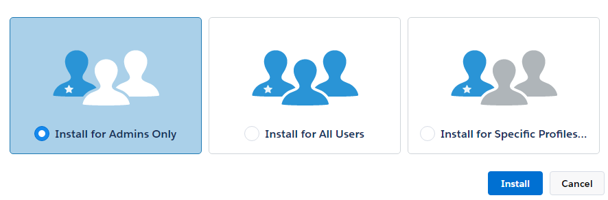
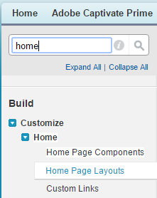

# 適用於Salesforce的Learning Manager應用程式

## 概觀 {#overview}

Salesforce™是銷售和行銷團隊中最受歡迎的CRM解決方案之一。 在Salesforce中使用AdobeLearning Manager應用程式時，您可以讓使用者直接從其Salesforce介面存取其所有學習內容。 使用者可以從Salesforce記憶體取其指派的學習內容，例如課程、學習方案、工作輔助等。 使用者也可以從管理員接收有關其註冊和公告的通知。

目前Salesforce應用程式無法使用，因為Salesforce應用程式交換正在等候核准。 如果您有興趣預覽測試版應用程式，請聯絡您的客戶經理或Learning Manager支援團隊。

## 安裝及設定 {#installationandsetup}

請依照下列步驟，瞭解如何安裝和設定適用於Salesforce的Learning Manager應用程式。

### 先決條件 {#prerequisites}

1. 貴組織的整合管理員必須核准Salesforce應用程式。 您可在Learning Manager整合管理員角色應用程式的「精選應用程式」區段找到此應用程式。
1. 存取您組織的Salesforce帳戶，該帳戶必須安裝應用程式。 通常，您組織中的Salesforce管理員是安裝這類應用程式的人。 如果您是Learning Manager整合管理員且沒有Salesforce帳戶，請聯絡貴組織的Salesforce管理員。

### 安裝步驟 {#installationsteps}

1. 請您的帳戶管理員或客戶成功案例經理，提供您的Learning Manager帳戶ID以啟用您的帳戶以供此應用程式使用。 此外，也請向CSM索取Salesforce適用的Learning Manager學習者應用程式的可安裝套件。

1. 以整合管理員身分登入您的Learning Manager帳戶，並確認您的帳戶已啟用Salesforce應用程式。

1. 若要在Salesforce帳戶中安裝Learning Manager應用程式，請使用帳戶管理員或客戶成功經理提供的可安裝套件。 您必須擁有您要安裝此應用程式之Salesforce帳戶的管理員許可權。

1. 選擇快照中所示的適當選項，然後按一下 **[!UICONTROL Install]**.

   

   *選取僅供管理員安裝的選項*

   如果您選擇加入 **為特定設定檔安裝**，從清單中選擇一或多個設定檔。

1. 按一下 **[!UICONTROL Continue]** 在出現以確認協力廠商存取的快顯視窗上。

   系統會顯示訊息，確認應用程式已成功安裝。 按一下 **完成**.

## 新增通知元件至首頁 {#addnotificationcomponenttothehomepage}

Learning Manager團隊建議Salesforce管理員也將Learning Manager通知元件新增到首頁版面配置中。 此元件可讓Salesforce使用者從Learning Manager取得有關工作分派和其他公告的通知，即使這些通知不在學習者應用程式的內容中亦然。

若要將Learning Manager通知元件新增至首頁版面配置，請依照下列步驟操作：

1. 按一下 **[!UICONTROL Setup]** 位於右上角。 首頁版面配置選項會顯示在左窗格中，如下面的快照所示。

   

   *選取首頁配置*

1. 選擇您選擇的版面配置，然後按一下 **[!UICONTROL Edit]**.
1. 選取出現在頁面上的AdobeLearning Manager通知選項，然後按一下 **[!UICONTROL Next]**.
1. 選擇元件在左窗格中的顯示順序、預覽，然後按一下 **[!UICONTROL Save]**.

若要瞭解如何登入Learning Manager應用程式並作為學習者用於Salesforce的說明，請參閱 [Salesforce應用程式說明內容](../../learners/feature-summary/sfdc-app.md).
