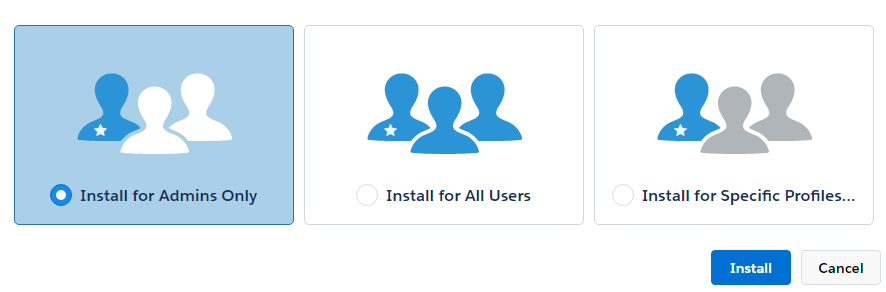
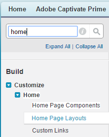

# Salesforce 學習管理應用程式

## 概觀 {#overview}

Salesforce™ 是銷售與行銷團隊中最受歡迎的 CRM 解決方案之一。 在 Salesforce 上使用 Adobe Learning Manager 應用程式，你可以讓使用者直接從 Salesforce 介面存取所有學習內容。 使用者可以在 Salesforce 內部存取他們分配的學習內容，如課程、學習計畫、工作輔助工具等。 使用者也能收到管理員提供的註冊通知及公告。

目前 Salesforce 應用程式尚未開放，因為 Salesforce App Exchange 的審核尚未完成。 如果你有興趣預覽應用程式的測試版，請聯絡你的帳戶經理或學習經理客服團隊。

## 安裝與設定 {#installationandsetup}

請依照以下步驟學習安裝及設定 Salesforce 的學習管理應用程式。

### 先決條件 {#prerequisites}

1. 你組織的整合管理員必須批准 Salesforce 應用程式。 此應用程式可在 Learning Manager 應用程式整合管理員角色的精選應用程式區找到。
1. 存取你組織的 Salesforce 帳號，該應用程式需要安裝在那裡。 通常，您組織中的 Salesforce 管理員是負責安裝這類應用程式的人。 如果您是學習管理整合管理員且沒有 Salesforce 帳號，請聯絡您組織的 Salesforce 管理員。

### 安裝步驟 {#installationsteps}

1. 請透過提供學習經理帳號，請求您的帳戶經理或客戶成功經理啟用您的帳戶使用此應用程式。 另外，請申請 Learning Manager Learner 應用程式的可安裝套件 CSM。

1. 以整合管理員身份登入你的學習管理員帳號，並確保你的帳號已啟用 Salesforce 應用程式。

1. 要在您的 Salesforce 帳戶中安裝學習管理員應用程式，請使用您的帳戶經理或客戶成功經理提供的可安裝套件。 你需要擁有 Salesforce 帳號的管理員權限，該帳戶是你打算安裝該應用程式的。

1. 依快照所示選擇適合您的選項並點擊 **[!UICONTROL Install]**。

   

   *選擇「僅限管理員安裝」選項*

   如果你選擇 **「安裝特定設定檔**」，請從列表中選擇一個或多個設定檔。

1. 點擊 **[!UICONTROL Continue]** 跳出的視窗確認第三方存取權。

   螢幕上會跳出確認應用程式已成功安裝的訊息。 點擊 **完成**。

## 在首頁新增通知元件 {#addnotificationcomponenttothehomepage}

Learning Manager 團隊建議 Salesforce 管理員也在首頁版面上加入學習管理員通知元件。 此元件讓 Salesforce 使用者即使不在學習者應用程式內，也能收到來自 Learning Manager 的作業及其他公告通知。

要將學習管理員通知元件加入首頁版面，請依照以下步驟操作：

1. 點擊 **[!UICONTROL Setup]** 右上角。 左側窗格顯示首頁版面配置選項，如下方快照所示。

   

   *選擇首頁版面配置*

1. 選擇你喜歡的版面並點擊 **[!UICONTROL Edit]**。
1. 選擇頁面上出現的 Adobe Learning Manager 通知選項並點擊 **[!UICONTROL Next]**。
1. 選擇左側窗格出現的元件順序，預覽後點選 **[!UICONTROL Save]**。

想了解如何登入學習管理員應用程式並以學習者身份在 Salesforce 中使用，請參考 [Salesforce 應用程式說明內容](../../learners/feature-summary/sfdc-app.md)。
