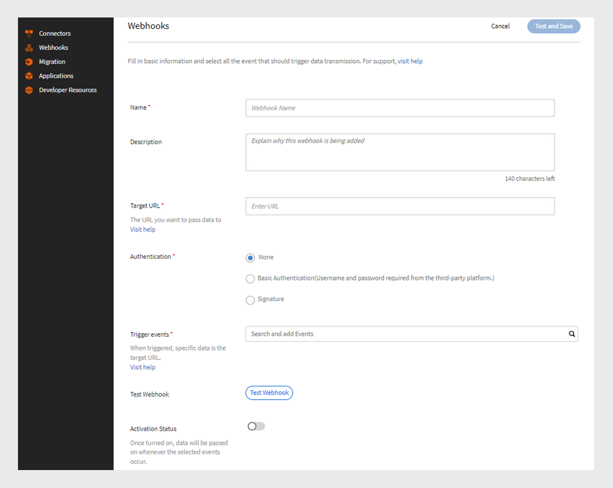
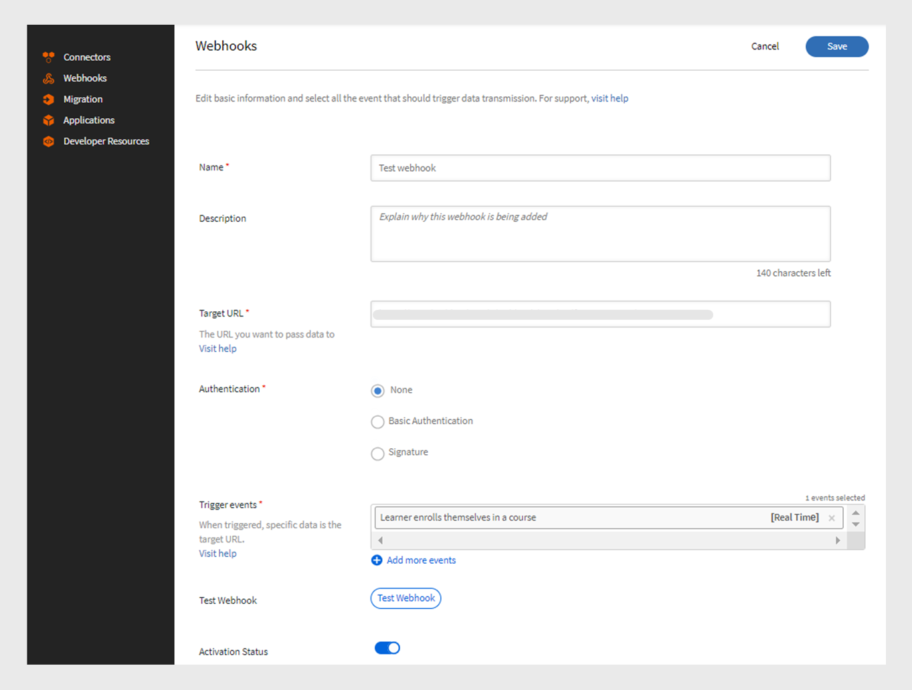
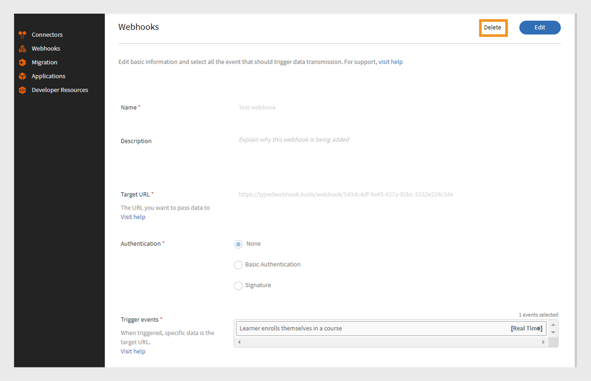
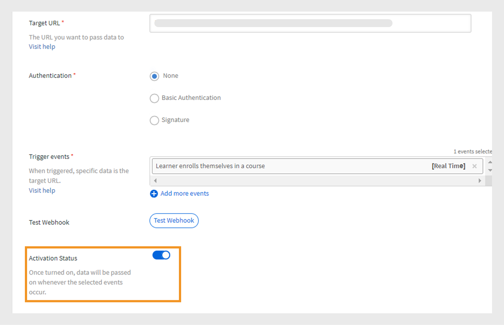

# Webhooks

webhook可讓一個實體在特定事件發生時自動向另一個實體傳送即時資料或通知。 如此一來，應用程式便能在不持續要求資訊的情況下，為其他應用程式提供資訊。 例如，如果使用者完成學習管理系統(LMS)課程，webhook可以自動將該資訊傳送到另一個平台，例如CRM或報告工具。 Webhook通常用於整合中，以自動化流程並減少系統之間手動更新的需求。 提供您要傳送資料的回呼URL，以設定Webhook。

## Webhook與API

Webhook和API都有助於系統相互通訊，但它們的工作方式不同。 透過API，資訊僅在使用者請求時分享。 例如，如果學習者需要課程進度資料，他們會傳送請求至API，然後提供資訊。 另一方面，Webhook會在事件發生時自動立即傳送資料。 例如，若學習者完成課程，資料會立即傳送至接聽程式URL，無需手動要求。

## 什麼是即時API？

即時API可讓應用程式在事件發生時立即交換資料。 傳統API會等待使用者要求資訊，而即時API則會在事件發生時共用資料。 Webhook可作為即時API，每當指定事件發生時，都有助於立即共用資料。 即時API可確保此資料傳輸立即進行，而無需任何手動請求，這使得系統可即時保持更新。

## Webhook活動

Webhook事件是發生在系統中的特定動作，可自動將資料傳送至監聽器URL。 例如，當學習者註冊課程時，系統會觸發webhook事件，並將註冊詳細資料傳送至接聽程式URL。
Webhook活動分為兩個類別：

* **即時事件**：事件已處理並即時傳送至目標URL
* **非即時事件**：事件會以批次處理，並在指定時間傳送，而非即時傳送

## 監聽器URL

監聽器URL是在事件發生時接收資料資訊的端點或目的地。 每當發生特定事件（例如使用者註冊課程），系統就會自動將詳細資料傳送至此URL，無需任何手動要求。 監聽器URL是傳送所有這些更新的位址。
Webhook會以JSON格式傳送相關資訊。 以下是Adobe Learning Manager中觸發之事件的裝載範例：

```
{
  "accountId": 1010,
  "events": [
    {
      "eventId": "d5fb7071-10a9-46b2-9f9e-79dde346c052",
      "eventName": "COURSE_ENROLLMENT_BATCH",
      "timestamp": 1727414643000,
      "eventInfo": "1727414643000-047210-84242-0",
      "data": {
        "userId": 4279332,
        "loId": "course:7374992",
        "loInstanceId": "course:7376092_10250977",
        "loType": "course",
        "enrollmentSource": "ADMIN_ENROLL",
        "dateEnrolled": 1727414643
      }
    }
  ]
}
```

## 建立和管理Webhook — 整合管理員

請依照下列步驟，在Adobe Learning Manager中建立Webhooks整合：

1. 以&#x200B;**[!UICONTROL Integration Admin]**&#x200B;登入。
2. 在首頁上，選取&#x200B;**[!UICONTROL Webhooks]** > **[!UICONTROL Add Webhook]**。

   
   _新增webhook_

3. 輸入Webhook的&#x200B;**[!UICONTROL Name]**&#x200B;和&#x200B;**[!UICONTROL Description]**。
4. 輸入接聽程式URL作為您要傳遞事件資料的&#x200B;**[!UICONTROL Target URL]**。
5. 選取任一驗證方法：
Webhooks中的驗證是一種安全性方法，可確保傳送至接聽程式URL的資料來自信任的來源。
   * **[!UICONTROL None]**：不需要驗證。
   * **[!UICONTROL Basic]**：這是認證式驗證。 輸入使用者名稱和密碼。
   * **[!UICONTROL Signature]**：系統建立特殊簽章，並將其新增至webhook資料。 接收伺服器會檢查此程式碼，確認資料為真實資料，且未曾變更。 產生簽章並用於驗證。 將簽名下載為JSON。
6. 從&#x200B;**[!UICONTROL Trigger events]**&#x200B;下拉式清單中選取Webhook事件。

   >[!NOTE]
   >
   >您也可以從「新增Webhook」頁面選取「測試Webhook」選項來測試Webhook。

7. 選取&#x200B;**[!UICONTROL Activation Status]**&#x200B;切換以啟用webhook。 啟用後，每當選取的事件發生，就會傳遞資料。

>[!NOTE]
>
>您最多可以建立和管理5個Webhook。

### 編輯Webhook — 整合管理員

請依照下列步驟，從Adobe Learning Manager編輯Webhook：

1. 以&#x200B;**[!UICONTROL Integration Admin.]**&#x200B;身分登入
2. 在首頁上選取&#x200B;**[!UICONTROL Webhooks]**。
3. 選取您要編輯的webhook。

   
   _編輯webhook_
4. 選取&#x200B;**[!UICONTROL Edit]**&#x200B;以修改webhook的詳細資料，並選取&#x200B;**[!UICONTROL Save]**。

### 移除Webhook — 整合管理員

請依照下列步驟，從Adobe Learning Manager編輯Webhook：

1. 以&#x200B;**[!UICONTROL Integration Admin]**&#x200B;登入。
2. 在首頁上選取&#x200B;**[!UICONTROL Webhooks]**。
3. 選取您要刪除的webhook。
4. 選取&#x200B;**[!UICONTROL Delete]**&#x200B;以移除webhook。


_移除webhook_

### 淘汰Webhook — 整合管理員

請依照下列步驟淘汰webhook：

1. 以&#x200B;**[!UICONTROL Integration Admin]**&#x200B;登入。
2. 在首頁上選取&#x200B;**[!UICONTROL Webhooks]**。
3. 選取您要編輯的webhook。
4. 選取&#x200B;**[!UICONTROL Edit]**&#x200B;並停用&#x200B;**[!UICONTROL Activation Status]**&#x200B;以停用webhook。


_淘汰webhook_

## 即時事件

| S.No | Webhook活動 | 說明 |
|---|---|---|
| 1 | CI_STATS | 當課程執行個體的名額或輪候表可用性發生變更時觸發。 |
| 2 | COURSE_ENROLLMENT | 學習者註冊課程時觸發。 |
| 3 | COURSE_COMPLETED | 於學習者完成課程時觸發。 |
| 4 | LEARNING_PATH_ENROLLMENT | 學習者註冊學習路徑時觸發。 |
| 5 | LEARNING_PATH_COMPLETED | 學習者完成學習路徑時觸發。 |
| 6 | CERTIFICATION_ENROLLMENT | 學習者註冊認證時觸發。 |
| 7 | CERTIFICATION_COMPLETED | 學習者完成認證時觸發。 |
| 8 | COURSE_UNENROLLMENT | 於學習者取消課程註冊時觸發。 |
| 9 | LEARNING_PATH_UNENROLLMENT | 當學習者取消註冊學習路徑時觸發。 |
| 10 | CERTIFICATION_UNENROLLMENT | 當學習者取消註冊認證時觸發。 |
| 11 | LEARNING_OBJECT_DRAFT | 在建立處於草稿狀態的學習物件期間觸發。 |
| 12 | LEARNING_OBJECT_DELETION | 在刪除學習物件期間觸發。 |
| 13 | LEARNING_OBJECT_MODIFY | 在修改學習物件期間觸發。 |
| 14 | LEARNING_OBJECT_INSTANCE_MODIFICATION | 在建立或修改學習物件例項期間觸發。<div><b>注意：</b>建議只在發佈課程之後才使用課程執行個體。</div> |
| 15 | LEARNING_OBJECT_INSTANCE_DELETION | 在刪除學習物件例項期間觸發。 |

## 非即時事件

| S.No | Webhook活動 | 說明 |
|---|---|---|
| 1 | COURSE_ENROLLMENT_BATCH | 管理員/經理/平台註冊課程學習者時觸發。 |
| 2 | COURSE_COMPLETED_BATCH | 在管理員/管理員/平台將課程標示為完成時觸發。 |
| 3 | LEARNING_PATH_ENROLLMENT_BATCH | 當管理員/經理/平台在學習路徑中註冊學習者時觸發。 |
| 4 | LEARNING_PATH_COMPLETED_BATCH | 當管理員/管理員將學習路徑標示為完成時觸發。 |
| 5 | CERTIFICATION_ENROLLMENT_BATCH | 管理員/經理/平台註冊認證中的學習者時觸發。 |
| 6 | CERTIFICATION_COMPLETED_BATCH | 當管理員/經理/平台將認證標示為完成時觸發。 |
| 7 | 學習者進度 | 完成模組時追蹤學習者的進度。 |
| 8 | COURSE_UNENROLLMENT_BATCH | 當管理員/經理/平台取消課程學習者的註冊時觸發。 |
| 9 | LEARNING_PATH_UNENROLLMENT_BATCH | 當管理員/經理/平台從學習路徑取消註冊學習者時觸發。 |
| 10 | CERTIFICATION_UNENROLLMENT_BATCH | 當管理員/經理/平台取消註冊認證的學習者時觸發。 |
| 11 | LEARNING_OBJECT_MODIFICATION_BATCH | 透過移轉工作流程修改學習物件時觸發。 |
| 12 | LEARNING_OBJECT_INSTANCE_MODIFICATION_BATCH | 透過移轉工作流程建立或修改學習物件例項時觸發。 |

## Webhook的最佳作法

Webhook實現了服務之間的即時事件驅動通訊。 但是，不當實作可能會導致事件遺失、系統效能緩慢或安全性風險。 以下是實作Webhook的最佳作法，重點放在容錯、可靠性和安全性上。

### 容錯

ALM Webhook系統的容錯為訂閱者提供建議，以處理潛在問題，例如事件遺失、重複事件和順序錯亂。

ALM的連線逾時設定為10秒，通訊端逾時設定為5秒。 預期使用者端一收到訊息，就會立即確認訊息。 這是為了確保使用者端在處理訊息時不會延遲。 如果有一些下游處理很耗時，使用者端仍應立即確認事件，然後在其末端處理下游處理。

#### 資料保留

事件會保留7天。 如果在此時間內未處理這些檔案，則會永久遺失。 如果復原是在最後一天，而且需要更多時間，則系統不會延長保留期間。
如果產生事件的速度快於使用的速度，則某些事件可能會遺失。 雖然這種情況不常見，但訂閱者應進行監控以避免其成為長期問題。

#### Webhook停用

當訂閱者無法回應webhook事件時，ALM系統會使用指數輪詢重試webhook，以避免讓訂閱者不知所措。

重試程式會以5秒的初始間隔開始。 如果訂閱者沒有回應，等候時間會加倍為10、20、40和80秒，最後會增加到5分鐘的上限。 一旦達到5分鐘，系統將繼續每5分鐘重試一次，直到7天的保留期結束。 如果訂閱者在此期間仍未回應，webhook將會自動停用。 系統會定期傳送提醒電子郵件給訂閱者。

#### 重複事件

如果訂閱者在處理事件後需要5秒以上的時間回應，系統可能會嘗試再次處理相同事件。 建議使用事件ID來追蹤哪些事件已處理。 此外，如果webhook在傳送事件後但在儲存之前因已處理而當機，則可能會重試相同的事件群組。 建議使用批次ID或個別事件ID來識別和忽略任何重複專案。

#### 順序錯亂事件

ALM會嘗試將事件維持在正確的順序，但有時候，事件可能會傳送順序不對，尤其是在即時和非即時事件之間。

如果管理員一次為多個學習者註冊了課程，則註冊事件會標籤為非即時。 但是，如果學習者快速完成課程，該完成事件會標示為即時，並可能在註冊事件之前傳遞。

#### 容錯建議

為避免這些錯誤，訂閱者應主動監控webhook事件，並針對錯過事件、重複傳送或順序錯亂等問題設定警報。

## Webhook事件的特定准則

1. 如果您先收到LEARNER_PROGRESS事件，請忽略下列事件：

   * COURSE_ENROLLMENT
   * COURSE_ENROLLMENT_BATCH
   * LEARNING_PATH_ENROLLMENT
   * LEARNING_PATH_ENROLLMENT_BATCH
   * CERTIFICATION_ENROLLMENT
   * CERTIFICATION_ENROLLMENT_BATCH

2. 如果LEARNER_PROGRESS事件在下列事件之後，請忽略該事件：

   * COURSE_COMPLETED
   * COURSE_COMPLETED_BATCH
   * LEARNING_PATH_COMPLETED
   * LEARNING_PATH_COMPLETED_BATCH
   * CERTIFICATION_COMPLETED
   * CERTIFICATION_COMPLETED_BATCH

3. 使用時間戳記欄位來判斷要忽略或處理事件（LEARNER_PROGRESS事件除外）。


## 事件的裝載範例

+++CI_STATS

```
{
  "accountId": 1234,
  "events": [
    {
      "eventId": "01234567-0458-4450-b5dd-6bc1edr4560",
      "eventName": "CI_STATS",
      "timestamp": 1725604147,
      "eventInfo": "1725604145-LoSt",
      "data": {
        "loInstanceId": "course:1234567_123456775",
        "waitlistCount": 0,
        "enrollmentCount": 10,
        "seatLimit": 30
      }
    }
  ]
}
```

+++

+++COURSE_ENROLLMENT

```
{
  "accountId": 1234,
  "events": [
    {
      "eventId": "29123ec1-4576-4ec5-a057-3a6dr45t9d6",
      "eventName": "COURSE_ENROLLMENT",
      "timestamp": 1725524713,
      "eventInfo": "1725524713000-040366-10488-0",
      "data": {
        "userId": 1234567,
        "loId": "course:1234567",
        "loInstanceId": "course:1234567_1234567",
        "loType": "course",
        "enrollmentSource": "SELF_ENROLL",
        "dateEnrolled": 1725524713
      }
    }
  ]
  }
```

+++

+++COURSE_ENROLLMENT_BATCH

```
{
  "accountId": 1234,
  "events": [
    {
      "eventId": "29572ec1-4576-4ec5-a057-3wsd43r59d6",
      "eventName": "COURSE_ENROLLMENT_BATCH",
      "timestamp": 1725524713,
      "eventInfo": "1725524713000-040366-10488-0",
      "data": {
        "userId": 1234567,
        "loId": "course:1234567",
        "loInstanceId": "course:12345678_123456788",
        "loType": "course",
        "enrollmentSource": "ADMIN_ENROLL",
        "dateEnrolled": 1725524713
      }
    }
  ]
  }
```

+++

+++COURSE_COMPLETED

```
{
  "accountId": 1234,
  "events": [
    {
      "eventId": "c1a3168c-6c98-4ed3-b0b0-ba3da5087c1c",
      "eventName": "COURSE_COMPLETED",
      "timestamp": 1725523823,
      "eventInfo": "1725523823000-040363-12018-0",
      "data": {
        "userId": 12345678,
        "loId": "course:12345671",
        "loInstanceId": "course:1234567_12345674",
        "loType": "course",
        "enrollmentSource": "SELF_ENROLL",
        "dateCompleted": 1725523818,
        "hasPassed": true
      }
    }
  ]
}
```

+++

+++COURSE_COMPLETED_BATCH

```
{
  "accountId": 1234,
  "events": [
    {
      "eventId": "c1a3168c-6c98-4ed3-b0b0-ba3da5087c1c",
      "eventName": "COURSE_COMPLETED_BATCH",
      "timestamp": 1725523823,
      "eventInfo": "1725523823000-040363-12018-0",
      "data": {
        "userId": 112345678,
        "loId": "course:12345678",
        "loInstanceId": "course:1234567_12345678",
        "loType": "course",
        "enrollmentSource": "ADMIN_ENROLL",
        "dateCompleted": 1725523818,
        "hasPassed": true
      }
    }
  ]
}
```

+++

+++LEARNING_PATH_ENROLLMENT

```
{
  "accountId": 1234,
  "events": [
    {
      "eventId": "96ed0791-338f-4c4c-83bc-9fwfr4564965",
      "eventName": "LEARNING_PATH_ENROLLMENT",
      "timestamp": 1725604249,
      "eventInfo": "1725604248000-040653-71396-0",
      "data": {
        "userId": 11234567,
        "loId": "learningProgram:123456",
        "loInstanceId": "learningProgram:12345_134567",
        "loType": "learningProgram",
        "enrollmentSource": "SELF_ENROLL",
        "dateEnrolled": 1725604248
      }
    }
  ]
}
```

+++

+++LEARNING_PATH_ENROLLMENT_BATCH

```
{
  "accountId": 1234,
  "events": [
    {
      "eventId": "96edft791-338f-4c4c-83bc-9f7erf94965",
      "eventName": "LEARNING_PATH_ENROLLMENT",
      "timestamp": 1725604249,
      "eventInfo": "1725604248000-040653-71396-0",
      "data": {
        "userId": 12345678,
        "loId": "learningProgram:12347",
        "loInstanceId": "learningProgram:12345_12345",
        "loType": "learningProgram",
        "enrollmentSource": "ADMIN_ENROLL",
        "dateEnrolled": 1725604248
      }
    }
  ]
  }
```

+++

+++LEARNING_PATH_COMPLETED

```
{
  "accountId": 1234,
  "events": [
    {
      "eventId": "e207104e-d554-4027-944b-08fty6fdddf",
      "eventName": "LEARNING_PATH_COMPLETED",
      "timestamp": 1725604392,
      "eventInfo": "1725604391000-040653-314618-0",
      "data": {
        "userId": 11080928,
        "loId": "learningProgram:12345",
        "loInstanceId": "learningProgram:12345_95662",
        "loType": "learningProgram",
        "enrollmentSource": "SELF_ENROLL",
        "dateCompleted": 1725604380,
        "hasPassed": true
      }
    }
  ]
  }
```

+++

+++LEARNING_PATH_COMPLETED_BATCH

```
{
  "accountId": 1234,
  "events": [
    {
      "eventId": "e207104e-d554-4027-944b-086debefdddf",
      "eventName": "LEARNING_PATH_COMPLETED",
      "timestamp": 1725604392,
      "eventInfo": "1725604391000-040653-314618-0",
      "data": {
        "userId": 12345678,
        "loId": "learningProgram:12345",
        "loInstanceId": "learningProgram:12345_95662",
        "loType": "learningProgram",
        "enrollmentSource": "ADMIN_ENROLL",
        "dateCompleted": 1725604380,
        "hasPassed": true
      }
    } 
    ]
    }
```

+++

+++CERTIFICATION_ENROLLMENT

```
{
  "accountId": 1234,
  "events": [
    {
      "eventId": "8bdfr76-148e-4128-80e9-b89123456755",
      "eventName": "CERTIFICATION_ENROLLMENT",
      "timestamp": 1725604672,
      "eventInfo": "1725604672000-040654-559128-0",
      "data": {
        "userId": 12345678,
        "loId": "certification:1234567",
        "loInstanceId": "certification:123456_160299",
        "loType": "certification",
        "enrollmentSource": "SELF_ENROLL",
        "dateEnrolled": 1725604672
      }
    }
  ]
}
```

+++

+++CERTIFICATION_ENROLLMENT_BATCH

```
{
  "accountId": 1234,
  "events": [
    {
      "eventId": "8b2ee776-148e-4128-80e9-12345678",
      "eventName": "CERTIFICATION_ENROLLMENT_BATCH",
      "timestamp": 1725604672,
      "eventInfo": "1725604672000-040654-559128-0",
      "data": {
        "userId": 123456788,
        "loId": "certification:1234567",
        "loInstanceId": "certification:12345678_160299",
        "loType": "certification",
        "enrollmentSource": "ADMIN_ENROLL",
        "dateEnrolled": 1725604672
      }
    }
  ]
  }
```

+++

+++CERTIFICATION_COMPLETED

```
{
  "accountId": 1234,
  "events": [
    {
      "eventId": "b8b63bf8-7521-4bc0-bc51-7f951ff63ea9",
      "eventName": "CERTIFICATION_COMPLETED",
      "timestamp": 1725604769,
      "eventInfo": "1725604768000-040654-756257-0",
      "data": {
        "userId": 12345678,
        "loId": "certification:1245678",
        "loInstanceId": "certification:1234567_160299",
        "loType": "certification",
        "enrollmentSource": "SELF_ENROLL",
        "dateCompleted": 1725604740
      }
    }
  ]
  }
```

+++

+++CERTIFICATION_COMPLETED_BATCH

```
{
  "accountId": 1234,
  "events": [
    {
      "eventId": "b8b63bf8-7521-4bc0-bc51-7f951ff63ea9",
      "eventName": "CERTIFICATION_COMPLETED_BATCH",
      "timestamp": 1725604769,
      "eventInfo": "1725604768000-040654-756257-0",
      "data": {
        "userId": 12345678,
        "loId": "certification:134567",
        "loInstanceId": "certification:1234567_160299",
        "loType": "certification",
        "enrollmentSource": "ADMIN_ENROLL",
        "dateCompleted": 1725604740
      }
    }
  ]
  }
```

+++

+++LEARNER_PROGRESS

```
{
  "accountId": 1234,
  "events": [
    {
      "eventId": "dd04d3a4-c3df-44fa-a1cf-7edd6e3d2075",
      "eventName": "LEARNER_PROGRESS",
      "timestamp": 1725604552,
      "eventInfo": "1725604551000-297002-5823-0",
      "data": {
        "loId": "course:7542090",
        "loType": "course",
        "userId": 12345678,
        "loInstanceId": "course:1234567_11234567",
        "dateStarted": 1725604380,
        "progressPercent": 50
      }
}
]
}
```

+++

+++COURSE_UNENROLLMENT

```
{
  "accountId": 1234,
  "events": [
    {
      "eventId": "f3417817-8cb8-40ea-a441-813bec1c7724",
      "eventName": "COURSE_UNENROLLMENT",
      "timestamp": 1725515824,
      "eventInfo": "1725506253000-040298-24078-0",
      "data": {
        "userId": 12345671,
        "loId": "course:12345678",
        "loInstanceId": "course:12345678_14450088",
        "loType": "course",
        "enrollmentSource": "ADMIN_ENROLL",
      }
    }
  ]
}
```

+++

+++COURSE_UNENROLLMENT_BATCH

```
{
  "accountId": 1234,
  "events": [
    {
      "eventId": "f3417817-8cb8-40ea-a441-8123e45724",
      "eventName": "COURSE_UNENROLLMENT_BATCH",
      "timestamp": 1725515824,
      "eventInfo": "1725506253000-040298-24078-0",
      "data": {
        "userId": 123456781,
        "loId": "course:12345678",
        "loInstanceId": "course:12345678_14450088",
        "loType": "course",
        "enrollmentSource": "SELF_ENROLL"
    }
   }
  ]
}
```

+++

+++LEARNING_PATH_UNENROLLMENT

```
{
  "accountId": 1234,
  "events": [
    {
      "eventId": "8e5df878-1dfd-47ac-9bfe-7d123456d1",
      "eventName": "LEARNING_PATH_UNENROLLMENT",
      "timestamp": 1725516573,
      "eventInfo": "1725506667000-040299-28209-0",
      "data": {
        "userId": 12345678,
        "loId": "learning_program:1234567",
        "loInstanceId": "learning_program:1234567_109139",
        "loType": "learning_program",
        "enrollmentSource": "SELF_ENROLL",
       
      }
    }
]
}
```

+++

+++LEARNING_PATH_UNENROLLMENT_BATCH

```
{
  "accountId": 1234,
  "events": [
    {
      "eventId": "8e5df878-1dfd-47ac-9bfe-7d4952e3edd1",
      "eventName": "LEARNING_PATH_UNENROLLMENT",
      "timestamp": 1725516573,
      "eventInfo": "1725506667000-040299-28209-0",
      "data": {
        "userId": 1234567,
        "loId": "learning_program:1234567",
        "loInstanceId": "learning_program:1234567_109139",
        "loType": "learning_program",
        "enrollmentSource": "ADMIN_ENROLL"
      }
    }
]
}
```

+++

+++CERTIFICATION_UNENROLLMENT

```
{
  "accountId": 1234,
  "events": [
    {
      "eventId": "7902766b-54d8-472d-b933-7e89d1b75ef8",
      "eventName": "CERTIFICATION_UNENROLLMENT",
      "timestamp": 1725517341,
      "eventInfo": "1725507900000-040304-1065-0",
      "data": {
        "userId": 12345678,
        "loId": "certification:1234567",
        "loInstanceId": "certification:12345678_162078",
        "loType": "certification",
        "enrollmentSource": "SELF_ENROLL"
      }
    }
  ]
}
```

+++

+++CERTIFICATION_UNENROLLMENT_BATCH

```
{
  "accountId": 1234,
  "events": [
    {
      "eventId": "7902766b-54d8-472d-b933-7e89d1b75ef8",
      "eventName": "CERTIFICATION_UNENROLLMENT_BATCH",
      "timestamp": 1725517341,
      "eventInfo": "1725507900000-040304-1065-0",
      "data": {
        "userId": 12345678,
        "loId": "certification:1234567",
        "loInstanceId": "certification:1234567_162078",
        "loType": "certification",
        "enrollmentSource": "SELF_ENROLL"
      }
    }
  ]
}
```

+++

+++LEARNING_OBJECT_DRAFT

```
{
  "accountId": 1234,
  "events": [
    {
      "eventId": "1712349f-26ec-453c-b56a-cdf18a841948",
      "eventName": "LEARNING_OBJECT_DRAFT",
      "timestamp": 1725519188,
      "eventInfo": "1725519188000-040344-48604-0",
      "data": {
        "loId": "course:12345671",
        "loType": "course"
      }
    }
  ]
}
```

+++

+++LEARNING_OBJECT_DELETION

```
{
  "accountId": 1234,
  "events": [
    {
      "eventId": "023456-5517-4c09-9cde-d953cdd8582c",
      "eventName": "LEARNING_OBJECT_DELETION",
      "timestamp": 1725605296,
      "eventInfo": "1234567800-040656-662792-0",
      "data": {
        "loId": "course:1234567",
        "loType": "course"
      }
    }
   ]
}
```

+++

+++LEARNING_OBJECT_MODIFY

```
{
  "accountId": 1234,
  "events": [
    {
      "eventId": "22345668-af3e-4dd3-a515-ce19d7234873",
      "eventName": "LEARNING_OBJECT_MODIFICATION_BATCH",
      "timestamp": 1725523081,
      "eventInfo": "123456000-039736-54153-0",
      "data": {
        "loId": "learningProgram:1234567",
        "loType": "learningProgram"

      }
    }
  ]
}
```

+++

+++LEARNING_OBJECT_MODIFICATION_BATCH

```
{
  "accountId": 1234,
  "events": [
    {
      "eventId": "2234567068-af3e-4dd3-a515-ce19d7234873",
      "eventName": "LEARNING_OBJECT_MODIFICATION_BATCH",
      "timestamp": 1725523081,
      "eventInfo": "123456700-039736-54153-0",
      "data": {
        "loId": "learningProgram:1234567",
        "loType": "learningProgram"

      }
    }
  ]
}
```

+++

+++LEARNING_OBJECT_INSTANCE_MODIFICATION

```
{
  "accountId": 1234,
  "events": [
    {
      "eventId": "b131da98-ab8d-43e9-b671-e79131cd69dc",
      "eventName": "LEARNING_OBJECT_INSTANCE_MODIFICATION",
      "timestamp": 1725603298,
      "eventInfo": "1723456000-040649-741781-0",
      "data": {
        "loInstanceId": "course:12345678_14453691",
        "loId": "course:12345678",
        "loType": "course"
        
      }
    }
  ]
}
```

+++

+++LEARNING_OBJECT_INSTANCE_MODIFICATION_BATCH

```
{
  "accountId": 1234,
  "events": [
    {
      "eventId": "b23458-ab8d-43e9-b671-e79131cd69dc",
      "eventName": "LEARNING_OBJECT_INSTANCE_MODIFICATION_BATCH",
      "timestamp": 1725603298,
      "eventInfo": "112345000-040649-741781-0",
      "data": {
        "loInstanceId": "course:12345678_14453691",
        "loId": "course:1234568",
        "loType": "course"

      }
    }
  ]
}
```

+++

+++LEARNING_OBJECT_INSTANCE_DELETION

```
{
  "accountId": 1234,
  "events": [
    {
      "eventId": "1234560-d73a-457b-83f3-666ba9654edb",
      "eventName": "LEARNING_OBJECT_INSTANCE_DELETION",
      "timestamp": 1725605491,
      "eventInfo": "17223456700-040657-236307-0",
      "data": {
        "loInstanceId": "course:1234567_14453849",
        "loId": "course:1234567",
        "loType": "course"

      }
    }
  ]
}
```

+++

