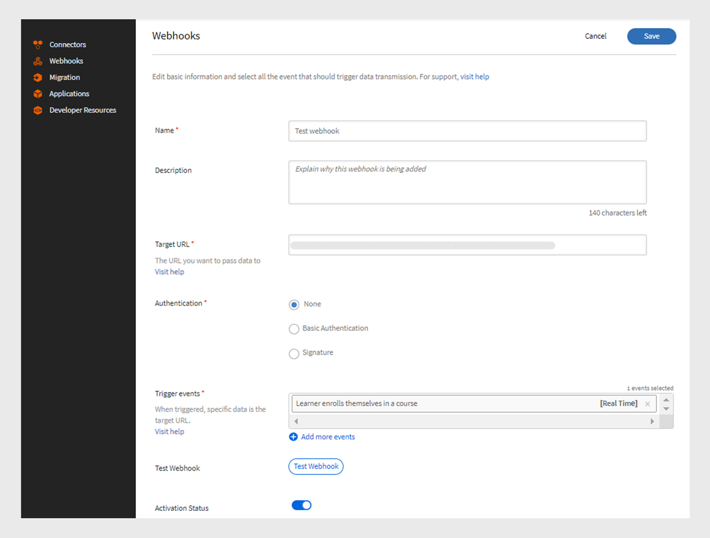

# Webhook

Webhook 允許一個實體在特定事件發生時自動向另一個實體即時傳送資料或通知。 它將使應用程式能夠在不持續請求的情況下，提供其他應用程式資訊。 例如，若使用者完成學習管理系統（LMS）課程，webhook 可自動將該資訊傳送至其他平台，如 CRM 或報告工具。 Webhook 常用於整合，以自動化流程並減少系統間手動更新的需求。 設置 webhook，提供一個回調 URL，然後把資料傳送過去。

## Webhook 與 API 的比較

Webhook 和 API 都幫助系統彼此溝通，但它們的運作方式不同。 API 則只有在使用者請求時才會分享資訊。 例如，如果學習者需要課程進度資料，他們會向 API 發送請求，API 再提供相關資訊。 另一方面，Webhook 會在事件發生時立即自動傳送資料。 例如，若學習者完成課程，資料會立即傳送至監聽者網址，無需手動請求。

## 什麼是即時 API？

即時 API 允許應用程式在事件發生時即時交換資料。 與傳統 API 等待使用者請求資訊不同，即時 API 在資料發生的瞬間即刻共享。 Webhook 作為即時 API，並在指定事件發生時立即協助分享資料。 即時 API 確保資料傳輸即時完成，無需人工請求，讓系統能即時更新。

## Webhook 事件

Webhook 事件是指系統中發生的特定動作，會自動將資料傳送到監聽者的 URL。 例如，當學習者註冊課程時，會觸發一個 webhook 事件，並將註冊資訊傳送到監聽者的網址。

Webhook 事件可分為兩類：

* **即時事件**：事件會即時處理並傳送到目標網址
* **非即時事件**：事件以批次處理，並於指定時間發送，而非即時

## 監聽器網址

監聽器網址是一個端點或目的地，當事件發生時會接收資料資訊。 每當發生特定事件，例如使用者報名課程時，系統會自動將詳細資訊傳送至該網址，無需人工請求。 監聽者網址是所有這些更新的傳送地址。
Webhook 會以 JSON 格式傳送相關資訊。 以下是 Adobe Learning Manager 觸發事件的範例載荷：

```
{
  "accountId": 1010,
  "events": [
    {
      "eventId": "d5fb7071-10a9-46b2-9f9e-79dde346c052",
      "eventName": "COURSE_ENROLLMENT_BATCH",
      "timestamp": 1727414643000,
      "eventInfo": "1727414643000-047210-84242-0",
      "data": {
        "userId": 4279332,
        "loId": "course:7374992",
        "loInstanceId": "course:7376092_10250977",
        "loType": "course",
        "enrollmentSource": "ADMIN_ENROLL",
        "dateEnrolled": 1727414643
      }
    }
  ]
}
```

## 建立與管理 Webhooks – 整合管理

請依照以下步驟在 Adobe Learning Manager 中建立 Webhooks 整合：

1. 以 . 登入。**[!UICONTROL Integration Admin]**
2. 在首頁選擇 **[!UICONTROL Webhooks]** > **[!UICONTROL Add Webhook]**。

   
   _新增一個 webhook_

3. 輸入 **[!UICONTROL Name]** Webhook 的 和 **[!UICONTROL Description]** 。
4. 輸入監聽器網址 **[!UICONTROL Target URL]** 作為你想傳遞事件資料的地方。
5. 選擇任一種認證方式：Webhooks 中的認證是一種安全方法，確保傳送到監聽者 URL 的資料來自受信任的來源。
   * **[!UICONTROL None]**：無需認證。
   * **[!UICONTROL Basic]**：這是基於憑證的認證。 輸入使用者名稱和密碼。
   * **[!UICONTROL Signature]**&#x200B;系統會建立一個特殊的簽章並將其加入 webhook 資料中。 接收端伺服器會檢查這些程式碼，確保資料是真實且沒有被更改。 產生簽名並用於驗證。 下載該簽章為 JSON。
6. 從 **[!UICONTROL Trigger events]** 下拉選單中選擇 Webhook 事件。

   >[!NOTE]
   >
   >你也可以從新增 Webhook 頁面選擇測試 Webhooks 選項來測試 webhooks。

7. 選擇 **[!UICONTROL Activation Status]** 開啟 webhook 的開關。 啟用後，當選取的事件發生時，資料會被傳遞。

>[!NOTE]
>
>你可以建立和管理最多 5 個 Webhook。

### 編輯 Webhooks – 整合管理

請依照以下步驟從 Adobe Learning Manager 編輯 Webhooks：

1. 以 **[!UICONTROL Integration Admin.]**
2. 請在首頁選擇 **[!UICONTROL Webhooks]** 。
3. 選擇你想編輯的 webhook。

   
   _編輯 webhook_
4. 選擇 **[!UICONTROL Edit]** 修改 webhook 的細節並選擇 **[!UICONTROL Save]**。

### 移除 Webhooks – 整合管理員

請依照以下步驟從 Adobe Learning Manager 編輯 Webhooks：

1. 以 . 登入。**[!UICONTROL Integration Admin]**
2. 請在首頁選擇 **[!UICONTROL Webhooks]** 。
3. 選擇你想刪除的 webhook。
4. 選擇 **[!UICONTROL Delete]** 移除 webhook。


_移除 webhook_

### Retire Webhooks – 整合管理員

請依照以下步驟退休 webhook：

1. 以 . 登入。**[!UICONTROL Integration Admin]**
2. 請在首頁選擇 **[!UICONTROL Webhooks]** 。
3. 選擇你想編輯的 webhook。
4. 選擇 **[!UICONTROL Edit]** 並停用 以 **[!UICONTROL Activation Status]** 退休 webhook。


_退休 webhook_

## 替代機的 Webhook {#webhooks-for-alternates}

ALM 提供專用的 webhook 事件，以支援自動化、整合及與外部系統同步。

這些事件讓外部消費者能可靠地區分直接完成與透過替代關係獲得的完成。

### 概觀

當學習者透過替代或關聯完成課程時，ALM 會觸發一個與標準課程完成 webhook 不同的 webhook 事件。 這確保整合能在需要時以不同方式回應替代完成。

當出現追溯性完成或追溯性未完成時，也會觸發 Webhook 事件，涵蓋歷史更新及關係變更。

### Webhook 事件行為

* 當學習者取得目標課程的「完成」狀態時，會觸發一個獨立的 webhook 事件。
* 當學習者完成一個已設定的來源課程，透過替代關係滿足目標時，該事件就會產生。
* 此 webhook 不會因直接完成課程而觸發。
* 當啟用追溯完成或追溯未完成時，會針對每位受影響的學習者及目標課程發出 webhook 事件。

### Webhook 有效載荷細節

備用完成 webhook 有效載荷包含以下關鍵屬性：

* **學習者識別**&#x200B;識別獲得替代補全的學習者。
* **原始課程**&#x200B;學習者直接完成的課程或學習路徑。
* **目標賽道**&#x200B;該課程透過替代關係標記為已完成。
* **完備方法**&#x200B;表示補全方法為交替。
* **完工日期**&#x200B;資料來源為原始課程的完成日期。
* **關係類型**&#x200B;指定關係是否為交替。

對於追溯性未完成情境，webhook 事件表示已有的替代完成已被撤銷。

### 整合考量

外部系統可利用這些 webhook 事件：

* 更新學習者紀錄
* 同步完成狀態
* 觸發通知或下游工作流程
* 維護審計追蹤以符合法規

Webhook 使用者應明確區分直接完成與替代完成。

替代完成不會授予技能、徽章或遊戲化獎勵。 下游系統應相應處理回饋。

## 自適應學習路徑的 Webhook

### 簡介

Adobe Learning Manager 提供 **webhook 事件**，當學習路徑（學習程式&#x200B;**）完成狀態**&#x200B;更新時，會通知外部系統。這讓您能在學習者的完成紀錄被回滾或重新計算時同步下游系統（如人力資源、報告或分析平台）。

新增兩種 webhook 事件類型：

**LEARNING_PATH_COMPLETION_ROLLBACK** – 當 **學習者** 為自己刷新學習路徑的完成狀態時觸發。

**LEARNING_PATH_COMPLETION_ROLLBACK_BATCH** – 當&#x200B;**管理員**&#x200B;刷新一位或多位學習&#x200B;**者的學習路徑**&#x200B;完成狀態（例如透過批量操作）時觸發。

這些事件使用 **通用的有效載荷結構** ，並可由你的 webhook 端點來更新或重新處理完成資料。

### 通用有效載荷結構

每個 webhook 請求包含以下頂層結構：

```
{
  "accountId": 69735,
  "events": [
    {
      "eventId": "757b9d58-048c-4ae2-9fff-35f9def7ef29",
      "eventName": "LEARNING_PATH_COMPLETION_ROLLBACK",
      "timestamp": "2026-01-20T05:48:10.000Z",
      "eventInfo": "1768888090000-197513-137581-0",
      "data": {
        "userId": 13446697,
        "loId": "learningProgram:157165",
        "loInstanceId": "learningProgram:157165_148769",
        "loType": "learningProgram",
        "enrollmentSource": "SELF_ENROLL",
        "dateEnrolled": "2026-01-20T05:44:05.000Z"
      }
    }
  ]
}
```

**兩種事件類型使用相同的結構**;只有 eventName 與資料內的值（例如 userId、loId、enrollmentSource）不同。

#### 範例：學習者主動刷新

當學習者刷新自己學習路徑的完成狀態時，webhook 會發送一個LEARNING_PATH_COMPLETION_ROLLBACK事件：

```
{
  "accountId": 69735,
  "events": [
    {
      "eventId": "757b9d58-048c-4ae2-9fff-35f9def7ef29",
      "eventName": "LEARNING_PATH_COMPLETION_ROLLBACK",
      "timestamp": "2026-01-20T05:48:10.000Z",
      "eventInfo": "1768888090000-197513-137581-0",
      "data": {
        "userId": 13446697,
        "loId": "learningProgram:157165",
        "loInstanceId": "learningProgram:157165_148769",
        "loType": "learningProgram",
        "enrollmentSource": "SELF_ENROLL",
        "dateEnrolled": "2026-01-20T05:44:05.000Z"
      }
    }
  ]
}
```

當學習者明確要求刷新時，利用此事件在 **外部系統中重新計算或重置學習者的完成度資料** 。

#### 範例：管理員發起的批次刷新

當管理員對一位或多位學習者執行完成更新（例如，修正一組的歷史完成紀錄）時，webhook 會發出一個LEARNING_PATH_COMPLETION_ROLLBACK_BATCH事件：

```
{
  "accountId": 69735,
  "events": [
    {
      "eventId": "757b9d58-048c-4ae2-9fff-35f9def7ef29",
      "eventName": "LEARNING_PATH_COMPLETION_ROLLBACK_BATCH",
      "timestamp": "2026-01-20T05:48:10.000Z",
      "eventInfo": "1768888090000-197513-137581-0",
      "data": {
        "userId": 13446698,
        "loId": "learningProgram:157166",
        "loInstanceId": "learningProgram:157166_148770",
        "loType": "learningProgram",
        "enrollmentSource": "ADMIN_ENROLL",
        "dateEnrolled": "2026-01-21T05:44:05.000Z"
      }
    }
  ]
}
```

在批次操作中，你的 webhook 端點可能會在單一請求&#x200B;**中接收**&#x200B;多個事件物件，每個完成的學習者會接收一個。你的整合應該會迭代事件陣列，並獨立處理每個事件。

### 如何在整合中運用這些事件

你可以利用這些 webhook 事件來：

**當完成紀錄被回滾或重新計算時，能與外部的 LMS/LRS、人力資源或報告系統同步完成紀錄** 。

**觸發下游工作流程** ，如重新分配、通知或重新計算證照與徽章。

**透過記錄 eventId、時間戳、eventInfo，以及學習者與學習路徑識別碼來維護稽核軌跡** 。

至少，你的 webhook 處理器應該：

驗證有效載荷並解析事件[]。
使用 eventName 判斷變更是 **learnerinitiated** 還是 **admin/batchinitiated**。

使用 userId、loId 和 loInstanceId，在系統中找到並更新對應的紀錄。
利用 eventId 避免同一事件多次傳送時重複處理。

## 用於新增與移除使用者群組成員的 Webhook

兩種新的 webhook 事件類型會攜帶最終狀態：

* 反應:ASYNCAPI_USERGROUP_USER_ADDED
* 反應:ASYNCAPI_USERGROUP_USER_REMOVED

### 樣本有效載荷

```
{
  "accountId": 69735,
  "events": [
    {
      "eventId": "cd2972c8-cb15-47a0-a23f-e4a16cb720f5",
      "eventName": "RESPONSE:ASYNCAPI_USERGROUP_USER_REMOVED",
      "timestamp": "2026-03-18T13:38:12.000Z",
      "eventInfo": "cd2972c8-cb15-47a0-a23f-e4a16cb720f5",
      "data": {
        "status": "SUCCESS",
        "request": {
          "metadata": { "event_id": "cd2972c8-cb15-47a0-a23f-e4a16cb720f5" },
          "data": [ { "type": "user", "id": "13446641" } ]
        }
      }
    }
  ]
}
```

### 關鍵要素

* `accountId` 識別 ALM 帳戶。
* `events` 是一個事件物件陣列。
* `eventId` 與原始非同步請求識別碼相符。
* `eventName` 表示新增或移除操作。
* `timestamp` 顯示完成時間。
* `data.status` 目前成功批次會顯示「成功」。
* `data.request` 包含你寄出的完全相同的請求。

你的積分主要應該以（或`metadata.event_id`）`status`和`eventId`為鍵。

### 範例

#### 非同步新增使用者

**第一步。 做非同步通話**

發佈 /primeapi/v2/async/userGroups/12345/users

```
{
  "metadata": {
    "event_id": "sync-2026-03-30T10:15:00Z-ug-12345",
    "sourceSystem": "HRIS",
    "batchId": "hr_2026_03_30_0001"
  },
  "data": [
    { "type": "user", "id": "11101219" },
    { "type": "user", "id": "11101220" }
  ]
}
```

**步驟二。 閱讀即時回應**

```
{ "event_id": "sync-2026-03-30T10:15:00Z-ug-12345" }
```

你現在可以在系統中標記此職缺為已提交。

**步驟三。 處理 Webhook**

Webhook 回調範例：

```
{
  "accountId": 69735,
  "events": [
    {
      "eventId": "sync-2026-03-30T10:15:00Z-ug-12345",
      "eventName": "RESPONSE:ASYNCAPI_USERGROUP_USER_ADDED",
      "timestamp": "2026-03-30T10:15:43.000Z",
      "data": {
        "status": "SUCCESS",
        "request": {
          "metadata": {
            "event_id": "sync-2026-03-30T10:15:00Z-ug-12345",
            "sourceSystem": "HRIS",
            "batchId": "hr_2026_03_30_0001"
          },
          "data": [
            { "type": "user", "id": "11101219" },
            { "type": "user", "id": "11101220" }
          ]
        }
      }
    }
  ]
}
```

典型消費者會：

* 找出內部工作。
* 可選擇使用 GET /userGroups/{id}/users 驗證會員資格。
* 將工作標記為完成。

#### 非同步移除使用者

移除是對稱的，使用相同身體結構的 DELETE。

```
{
  "metadata": {
    "event_id": "sync-2026-03-30T11:00:00Z-ug-12345",
    "sourceSystem": "HRIS",
    "batchId": "hr_2026_03_30_0002"
  },
  "data": [ { "type": "user", "id": "11101219" } ]
}
```

立即回應：

```
{ "event_id": "sync-2026-03-30T11:00:00Z-ug-12345" }
```

之後，一個帶有相同 eventId 的回應:ASYNCAPI_USERGROUP_USER_REMOVED Webhook 也到了。

欲了解更多資訊，請參閱 [非同步公開 API 以取得使用者群組成員資格](/help/migrated/api-changes-alm.md#asynchronous-public-apis-for-user-group-membership) 。
