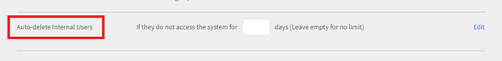
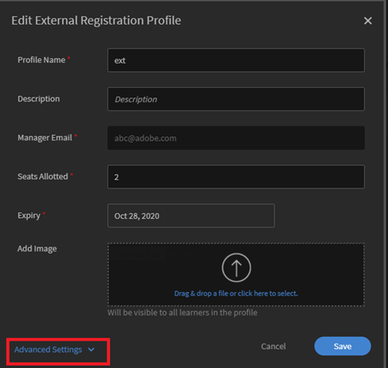

# 使用者在Learning Manager中自動刪除 {#user-gets-auto-deleted-in-learning-manager}

## 問題

使用者會從Learning Manager中刪除，但管理員不會執行任何此類動作。

## 原因

在Adobe Learning Manager中，有一個選項可讓您刪除在一段時間內未登入系統的使用者。

## 如何變更/套用設定？

### 內部學習者

1. 以&#x200B;**系統管理員**&#x200B;登入。
1. 在&#x200B;**設定**&#x200B;下，按一下&#x200B;**設定** > **一般**。
1. 在一般設定頁面中，請參閱選項&#x200B;**自動刪除內部使用者**。
1. 按一下&#x200B;**[!UICONTROL Edit]**&#x200B;在欄位中輸入天數，如果學習者未存取系統，則自動刪除學習者。

   

   *編輯天數*

>[!NOTE]
>
>   如果您不想自動刪除使用者，請將此欄位保留空白。

1. 按一下&#x200B;**[!UICONTROL Save]**&#x200B;以保留所做的設定。

### 對於外部學習者：

1. 以&#x200B;**系統管理員**&#x200B;登入。
1. 在&#x200B;**管理**&#x200B;下，按一下&#x200B;**[!UICONTROL Users]** > **[!UICONTROL External]**。
1. 按一下需要套用設定的外部使用者名稱。

   這會開啟&#x200B;**編輯外部註冊設定檔**&#x200B;視窗。

1. 按一下左下角的&#x200B;**[!UICONTROL Advanced Settings]**。

   

   *選取[進階設定]選項*

1. 在&#x200B;**登入需求**&#x200B;欄位中，輸入學習者未存取系統時自動刪除的天數。
1. 按一下&#x200B;**[!UICONTROL Save]**&#x200B;以保留所做的設定。
