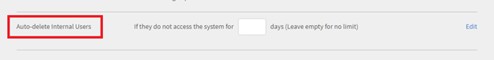
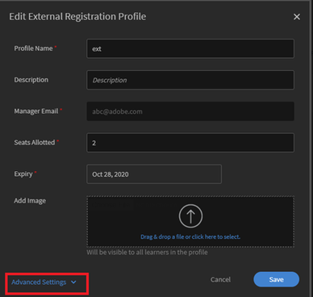

# 使用者在學習管理員中會自動刪除 {#user-gets-auto-deleted-in-learning-manager}

## 子嗣

使用者會從學習管理員中刪除，但管理員從未執行過任何此類操作。

## 成因

在 Adobe Learning Manager 中，有一個選項允許你刪除該使用者，如果他/她在系統中未登入一定時間。

## 如何更改或套用設定？

### 給內在學習者

1. 以管理員&#x200B;**身份登入**。
1. 在設定&#x200B;**中**，點選&#x200B;**>**&#x200B;一般&#x200B;**設定**。
1. 在一般設定頁面，請參閱「自動刪除內部使用者&#x200B;**」這個選項**。
1. 點擊 **[!UICONTROL Edit]** 輸入欄位中的天數，若學習者尚未進入系統，即可自動刪除。

   

   *編輯天數*

>[!NOTE]
>
>   若不想自動刪除使用者，請將欄位留空。

1. 點擊 **[!UICONTROL Save]** 以保留已設定的設定。

### 對外部學習者：

1. 以管理員&#x200B;**身份登入**。
1. 在管理&#x200B;**中**，點擊&#x200B;**[!UICONTROL Users]**>**[!UICONTROL External]**。
1. 點選需要套用該設定的外部使用者名稱。

   這會開啟 **「編輯外部註冊資料」** 視窗。

1. 點擊 **[!UICONTROL Advanced Settings]** 左下角。

   

   *選擇「進階設定」選項*

1. 在 **登入需求** 欄位輸入若學員尚未進入系統，自動刪除的天數。
1. 點擊 **[!UICONTROL Save]** 以保留已設定的設定。
