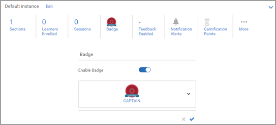
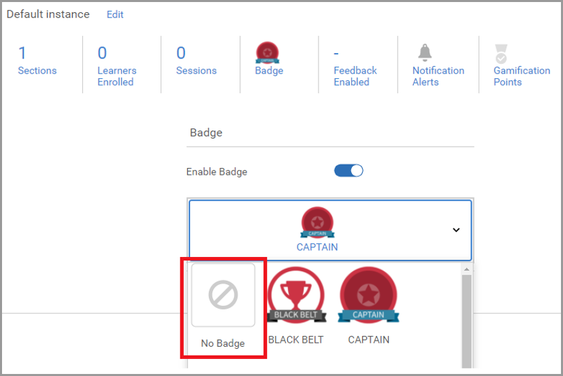
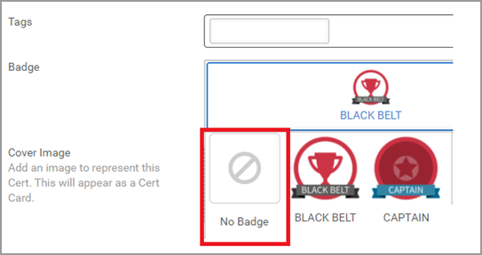

# 無法指派徽章

## 問題

即使完成課程或訓練，仍無法如預期獲得徽章。

## 說明

學習者完成課程/學習計畫/認證後，徽章不會授予學習者。

## 原因

當學習者完成學習物件後，會新增指派給學習物件的徽章。

在舊版中，如果在學習者完成學習物件時沒有指派徽章給學習物件，則無法稍後新增徽章。

在目前版本中，此功能可供使用。

## 解決方法

如果學習者遇到問題，請嘗試下列步驟：

## 課程/學習計畫

1. 以管理員身分登入。

1. 開啟相關的學習物件（課程/學習計畫）。

1. 按一下 **[!UICONTROL Instances]** > **[!UICONTROL Badge]**.

   

1. 從學習物件移除徽章，然後按一下 **[!UICONTROL Save]**.

   

1. 將徽章重新指派給學習物件，然後按一下 **[!UICONTROL Save]**.

   此步驟會將徽章指派給所有已註冊學習物件的學習者。

## 認證

1. 以管理員身分登入。
1. 開啟認證。
1. 按一下 **[!UICONTROL Overview]** > **[!UICONTROL Badge]**.
1. 從認證中移除徽章，然後按一下 **[!UICONTROL Save]**.

   

1. 將徽章重新指派給認證，然後按一下 **[!UICONTROL Save]**.
