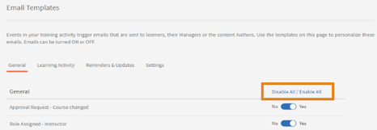
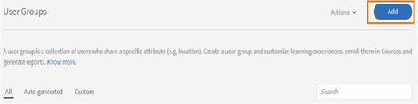
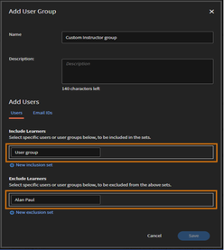
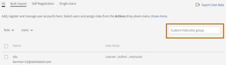
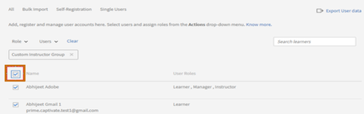

# Learning Manager中講師角色的預設配置給使用者群組

## 問題

分配給工作階段的所有使用者都會被指派講師的角色。

## 說明

在某些情況下，一個工作階段可能需要多個講師，或者管理員/作者將使用者群組指派給一個工作階段。 這會導致使用者群組中的所有使用者被指派為講師的角色。

## 原因

由於角色無法在大量指派使用者群組使用者期間進行分支，因此會指派講師角色給所有使用者。

## 解決方案

建立自訂使用者群組以篩選指派給工作階段的使用者角色。 若要移除使用者群組中指派的講師角色，請執行下列步驟：

1. 以管理員身分登入。 在左側面板中，按一下&#x200B;**[!UICONTROL Email Templates]**。
1. 若要避免電子郵件觸發以進行變更，請按一下&#x200B;**[!UICONTROL Disable All]**。

   

1. 瀏覽至&#x200B;**使用者** > **使用者群組**。 按一下&#x200B;**[!UICONTROL Add]**。

   

1. 在「新增使用者群組」視窗中建立自訂使用者群組，如下所示：

   * 在&#x200B;**[!UICONTROL Name]**&#x200B;欄位中輸入自訂群組的名稱。
   * 在&#x200B;**[!UICONTROL Include Learners]**&#x200B;欄位下，新增您要篩選其講師的使用者群組。
   * 在&#x200B;**[!UICONTROL Exclude Learners]**&#x200B;欄位下，新增您要保留講師角色的使用者。

   

   上述步驟會建立要新增至包含集中的使用者清單，並移除排除集中提及的特定使用者（講師）。

1. 按一下&#x200B;**[!UICONTROL Save]**&#x200B;所做的變更。
1. 前往「**[!UICONTROL Users]** > **[!UICONTROL Internal]**」搜尋已建立的自訂使用者群組。

   

1. 按一下核取方塊以選取群組中的所有使用者。

   

1. 按一下&#x200B;**[!UICONTROL Actions]** > **[!UICONTROL Remove Role]** > **[!UICONTROL Remove Instructor]**。

請確保在步驟2中停用的任何電子郵件觸發程式在完成後都重新啟用。
