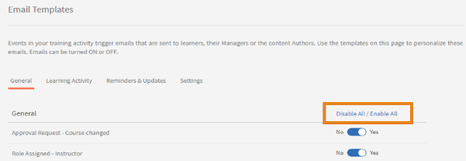
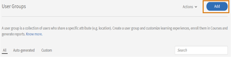
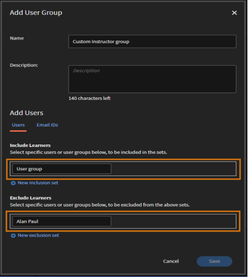
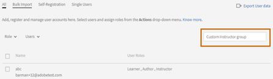
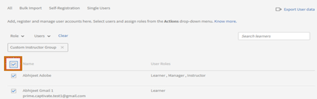

# Learning Manager 中使用者群組中教師角色的預設分配

## 子嗣

所有被分配到該會話的使用者都會被指派為講師的角色。

## 說明

有些情境下，一個會話可能需要多位講師，或管理員/作者指派使用者群組到某個會話。 這會導致使用者群組中的所有使用者都被指派為講師的角色。

## 成因

由於在使用者群組中大量指派使用者時，角色無法分支，因此講師角色會分配給所有使用者。

## 解法

建立自訂使用者群組以篩選分配給會話的使用者角色。 要移除使用者群組中指定的講師角色，請執行以下步驟：

1. 以管理員身份登入。 在左側面板，點擊 **[!UICONTROL Email Templates]**。
1. 為了避免收到電子郵件觸發變更，請點擊 **[!UICONTROL Disable All]**。

   

1. 前往 **使用者** > **使用者群組**。 點擊 **[!UICONTROL Add]**。

   

1. 在新增使用者群組視窗中建立自訂使用者群組，如下：

   * 在欄位 **[!UICONTROL Name]** 中輸入自訂群組的名稱。
   * 在欄位中 **[!UICONTROL Include Learners]** ，新增你想篩選講師的使用者群組。
   * 在欄位中 **[!UICONTROL Exclude Learners]** ，新增你想保留講師角色的使用者。

   

   上述步驟會建立一個要加入包含集的使用者清單，並移除排除集中提及的特定使用者（講師）。

1. 點擊 **[!UICONTROL Save]** 已更改。
1. 請 **[!UICONTROL Users]** 前往 > **[!UICONTROL Internal]**&#x200B;搜尋已建立的自訂使用者群組。

   

1. 點選勾選方塊以選取群組中的所有使用者。

   

1. 點擊 **[!UICONTROL Actions]** > **[!UICONTROL Remove Role]** > **[!UICONTROL Remove Instructor]**。

確保步驟 2 中被停用的電子郵件觸發器在完成後重新啟用。
