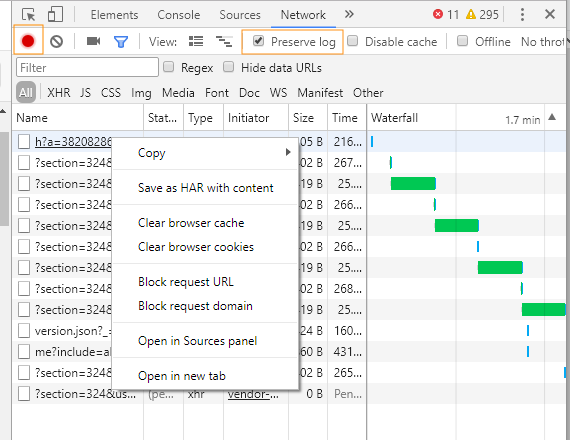
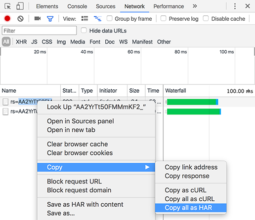

# 產生HAR檔案

請閱讀下文，瞭解如何在Google Chrome上產生HAR檔案。

若要產生HAR檔案，請執行下列步驟：

1. 開啟Google Chrome視窗並開啟新標籤。
1. 開啟頁面的開發人員工具，按一下右鍵> Inspect。
1. 開啟&#x200B;**[!UICONTROL Network]**&#x200B;標籤。 確定紅色記錄按鈕為作用中。 啟用&#x200B;**[!UICONTROL Preserve Log]**&#x200B;核取方塊。

   

   *在[網路]索引標籤中選取[保留記錄檔]核取方塊*

1. 使用您的憑證登入[Learning Manager](https://learningmanager.adobe.com/acapindex.html)並參加課程。 執行所有會導致問題的操作。
1. 在開發人員工具中，按一下滑鼠右鍵並選取&#x200B;**全部儲存為HAR與內容**。

   在某些版本的Google Chrome中，您可能必須選取&#x200B;**[!UICONTROL Copy]** > **[!UICONTROL Copy all as HAR]**。

   

   *複製所有HAR檔案*

1. 將複製的內容貼到記事本檔案中。 將其以&#x200B;**logs.har**&#x200B;格式儲存至案頭，並透過電子郵件傳送給Adobe。
