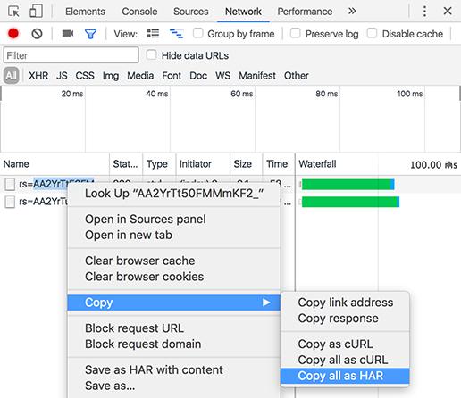

# 產生 HAR 檔案

繼續閱讀，了解如何在 Google Chrome 上產生 HAR 檔案。

要產生 HAR 檔案，請依照以下步驟操作：

1. 打開 Google Chrome 視窗並開啟新分頁。
1. 打開該頁面的開發者工具，右鍵點擊 > 檢查。
1. 打開 **[!UICONTROL Network]** 分頁。 請確認紅色錄影按鈕是啟用的。 啟用 **[!UICONTROL Preserve Log]** 勾選框。

   

   *在網路標籤中選擇「保留日誌」勾選框*

1. 請 [使用你的帳號登入學習管理員](https://learningmanager.adobe.com/acapindex.html) 並參加課程。 做所有會導致問題的操作。
1. 在開發者工具中，右鍵點擊並選擇 **「全部儲存為 HAR 並包含內容**」。

   在某些版本的 Google Chrome，你可能需要選擇 **[!UICONTROL Copy]** > **[!UICONTROL Copy all as HAR]**。

   

   *複製所有 HAR 檔案*

1. 把複製的內容貼到記事本檔案裡。 把它存到桌面，格式是 **logs.har** ，然後寄給 Adobe。
