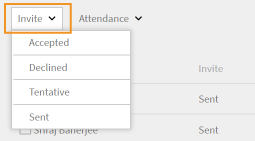
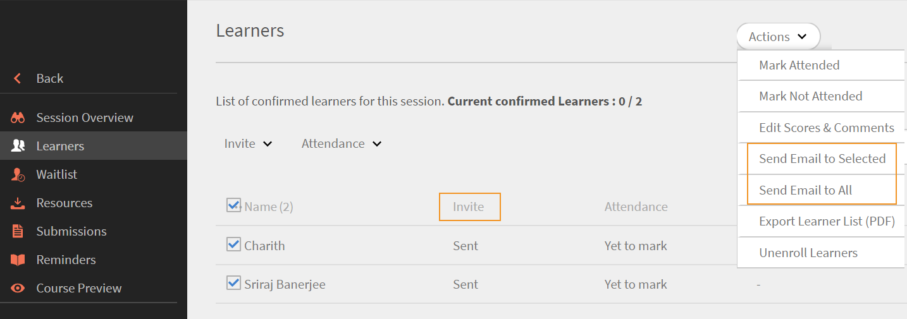

# 檢視學習者對[!DNL Learning Manager]上的Outlook行事曆邀請的回應

瞭解管理員和講師如何檢視學習者對行事曆邀請的回應。

在Learning Manager中，當學習者註冊課程中的虛擬課程/教室工作階段時，學習者會獲得詳細的Outlook行事曆邀請。

學習者對工作階段邀請的回應會記錄在Learning Manager中，管理員和講師可以檢視詳情。

如果學習者回應相同邀請多次，則會考量最新回應並覆寫前一個回應。 如果工作階段計時變更，則會清除所有邀請回應，學習者需要再次回應請求。

## 啟用邀請回覆追蹤功能 {#enablingtheinvitereplytrackingfeature}

* 請聯絡Adobe Learning Manager支援以啟用邀請回覆追蹤功能。
* 為帳戶啟用此功能後，作者建立的所有未來虛擬類別/類別聊天室工作階段都可以記錄學習者對行事曆邀請的回應。

如果學習者註冊了在啟用邀請 — 回覆 — 追蹤功能之前建立的虛擬類別/類別會議室工作階段，則不會記錄學習者對行事曆邀請的回應。

## 以管理員身分檢視邀請回應 {#viewinginviteresponsesasanadmin}

如果虛擬類別/類別聊天室工作階段已啟用邀請回覆追蹤功能，則管理員可檢視學習者對邀請的回應以及其他許可權，如下所示：

1. 按一下左側導覽面板中的&#x200B;**[!UICONTROL Course]**，並檢視啟用邀請回覆追蹤功能後建立的課程。
1. 按一下左側導覽面板中的&#x200B;**[!UICONTROL Attendance & Scoring]**。
1. 若要顯示下表中包含學習者名稱及其對於行事曆邀請的回應，請在「出席與評分」頁面上選取&#x200B;**執行個體**&#x200B;和&#x200B;**[!UICONTROL Module]**。
1. 使用&#x200B;**[!UICONTROL Invite]**&#x200B;篩選依據下列選項來檢視學習者：所有回應、已接受、已拒絕、暫定及已傳送

   

1. 若要只傳送電子郵件給已選取的學習者，請從「出席與評分」頁面的右上角按一下「**[!UICONTROL Actions]** > **[!UICONTROL Send Email to Selected]**」。

   若要傳送電子郵件給「出席與評分」頁面中顯示的所有學習者，請按一下「**[!UICONTROL Actions]** > **[!UICONTROL Send Email to All]」。**

1. 若要下載學習者工作階段詳細資訊的csv報告（顯示在出席與評分頁面中），請按一下「**[!UICONTROL Actions]** > **[!UICONTROL Export]」。**

## 以講師的身分檢視邀請回應 {#viewinginviteresponsesasaninstructor}

如果帳戶已啟用邀請 — 回覆 — 追蹤功能，請依照下列程式檢視學習者對行事曆邀請的回應：

1. 按一下左側導覽面板中的&#x200B;**[!UICONTROL Upcoming Sessions]**&#x200B;並選取課程。
1. 按一下左側導覽面板中的&#x200B;**[!UICONTROL Learners]**，以取得已回應行事曆邀請的學習者詳細檢視。
1. 使用&#x200B;**[!UICONTROL Invite]**&#x200B;篩選器，根據下列選項篩選學習者的名稱：已接受、已拒絕、暫定及已傳送

   

1. 您可以根據顯示的學習者資訊傳送電子郵件給學習者。

   若要只傳送電子郵件給已選取的學習者，請按一下&#x200B;**[!UICONTROL Actions]** > **[!UICONTROL Email to Selected]**。

   若要傳送電子郵件給顯示表格中的所有學習者，請按一下「**[!UICONTROL Actions]** > **[!UICONTROL Email to All]**」。

   

