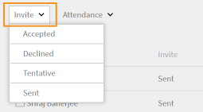
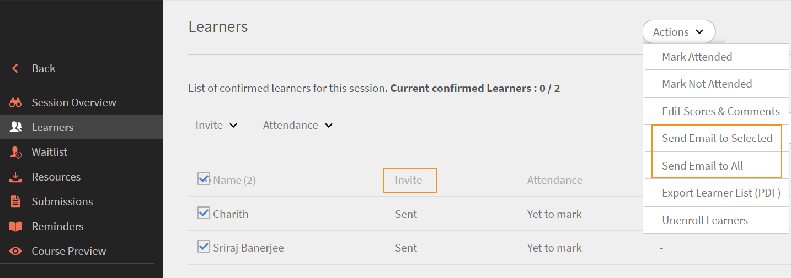

# 查看學習者對 Outlook 日曆邀請的回應 [!DNL Learning Manager]

了解管理員與講師如何查看學習者對行事曆邀請的回應。

在學習管理員中，當學習者註冊課程中的虛擬課程/教室課程時，會收到詳細的 Outlook 行事曆邀請。

學習者對課程邀請的回應會記錄在學習管理員中，管理員與講師可查看詳細資訊。

如果學習者對同一邀請回覆超過一次，則會考慮最新的回應並覆蓋先前的回覆。 若課程時間改變，所有邀請回應將被清除，學習者需再次回應該請求。

## 啟用邀請回覆追蹤功能 {#enablingtheinvitereplytrackingfeature}

* 請聯絡 Adobe Learning Manager 支援，啟用邀請回覆追蹤功能。
* 一旦該功能啟用，所有由作者建立的未來虛擬教室/教室課程都能記錄學習者對行事曆邀請的回應。

若學習者在啟用邀請回覆追蹤功能前已註冊虛擬課程/教室課程，則學習者對行事曆邀請的回應不會被記錄。

## 以管理員身份查看邀請回應 {#viewinginviteresponsesasanadmin}

如果虛擬教室/教室課程啟用了邀請-回覆追蹤功能，管理員可以查看學習者對邀請的回應及其他權限，如下：

1. 從左側導覽面板點擊 **[!UICONTROL Course]** ，查看啟用邀請-回覆追蹤功能後所建立的課程。
1. 從左側導航面板點擊 **[!UICONTROL Attendance & Scoring]** 。
1. 若要在下方顯示學習者姓名及其對行事曆邀請的回應，請選擇 **實例** ，並 **[!UICONTROL Module]** 於出席與評分頁面。
1. 使用 **[!UICONTROL Invite]** 篩選器可根據以下選項查看學習者：所有回應、接受、拒絕、暫定及已送出

   

1. 若要只向被選中的學習者發送電子郵件，請從出席與評分頁面右上角點擊 **[!UICONTROL Actions]** > **[!UICONTROL Send Email to Selected]** 。

   若要將電子郵件寄送給所有顯示於「出席與評分」頁面的學習者，請點擊 **[!UICONTROL Actions]** > **[!UICONTROL Send Email to All]。**

1. 若要下載學生課程細節的csv報告，該報告顯示於出席與評分頁面，請點擊 **[!UICONTROL Actions]** > **[!UICONTROL Export]。**

## 作為講師查看邀請回覆 {#viewinginviteresponsesasaninstructor}

如果該帳號啟用了邀請-回覆追蹤功能，請依以下程序查看學習者對行事曆邀請的回應：

1. 從左側導覽面板點擊 **[!UICONTROL Upcoming Sessions]** 並選擇課程。
1. 點擊 **[!UICONTROL Learners]** 左側導覽面板，可詳細查看回覆行事曆邀請的學習者名單。
1. 使用 **[!UICONTROL Invite]** 篩選器依以下選項篩選學習者姓名：接受、拒絕、暫定及已送出

   

1. 根據顯示的學習者資訊，你可以向學習者發送電子郵件。

   若要僅寄送電子郵件給已被選中的學習者，請點擊 **[!UICONTROL Actions]** > **[!UICONTROL Email to Selected]**。

   要向顯示表格中的所有學習者發送電子郵件，請點擊 **[!UICONTROL Actions]** > **[!UICONTROL Email to All]**。

   
