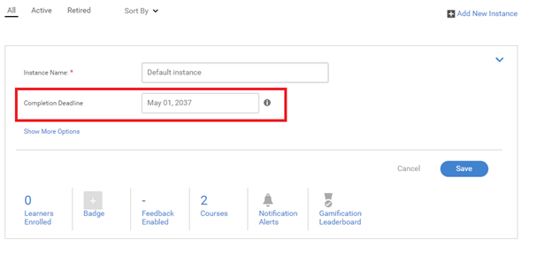
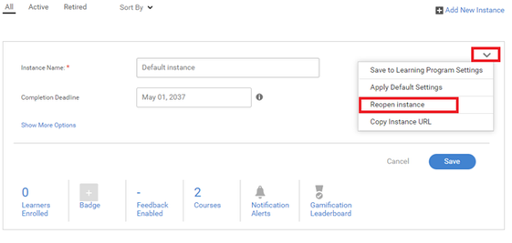

# 棄用學習計畫的問題

## 問題

學習計畫會自動淘汰。

## 原因

在某些情況下，學習計畫已淘汰，而管理員/作者未明確淘汰LP。

發生此問題是因為學習計畫是課程的集合。 如果其中有任何課程包含已淘汰執行環境，或課程執行環境已淘汰，則會淘汰較高階的培訓。

## 解決方法

若要檢查包含已淘汰執行個體的課程，請遵循下列步驟：

1. 以管理員身分登入並啟動相關的學習計畫。

1. 按一下&#x200B;**[!UICONTROL Instances]** > **C課程**。 此頁面會列出屬於此學習計畫的所有課程。 您將能夠檢視包含已淘汰執行個體的課程。

   

   *檢視所有課程清單*

1. 在您找出已淘汰的課程執行個體後，請按一下「**[!UICONTROL Courses]** > **[!UICONTROL Open the course]**」。

1. 按一下&#x200B;**[!UICONTROL Instances]**。 在淘汰的執行個體上，按一下&#x200B;**[!UICONTROL Edit]**，然後將完成日期編輯為您希望執行個體淘汰的未來日期。

   

   *編輯課程的完成日期*

1. 完成後，請按一下下拉式清單（如下圖所示）。 然後按一下&#x200B;**[!UICONTROL Reopen Instance]**。

   

   *重新顯示課程的執行個體*

1. 造訪相關的學習計畫。 按一下&#x200B;**[!UICONTROL Instances]**&#x200B;並執行上一個步驟以重新開啟學習計畫的執行個體。
