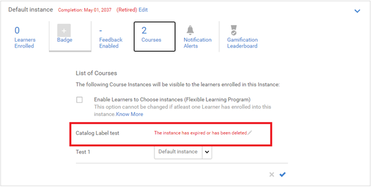
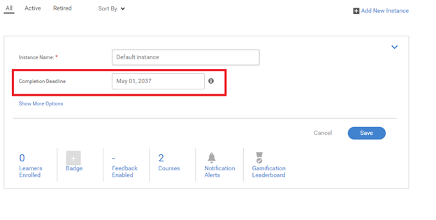
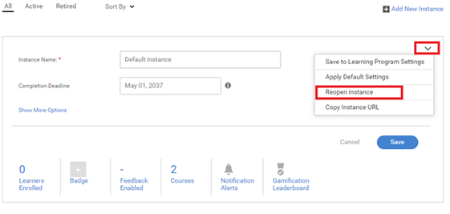

# 退休學習計畫的問題

## 子嗣

學習計畫會自動退休。

## 成因

有些情況是學習計畫在沒有管理員或作者明確退休的情況下退休。

這個問題是因為學習計畫是由一系列課程組成的集合。 若其中任何課程包含已退休的實例，或該課程實例退役，則高階訓練會退役。

## 解決方法

要檢查包含已退休實例的課程，請遵循以下步驟：

1. 以管理員身份登入並啟動相關的學習程式。

1. 點擊&#x200B;**[!UICONTROL Instances]**> **我們的**。該頁面列出了本學習計畫中所有的課程。 你可以看到包含已退休實例的課程。

   

   *查看所有課程列表*

1. 一旦你確定了已退休的課程實例，點擊 **[!UICONTROL Courses]** > **[!UICONTROL Open the course]**。

1. 點擊 **[!UICONTROL Instances]**。 在已退休的實例上，點擊 **[!UICONTROL Edit]** 並編輯完成日期，改成你希望實例退休的未來日期。

   

   *編輯課程完成日期*

1. 完成之後，請點擊下拉選單，如下圖所示。 然後點擊 **[!UICONTROL Reopen Instance]**。

   

   *回贈課程實例*

1. 請造訪相關的學習計畫。 點擊 **[!UICONTROL Instances]** 並執行前一步驟以重新開啟學習程式的實例。
