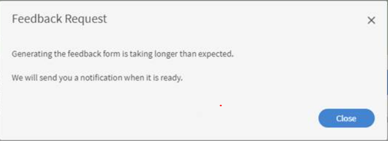

# L1意見回饋自動快顯視窗未出現

## 問題

學習者完成課程後，L1意見自動快顯視窗不會顯示。

## 原因

有時候，學習者可能在完成特定課程後沒有收到L1意見反應，或可能收到如下所示的訊息：

*無法接收L1意見反應*

發生此狀況的可能原因如下：

1. 課程完成後，意見反應未設定為顯示。
1. 提醒已關閉。
1. 已排程在一定時間後顯示提醒。

## 解決方法

1. 確定中已啟用「課程完成後立即顯示問卷」選項 **課程** > **例項** > **L1意見反應**.
   <!---->
1. 以管理員身分，導覽至 **設定>意見回饋**. 檢查何時排程提醒。 如果排程為 **課程後** 完成，將選項變更為 **在課程上** 完成。
1. 啟用下列電子郵件範本： **電子郵件範本>提醒與更新>要求學習者的課程意見**. 如果停用該選項，請啟用該選項，然後進行測試。
1. 如果上述步驟無法運作，請刪除中顯示的提醒 **「管理員>設定>意見回饋」**. 為「課程完成時」建立一個，並根據要求設定週期。
