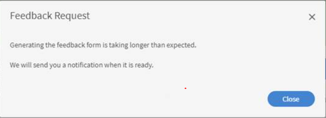

# L1 反饋自動彈出視窗不會出現

## 子嗣

完成課程後，學習者不會看到 L1 回饋自動彈出視窗。

## 成因

有時學習者在完成特定課程後可能未收到第一語言回饋，或收到如下所示的訊息：

*無法接收 L1 回饋*

這可能由以下原因引起：

1. 課程結束後不會顯示回饋。
1. 提醒功能已關閉。
1. 提醒會在一定時間後顯示。

## 解決方法

1. 請確保在課程&#x200B;**>**&#x200B;實例&#x200B;**>** L1回饋&#x200B;**中啟用**「立即顯示問卷」選項。   <!---->
1. 作為管理員，請前往 **設定>回饋**。 確認提醒時間安排。 若排定在 **課程** 完成後，請將選項改為 **課程完成後** 。
1. 啟用以下電子郵件範本： **電子郵件範本>提醒與更新>請求學習者對課程**&#x200B;的回饋。 如果選項被停用，請啟用它，然後再測試。
1. 如果上述步驟無效，請刪除管理員 **>設定>回饋**&#x200B;中的提醒。 建立一個「在航線完成」的選項，並依需求設定重複出現。
