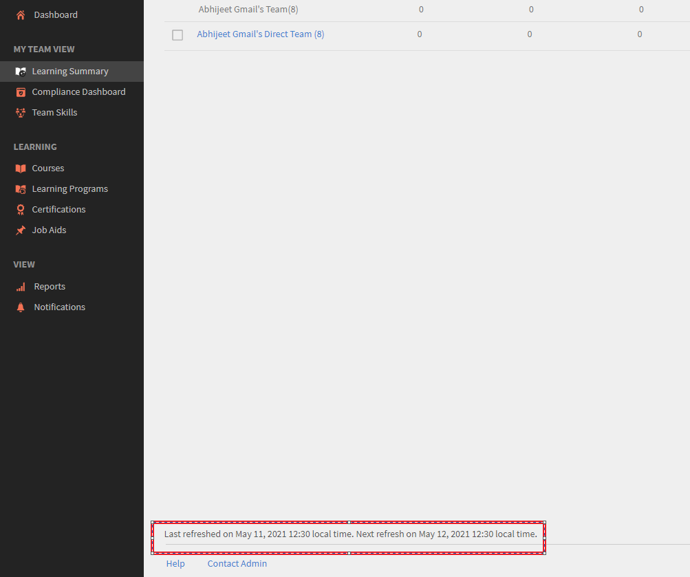

# 學習摘要不顯示目前的資料

## 問題

在Adobe學習管理員中，學習摘要不會顯示註冊、完成或進度的最新資料。

有些情況下學習者會完成課程。 不過，管理員或經理檢視時，資料不會顯示在「學習摘要」中。

## 原因

問題發生的原因是「學習摘要」會根據您選取的條件在不同時間更新。

## 重新整理持續時間

「學習摘要」資料會根據下列排程重新整理：

1. **本月：** 資料每天都會重新整理。 您可以在頁面底部檢視上次重新整理時間。
1. **過去3個月：** 此資料會每月重新整理一次。
1. **過去12個月：** 此資料會每月重新整理一次。

*資料重新整理訊息會顯示在頁面底部*
