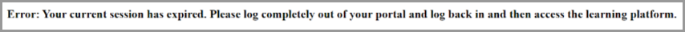

# Learning Manager中的登入問題

## 問題

無法登入Adobe學習管理員。

## 錯誤

嘗試登入AdobeLearning Manager時，顯示如下所示的錯誤訊息：

*過期工作階段的錯誤訊息*

## 原因

當使用者透過SSO登入時，會建立工作階段Cookie並儲存在瀏覽器中。 它也能讓使用者登入其他應用程式。 大部分的SSO都設定為在24小時後登出。 使用者必須重新驗證新工作階段。

在某些情況下，由於SSO Cookie過時，使用者無法存取系統。 這些Cookie會轉送至Adobe Learning Manager進行驗證。 如果使用者長時間未關閉瀏覽器或未登出，工作階段不會結束。

Adobe Learning Manager會拒絕這些導致錯誤的陳舊Cookie。

## 解析度

如果Adobe Learning Manager拒絕過時的Cookie，請嘗試下列選項：

1. 清除瀏覽器Cookie和快取。 如需詳細資訊，請參閱此 [檔案](unable-log-in-learning-manager.md).

   或者，IDP管理員可以在特定設定時間後定義強制登出。 此步驟會再次驗證使用者，以開始新的工作階段。

發生此錯誤還有其他原因，但上述原因很常見。

## 參考連結：

[Microsoft：期限內的條件式存取工作階段](https://docs.microsoft.com/en-us/azure/active-directory/conditional-access/howto-conditional-access-session-lifetime)
