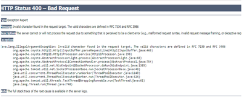
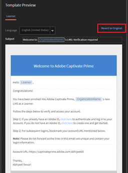

# 由修改範本觸發的電子郵件連結在Learning Manager中擲回錯誤

## 問題

按一下自動化電子郵件/歡迎電子郵件/註冊郵件的連結後發生錯誤。

**錯誤**

HTTP狀態400 — 錯誤請求

## 原因

這通常發生在電子郵件範本不正確自訂時。

**解決方案**

若要避免與中斷連結相關的任何錯誤（可能因自訂而出現），請遵循下列步驟：

1. 以管理員身分登入。
1. 在左側面板中，按一下 **[!UICONTROL Email Templates]**.

1. 導覽至所需的範本，然後按一下以修改它。

   如此將可開啟 **範本預覽** 視窗。

   

   編輯電子郵件範本時請注意以下幾點：

   * 建議您從Learning Manager介面修改電子郵件範本。
   * 將修改過的範本複製貼上到記事本/Word檔案中，以儲存所做變更的復本。
   * 請避免取代範本中反白為藍色的任何動態文字。 例如，「**組織名稱**「， 」**學習者**「， 」**按一下這裡**「， 」**憑證名稱**&quot;，以此類推。

1. 按一下 **[!UICONTROL Save]** 以確認套用至範本的變更。
1. 觸發電子郵件以驗證連結是否如預期運作。
1. 按一下選項，將設定還原為原始設定 **還原為原始** （針對已修改的範本）。
