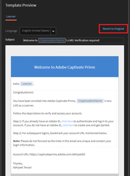

# 從修改過的範本觸發的電子郵件連結會在學習管理員中出錯

## 子嗣

點擊自動郵件/歡迎信箱/報名郵件連結後會發生錯誤。

**錯誤**

HTTP 狀態 400 - 錯誤請求

## 成因

這通常是因為電子郵件範本被錯誤客製化。

**解法**

為避免因自訂而出現的連結失效錯誤，請遵循以下步驟：

1. 以管理員身份登入。
1. 在左側面板，點擊 **[!UICONTROL Email Templates]**。

1. 請導覽到所需範本並點擊修改。

   這會開啟 **範本預覽** 視窗。

   

   編輯電子郵件範本時請注意：

   * 我們建議您在學習管理員介面中修改電子郵件範本。
   * 將修改過的範本複製貼上到記事本或 Word 檔案，以儲存所做變更的副本。
   * 避免替換模板中以藍色標示的動態文字。 例如，「**組織名稱**」、「**學習者**」、「**點此**」、「**憑證名稱**」等等。

1. 點擊 **[!UICONTROL Save]** 確認套用到範本的變更。
1. 觸發郵件確認連結是否如預期運作。
1. 點擊修改後範本的「 **還原為原始** 」選項，將設定還原為原始。
