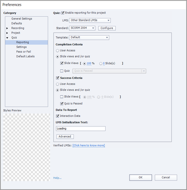

# 在Adobe學習管理員中完成課程時，模組被標籤為未完成

## 問題

即使學習者在Adobe Learning Manager中完成課程後，模組仍會標籤為未完成。

## 原因

SCORM 2004定義了成功和完成標準，並分別傳送兩者的陳述式。

例如，讓某個內容集包含 **完成條件** 共100%投影片檢視和 **成功標準** 設為「通過的測驗」。

學習者，完成課程但未能通過測驗。 在此情況下，進度為100%，但學習者不符合時，模組會標籤為不完整 **成功標準**.

## 解決方案

此問題與報告有關 **偏好設定** 為專案設定。 作者必須確認課程完成和成功所設定的條件。

如果需要進行任何變更，作者可使用內容製作工具(例如Adobe Captivate Classic)進行此作業。 然後，作者可以據此更新模組。

*檢視Captivate Classic報表偏好設定*
