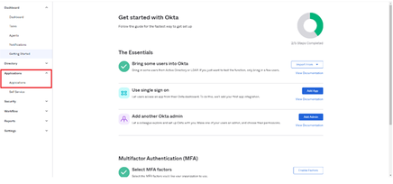
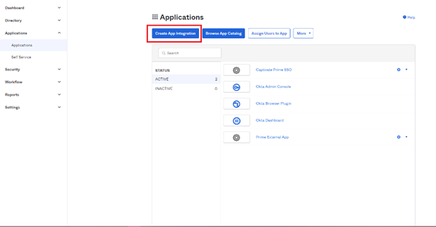
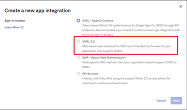
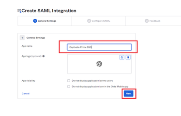
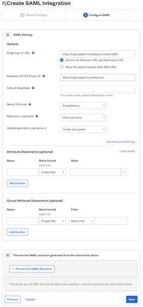
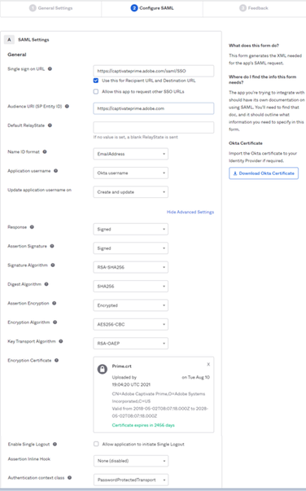
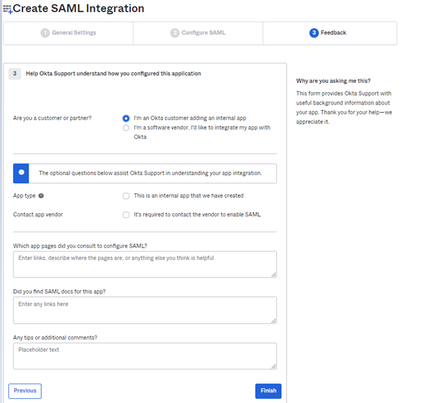
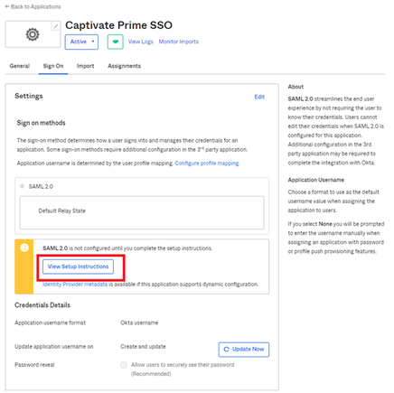
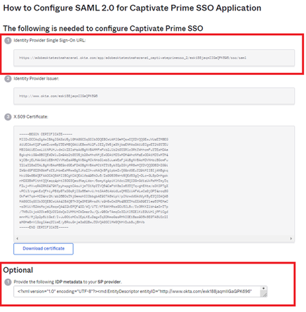

# Okta Active Directory與Adobe Learning Manager整合 {#okta-active-directory-integration-with-adobe-learning-manager}

在本檔案中，您將瞭解如何將Adobe Learning Manager與Okta Active Directory (AD)整合。 將Adobe Learning Manager與Okta AD整合時，您可以：

* 在Okta AD中檢查並控制Learning Manager使用者的存取權。
* 讓使用者能夠使用其Okta AD帳戶自動登入Adobe Learning Manager。
* 在一個中央位置（Okta入口網站）管理您的帳戶。

Adobe Learning Manager支援身分提供者(IdP)和服務提供者(SP)起始的SSO。

## 在OKTA中建立應用程式

1. 登入Okta AD。

   >[!NOTE]
   >
   >您不需要ALM管理員存取權即可建立應用程式和設定IDP。

1. 按一下&#x200B;**[!UICONTROL Applications]**。 如此即會在Okta中開啟應用程式商店。

   

   *在Okta檢視應用程式存放區*

1. 按一下&#x200B;**[!UICONTROL Create App Integration]**。

   

   *選取「建立應用程式整合」*

1. 從新應用程式整合視窗中選取&#x200B;**[!UICONTROL SAML 2.0]**。

   

   *選取SAML2.0選項*

1. 選取&#x200B;**[!UICONTROL Create SAML integration]** > **[!UICONTROL General settings page]**。 輸入應用程式名稱。

   請注意，這可以是任何可唯一識別您應用程式的名稱。 完成後，按一下&#x200B;**[!UICONTROL Next]**。

   

   *輸入應用程式的名稱*

1. 在「配置SAML設定」頁面上執行下列步驟：

   **用於IDP設定：**

   1. 在「單一登入URL」欄位中，輸入URL： [https://learningmanager.adobe.com/saml/SSO](https://learningmanager.adobe.com/saml/SSO)
   1. 在「對象URL」欄位中，輸入URL： [https://learningmanager.adobe.com](https://learningmanager.adobe.com/)
   1. 在&#x200B;**名稱ID格式**&#x200B;下拉式方塊中，選取&#x200B;**電子郵件地址**。
   1. 在&#x200B;**應用程式使用者名稱**&#x200B;下拉式清單中，選取Okta使用者名稱。
   1. 如果您想要傳遞任何其他屬性，可以在&#x200B;**屬性陳述式**&#x200B;下新增屬性（選擇性）

   

   *新增SAML屬性*

   SP設定的&#x200B;**：**

   1. 在「單一登入URL」欄位中，輸入URL： [https://learningmanager.adobe.com/saml/SSO](https://learningmanager.adobe.com/saml/SSO)
   1. 在「對象URL」欄位中，輸入URL： [https://learningmanager.adobe.com](https://learningmanager.adobe.com/)
   1. 在「名稱ID格式」下拉式方塊中，選取&#x200B;**電子郵件地址**。
   1. 在應用程式中，使用者名稱下拉式清單選取Okta使用者名稱。
   1. 按一下&#x200B;**顯示進階設定**。
   1. 在&#x200B;**簽章演演算法**&#x200B;下，選取RSA-SHA256
   1. 在&#x200B;**宣告演演算法**&#x200B;中，選取SHA256
   1. 在&#x200B;**宣告加密**&#x200B;下拉式方塊中，選取&#x200B;**加密**。

   1. 在&#x200B;**加密憑證**&#x200B;選項中，上傳Adobe共用的憑證檔案。
   1. 如果您想要傳遞任何其他屬性，可以在&#x200B;**屬性陳述式** （選擇性）下新增屬性。

   

   *新增其他屬性*

   完成後，按一下&#x200B;**[!UICONTROL Next]**。

1. **意見反應**&#x200B;標籤是選用的。 選取選項並提供您的意見回饋後，請按一下&#x200B;**[!UICONTROL Finish]**。

   

   *完成SAML設定*

## 擷取IDP起始的URL和中繼資料檔案

若要檢視IdP/SP起始的URL和中繼資料檔案，請執行下列步驟：

1. 開啟您已建立的應用程式。
1. 在&#x200B;**單一登入**&#x200B;標籤下，按一下&#x200B;**[!UICONTROL View Instructions]**。

   

   *選取SSO標籤*

   IDP的&#x200B;**：**

   1. 身分提供者單一登入URL是IdP起始的URL。
   1. 複製&#x200B;**選擇性**&#x200B;欄位下出現的所有文字。
   1. 開啟新的記事本檔案並貼上複製的文字。
   1. 按一下「**[!UICONTROL File]** > **[!UICONTROL Save as]** > &quot;filename.xml&quot;。 這將是中繼資料檔案。

   SP的&#x200B;**：**

   1. 身分提供者單一登入URL是IdP起始的URL。
   1. 身分提供者簽發者是實體ID。
   1. 複製&#x200B;**選擇性**&#x200B;欄位下出現的所有文字。
   1. 開啟新的記事本檔案並貼上複製的文字。
   1. 按一下&#x200B;**[!UICONTROL File]** > **[!UICONTROL Save as]** > **[!UICONTROL filename.xml]**。 這將是中繼資料檔案。

   

   *儲存SP XML檔案*

   您必須以XML格式儲存此檔案。

## 設定Adobe Learning Manager SSO

若要設定Adobe Learning Manager SSO，請執行下文中提及的步驟。

<!--

article not in TOC

[SSO Authentication](/help/migrated/kb/sso-authentication-for-learning-manager.md)
-->
