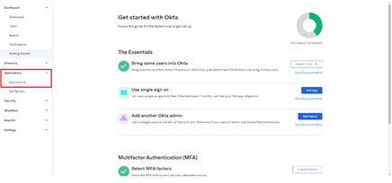
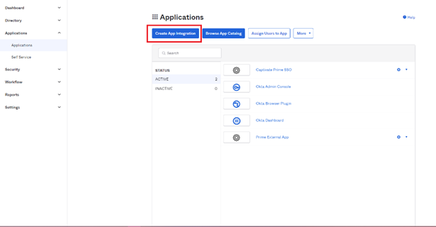
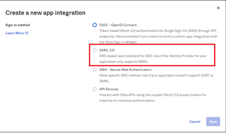
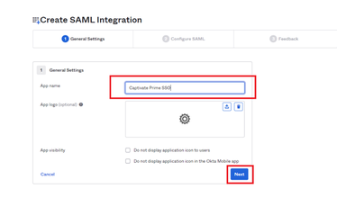
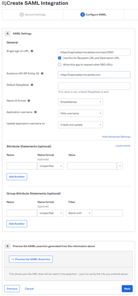
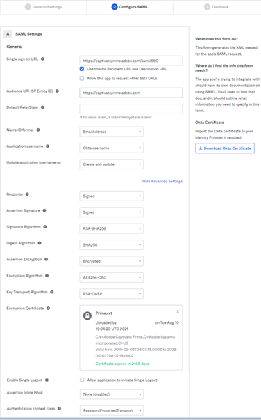
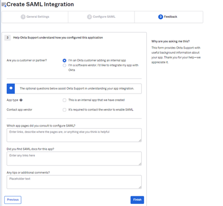
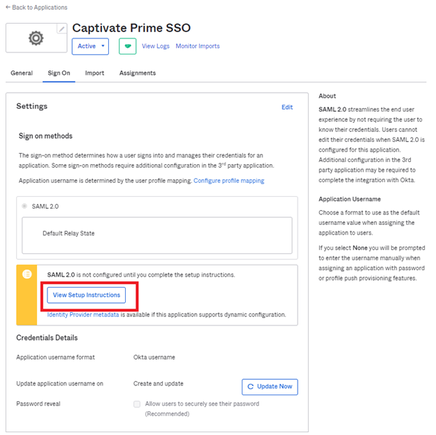
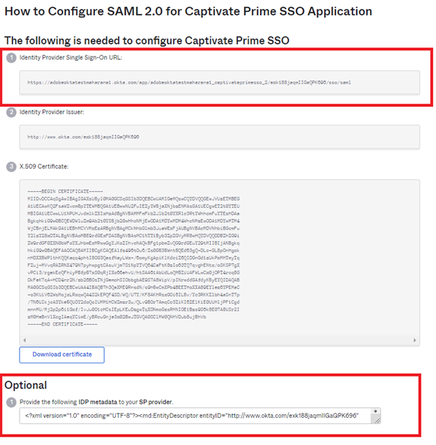

# Okta Active Directory 與 Adobe Learning Manager 的整合 {#okta-active-directory-integration-with-adobe-learning-manager}

在這份文件中，你將學習如何將 Adobe Learning Manager 與 Okta Active Directory （AD） 整合。 當你將 Adobe Learning Manager 與 Okta AD 整合時，你可以：

* 檢查並控制 Learning Manager 使用者在 Okta AD 中的存取權限。
* 啟用使用者自動以 Okta AD 帳號登入 Adobe Learning Manager。
* 在一個集中的地方管理你的帳戶——Okta 入口網站。

Adobe Learning Manager 支援由身份提供者（IdP）和服務提供者（SP）發起的 SSO。

## 在 OKTA 中建立應用程式

1. 登入 Okta AD。

   >[!NOTE]
   >
   >建立應用程式和設定 IDP 不需要 ALM 管理員權限。

1. 點擊 **[!UICONTROL Applications]**。 這會開啟 Okta 的應用程式商店。

   

   *在 Okta 中查看應用程式商店*

1. 點擊 **[!UICONTROL Create App Integration]**。

   

   *選擇建立應用程式整合*

1. 從新的應用程式整合視窗中選擇 **[!UICONTROL SAML 2.0]** 。

   

   *選擇 SAML2.0 選項*

1. 選擇 **[!UICONTROL Create SAML integration]** > **[!UICONTROL General settings page]**。 輸入應用程式名稱。

   請注意，這可以是任何名稱，以唯一識別你的申請。 完成後，點擊 **[!UICONTROL Next]**。

   

   *請輸入應用程式名稱*

1. 請在配置 SAML 設定頁面執行以下步驟：

   **關於 IDP 設定：**

   1. 在單一登入網址欄位輸入 URL： [https://learningmanager.adobe.com/saml/SSO](https://learningmanager.adobe.com/saml/SSO)
   1. 在受眾網址欄位輸入網址： [https://learningmanager.adobe.com](https://learningmanager.adobe.com/)
   1. 在「 **姓名 ID 格式** 」下拉選單中，選擇 **電子郵件地址**。
   1. 在 **應用程式使用者名稱** 下拉選單中，選擇 Okta 使用者名稱。
   1. 如果你想傳遞額外的屬性，可以在屬性陳述句&#x200B;**（可選）中**&#x200B;新增這些屬性

   

   *新增 SAML 屬性*

   **針對 SP 設定：**

   1. 在單一登入網址欄位輸入 URL： [https://learningmanager.adobe.com/saml/SSO](https://learningmanager.adobe.com/saml/SSO)
   1. 在受眾網址欄位輸入網址： [https://learningmanager.adobe.com](https://learningmanager.adobe.com/)
   1. 在「姓名 ID 格式」下拉選單中，選擇 **電子郵件地址**。
   1. 在應用程式中，使用者名稱下拉選單，選擇 Okta 使用者名稱。
   1. 點選 **「顯示進階設定**」。
   1. 在簽章演算法&#x200B;**中**，選擇 RSA-SHA256
   1. 在斷言演算法&#x200B;**中**，選擇 SHA256
   1. 在&#x200B;**斷言加密**&#x200B;的下包框中，選擇&#x200B;**「加密」。**

   1. 在 **加密憑證** 選項中，上傳 Adobe 共享的憑證檔案。
   1. 如果你想傳遞任何額外的屬性，可以在屬性陳述句&#x200B;**（可選）下**&#x200B;新增這些屬性。

   

   *新增屬性*

   完成後，點擊 **[!UICONTROL Next]**。

1. **回饋**&#x200B;分頁是可選的。選好選項並給予回饋後，點擊 **[!UICONTROL Finish]**。

   

   *完整的 SAML 設定*

## 擷取 IDP 發起的 URL 與元資料檔案

要查看由 IdP/SP 發起的 URL 與元資料檔案，請執行以下步驟：

1. 打開你已建立的應用程式。
1. 在單一登入標籤下&#x200B;**，點擊&#x200B;**[!UICONTROL View Instructions]**。**

   

   *選擇 SSO 標籤*

   **針對IDP的：**

   1. 身份提供者單點登入 URL 是 IdP 發起的 URL。
   1. 複製所有在可選&#x200B;**欄位下**&#x200B;出現的文字。
   1. 打開新的記事本文件，貼上複製的文字。
   1. 點擊 **[!UICONTROL File]** > **[!UICONTROL Save as]** >「filename.xml」。 這將是元資料檔案。

   **針對 SP：**

   1. 身份提供者單點登入 URL 是 IdP 發起的 URL。
   1. 身份提供者發行者為實體識別碼。
   1. 複製所有在可選&#x200B;**欄位下**&#x200B;出現的文字。
   1. 打開新的記事本文件，貼上複製的文字。
   1. 點擊 **[!UICONTROL File]** > **[!UICONTROL Save as]** > **[!UICONTROL filename.xml]**。 這將是元資料檔案。

   

   *儲存 SP XML 檔案*

   你需要將此檔案儲存為 XML 格式。

## 設定 Adobe Learning Manager SSO

要設定 Adobe Learning Manager SSO，請執行以下文章中提到的步驟。

<!--

article not in TOC

[SSO Authentication](/help/migrated/kb/sso-authentication-for-learning-manager.md)

-->
