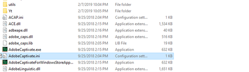
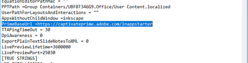

# 無法發佈至Learning Manager歐盟網域 {#unable-to-publish-to-learning-manager-eu-domain}

## 問題

無法從Adobe Captivate發佈至Adobe Learning Manager EU網域。

## 錯誤

找不到帳戶

## 說明

在某些情況下，作者會嘗試將課程從Adobe Captivate發佈到Adobe Learning Manager。 但是，他們無法這麼做，因為他們看到錯誤訊息「找不到帳戶」。

## 原因

發生此問題的原因是Adobe Captivate預設設定為發佈內容至Adobe Learning Manager的美國網域。

## 解析度：

注意事項：

* 如果開啟，請關閉Adobe Captivate應用程式。
* 您需要電腦上的管理員存取權才能執行下列步驟。 如果您沒有管理員存取權，請洽詢您的IT團隊以尋求協助。

執行以下步驟：

1. 前往Adobe Captivate的安裝目錄。

   例如，`kbd C:\\Program Files\\Adobe\\Adobe Captivate 2019 x64` (2019是Captivate版本。 若您使用其他版本的Adobe Captivate則不同)。

1. 將組態檔&#x200B;**AdobeCaptivate.ini**&#x200B;複製到您的案頭。

   
   *檢視組態檔*

1. 在記事本上開啟從案頭複製的檔案。
1. 將LearningManagerBaseUrl = `https://learningmanager.adobe.com/inappstarter`的值變更為LearningManagerBaseUrl = `https://learningmanagereu.adobe.com/inappstarter`

   
   *檢視PrimeBaseURL*

1. 儲存對記事本所做的變更。
1. 複製您編輯的已儲存檔案，並將其貼回檔案路徑。 取代`kbd C:\\Program Files\\Adobe\\Adobe Captivate 2019 x64`中的原始檔案
1. 完成後，請啟動Adobe Captivate並嘗試發佈至Adobe Learning Manager。
