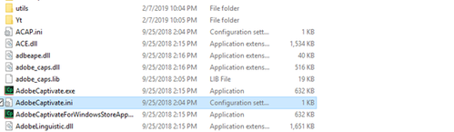
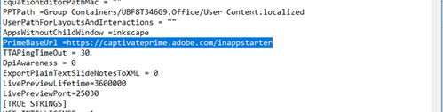

# 無法發佈到 Learning Manager 歐盟網域 {#unable-to-publish-to-learning-manager-eu-domain}

## 子嗣

無法從 Adobe Captivate 發佈到 Adobe Learning Manager 歐洲網域。

## 錯誤

未找到任何帳號

## 說明

有些情況是作者試圖將課程從 Adobe Captivate 發佈到 Adobe Learning Manager。 然而，他們無法登入，因為他們看到錯誤訊息「找不到帳號」。

## 成因

此問題是因為 Adobe Captivate 預設設定為將內容發佈至 Adobe Learning Manager 的美國網域。

## 解決：

注意事項：

* 如果開啟，請關閉 Adobe Captivate 應用程式。
* 你需要在你的電腦上取得管理員權限才能執行以下步驟。 若您沒有管理員權限，請聯繫您的 IT 團隊尋求協助。

請執行以下步驟：

1. 前往 Adobe Captivate 的安裝目錄。

   例如，  `kbd C:\\Program Files\\Adobe\\Adobe Captivate 2019 x64` （2019 年是 Captivate 版本。 如果你用的是不同版本的 Adobe Captivate，情況會有所不同。

1. 把設定檔 **AdobeCaptivate.ini** 複製到你的桌面。

   
   *查看設定檔*

1. 把從桌面複製的檔案打開到記事本上。
1. 將 LearningManagerBaseUrl = `https://learningmanager.adobe.com/inappstarter` 的值改為 LearningManagerBaseUrl = `https://learningmanagereu.adobe.com/inappstarter`

   
   *查看 PrimeBaseURL*

1. 將資料存檔修改到記事本。
1. 複製你編輯的儲存檔案，然後貼回檔案路徑。 替換原始檔案  `kbd C:\\Program Files\\Adobe\\Adobe Captivate 2019 x64`
1. 完成後，啟動 Adobe Captivate 並嘗試發佈到 Adobe Learning Manager。
