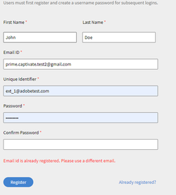
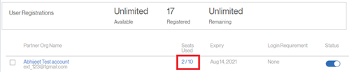
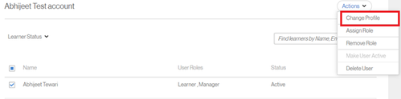
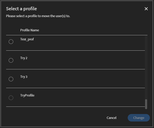
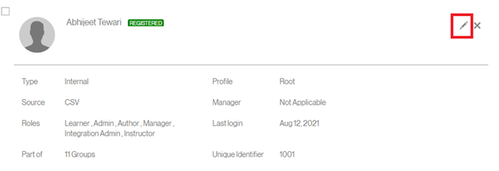
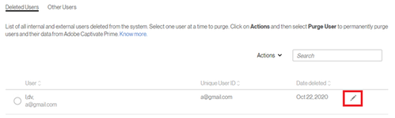

# 無法註冊為外部使用者

## 問題

外部學習者無法註冊至設定檔。

## 錯誤

電子郵件ID已註冊。 請使用其他電子郵件。

*已註冊電子郵件的錯誤訊息*

## 說明

在某些情況下，使用者無法註冊到外部設定檔。 使用者在註冊時會收到上述錯誤。

## 原因

此問題會在以下其中一種情況下發生：

* 使用者已註冊到另一個外部設定檔。
* 使用者已是內部學習者。
* 使用者處於已刪除狀態。

## 解析度：

**案例1：** 使用者已註冊到另一個外部設定檔。

1. 以管理員身分登入。
1. 在 **管理**，按一下 **[!UICONTROL Users]** > **[!UICONTROL External]**.
1. 按一下使用的座位，開啟使用者已經屬於的設定檔

   

   *開啟使用者的設定檔*

1. 選取使用者，按一下 **[!UICONTROL Actions]** > **[!UICONTROL Change Profile]**.

   

   *變更使用者的設定檔*

   這會開啟一個視窗，讓您選取新的設定檔，如下所示。

   

   *選取使用者設定檔*

1. 選取後，按一下 **[!UICONTROL Change]**.

**案例2：** 使用者以內部學習者身分出現。

1. 以管理員身分登入。
1. 在 **管理**，按一下 **[!UICONTROL Users]** > **[!UICONTROL Internal]**.
1. 按一下以開啟學習者設定檔，然後按一下編輯圖示。

   

   *開啟內部學習者設定檔*

1. 變更學習者的電子郵件地址或新增 *舊(_O)* 至現有的電子郵件地址。 這將釋放電子郵件地址。

   例如，如果學習者的電子郵件地址為 *<abc@adobe.com>，* 將其變更為 *<abc_old@adobe.com>*

1. 按一下 **儲存** 以保留所做的變更。

**案例3**：使用者處於已刪除狀態。

1. 以管理員身分登入。
1. 在 **管理**，按一下 **[!UICONTROL Users]** > **[!UICONTROL User Cleanup]**.
1. 選取學習者並按一下「編輯」圖示。

   

   *編輯使用者電子郵件地址*

1. 變更學習者的電子郵件地址或新增 *舊(_O)* 至現有的電子郵件地址。 這將釋放電子郵件地址。

   例如，如果學習者的電子郵件地址為 **<abc@adobe.com>**，將其變更為 **<abc_old@adobe.com>**.
