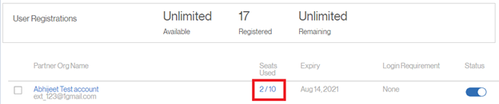
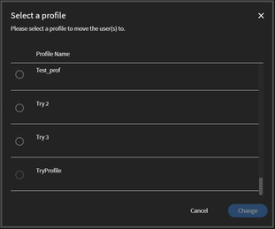
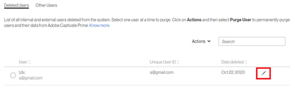

# 無法以外部使用者身份註冊

## 子嗣

外部學習者無法註冊個人檔案。

## 錯誤

電子郵件帳號已經註冊好了。 請使用其他電子郵件。

*已註冊電子郵件的錯誤訊息*

## 說明

有些情況使用者無法註冊外部設定檔。 使用者在註冊時會收到上述錯誤。

## 成因

此問題發生在以下情境之一：

* 使用者已經註冊到另一個外部帳號。
* 使用者本身就是內在學習者。
* 使用者處於刪除狀態。

## 解決：

**情境一：** 使用者已註冊到另一個外部設定檔。

1. 以管理員身份登入。
1. 在管理&#x200B;**中**，點擊&#x200B;**[!UICONTROL Users]**>**[!UICONTROL External]**。
1. 點擊「已使用座位」開啟該使用者已加入的個人檔案

   

   *使用者的開放個人檔案*

1. 選擇使用者，點擊 **[!UICONTROL Actions]** > **[!UICONTROL Change Profile]**。

   

   *變更使用者設定檔*

   這會開啟一個視窗，可以選擇如下的全新個人檔案。

   

   *選擇使用者設定檔*

1. 選中後，點擊 **[!UICONTROL Change]**。

**情境二：** 使用者以內在學習者身份存在。

1. 以管理員身份登入。
1. 在管理&#x200B;**中**，點擊&#x200B;**[!UICONTROL Users]**>**[!UICONTROL Internal]**。
1. 點擊開啟學習者個人檔案，並點擊編輯圖示。

   

   *開啟內部 Learber 剖面*

1. 更改學習者的電子郵件地址，或在現有電子郵件地址中新增 *_old* 。 這樣就能釋放電子郵件地址。

   例如，若學習者的電子郵件地址為 *<abc@adobe.com>，* 則改為 *<abc_old@adobe.com>*

1. 點擊 **儲存** 以保留已更改的內容。

**情境三**：使用者處於刪除狀態。

1. 以管理員身份登入。
1. 在管理&#x200B;**中**，點擊&#x200B;**[!UICONTROL Users]**>**[!UICONTROL User Cleanup]**。
1. 選擇學習者並點擊編輯圖示。

   

   *編輯使用者電子郵件地址*

1. 更改學習者的電子郵件地址，或在現有電子郵件地址中新增 *_old* 。 這樣就能釋放電子郵件地址。

   例如，若學習者的電子郵件地址為 **<abc@adobe.com>**，則改為 **<abc_old@adobe.com>**。
