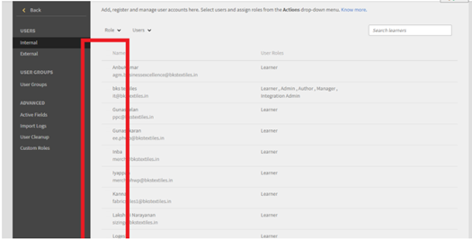
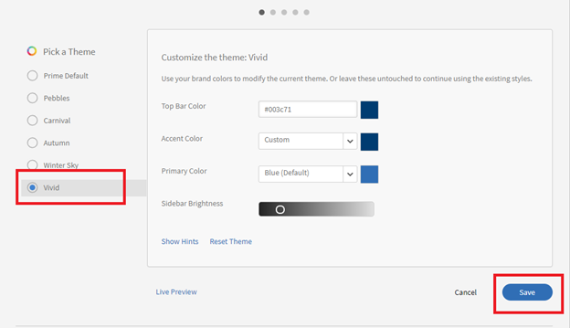

# 選擇按鈕未出現在Learning Manager中

## 問題

由於缺少選項按鈕，管理員無法執行下列動作（不是完整清單）：

* 指派或移除角色。
* 傳送歡迎郵件。
* 刪除使用者。

## 原因

發生此問題的原因是帳戶中的主題不正確。

*選項按鈕不可見*

## 解決方法

重新載入主題並修正選項按鈕的外觀。 執行下列步驟：

1. 以管理員身分，按一下&#x200B;**[!UICONTROL Branding]**。
1. 在&#x200B;**主題**&#x200B;區段中，按一下&#x200B;**[!UICONTROL Edit].**
1. 挑選任何佈景主題並儲存變更。

   

   *選取任何主題*

1. 還原至上一個主題並儲存變更。
1. 登出Adobe Learning Manager並重新登入。
