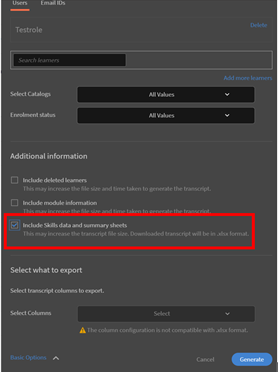
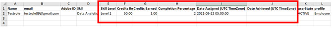
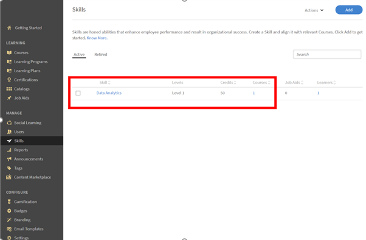
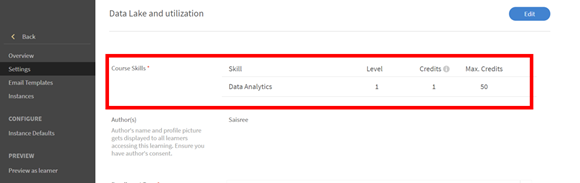

# 完成課程後無法習得技能

## 問題

學習者即使完成課程仍無法習得技能。 指派給該課程的技能保持為 **進行中** 適用於學習者。

## 原因

此問題發生於 **需要積分** 要達到此技能，您必須先完成 **已獲取的積分** 由學習者完成課程後決定。

## 解決方案

檢查目前的 **技能積分** 和 **點** 獲得技能所需的資訊。 請遵循下列步驟：

1. 對學習者產生 **學習者成績單** 報告。
1. 產生學習者成績單時，按一下 **[!UICONTROL Advanced Options]**，並核取選項 **[!UICONTROL Include Skills data and summary sheets]**.

   

   *選取包含技能資料和摘要表選項*

1. 開啟下載的學習者成績單報表。
1. 導覽至 **[!UICONTROL Skills transcript]** 工作表。 在這裡，您可以檢視 **[!UICONTROL Credits Required]** 和 **[!UICONTROL Credits Earned]** 由學習者決定。

   例如，在以下範例中，完成課程的技能所需的學分為50。 但學習者僅獲得一個學分。

   

   *檢視必要的積分*

1. 若要檢查指派給特定技能的學分，請以管理員身分登入，然後導覽至 **技能** 標籤，如下所示：

   

   *啟動「技能」標籤*

1. 若要檢查指派給課程的學分數，請以作者身分登入，然後開啟課程。 按一下 **[!UICONTROL Settings]** > **課程技能** 如下所示：

   

   *檢視課程技能*
