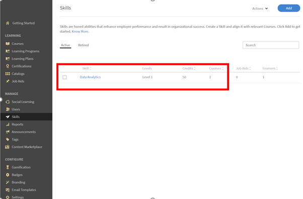

# 完成課程後無法達成某項技能

## 子嗣

即使完成課程，學習者也不會獲得技能。 該課程所分配的技能對學習者而言仍為 **「進行中** 」狀態。

## 成因

若 **達成此技能所需的** 學分超過 **完成課程後所獲得** 的學分，則會出現此問題。

## 解法

請檢查目前 **的技能點數** 和 **達成技能所需的點數** 資訊。 請依照以下步驟操作：

1. 對學習者而言，產生 **一份學習者成績單** 報告。
1. 在產生學習者成績單時，點擊 **[!UICONTROL Advanced Options]**，並勾選選項 **[!UICONTROL Include Skills data and summary sheets]**。

   

   *選擇「包含技能資料與摘要表」選項*

1. 打開下載的學習者成績單報告。
1. 切換到 **[!UICONTROL Skills transcript]** 工作表。 在這裡，你可以查看 **[!UICONTROL Credits Required]** 學習 **[!UICONTROL Credits Earned]** 者和

   例如，在下面的例子中，達成該技能所需的學分是50學分。 但學習者僅取得一學分。

   

   *查看所需製作人員*

1. 要查看分配給特定技能的積分，請以管理員身份登入，並如 **下所示進入技能** 標籤：

   

   *發射技巧標籤*

1. 要查看課程分配的學分數，請以作者身份登入並開啟課程。 請點擊 **[!UICONTROL Settings]** > **課程技能** ，如下所示：

   

   *查看課程技能*
