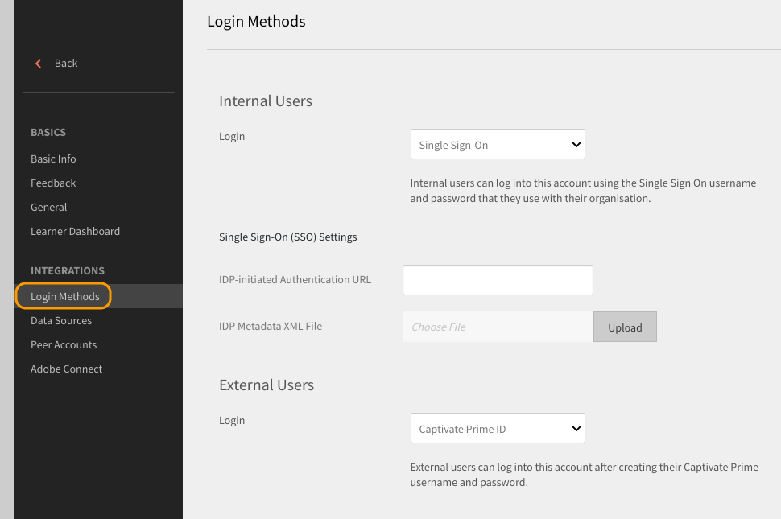
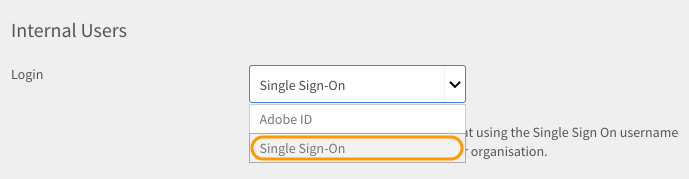
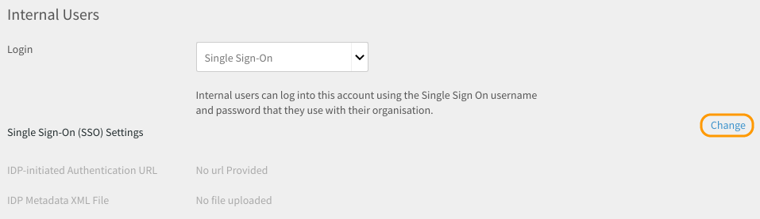
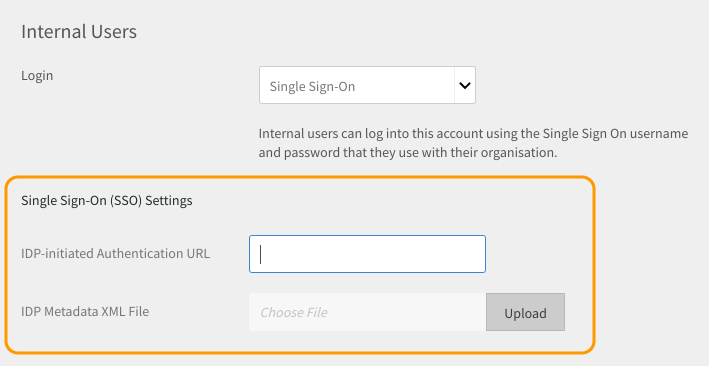

# 使用SSO驗證登入Learning Manager

本檔案可協助您設定SSO驗證，以登入您的Learning Manager帳戶。

若要設定SSO驗證，請執行下列步驟：

1. 開啟 **[!UICONTROL Settings]** > **[!UICONTROL Login Methods.]**

   

1. 選擇 **[!UICONTROL Internal Users]** 或 **[!UICONTROL External Users]** 視您的需求而定。
1. 按一下旁邊的下拉式清單  **[!UICONTROL login]** 選項並選取 **[!UICONTROL Single Sign-On]**.

   

1. 若要調整單一登入(SSO)設定，請按一下  **[!UICONTROL Change.]**

   

1. 輸入  **[!UICONTROL IDP-initiated Authentication URL]** 由您的服務提供者提供，並透過按一下 **[!UICONTROL IDP Metadata XML File.]**

   

   您在Learning Manager中設定的SSO應為SAML 2.0支援。

   您現在可以使用您的SSO驗證登入Learning Manager。

