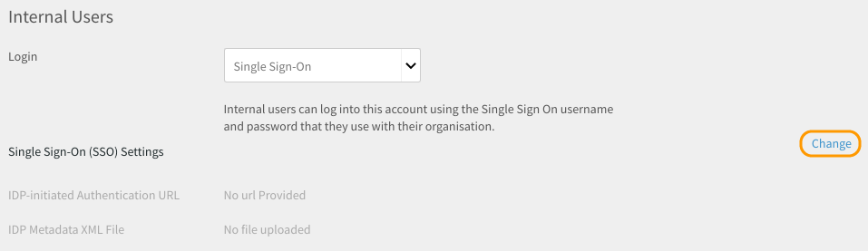
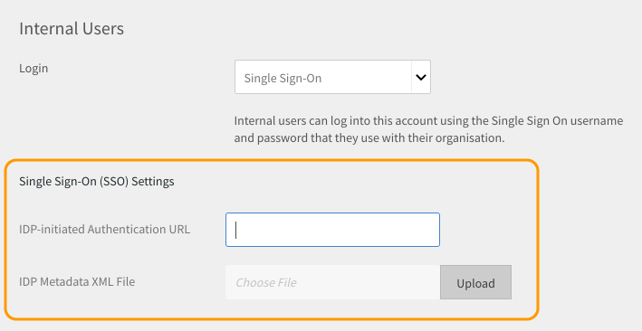

# 使用 SSO 認證登入 Learning Manager

本文件協助你設定 SSO 認證，以便登入你的學習管理員帳號。

要設定 SSO 認證，請執行以下步驟：

1. 開放 **[!UICONTROL Settings]** > **[!UICONTROL Login Methods.]**

   

1. 根據你的需求選擇 **[!UICONTROL Internal Users]** 或 **[!UICONTROL External Users]** 選擇。
1. 點選選項旁的  **[!UICONTROL login]** 下拉選單並選擇 **[!UICONTROL Single Sign-On]**。

   

1. 要調整單一登入（SSO）設定，請點擊  **[!UICONTROL Change.]**

   

1. 輸入  **[!UICONTROL IDP-initiated Authentication URL]** 服務提供者提供的資訊，並點擊上傳您的 XML 檔案 **[!UICONTROL IDP Metadata XML File.]**

   

   你在 Learning Manager 設定的 SSO 應該是支援 SAML 2.0 的。

   你現在可以用你的 SSO 認證登入 Learning Manager。
