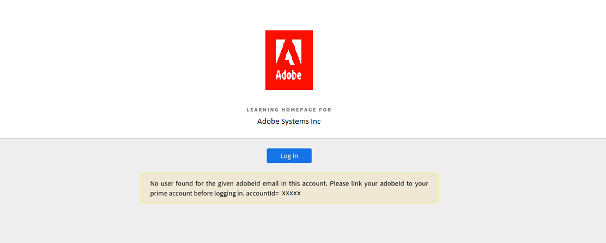

# 無法登入Learning Manager

## 問題

嘗試登入AdobeLearning Manager時，您會看到以下錯誤：

*此帳戶找不到特定adobeid電子郵件的使用者。 請先將您的adobe id連結至Learning Manager帳戶再登入。*

<!---->

## 原因

瀏覽器快取和Cookie可能會阻止您存取AdobeLearning Manager平台。

## 解析度

## 清除瀏覽歷程記錄/快取

以下連結是清除快取的瀏覽器專用指南：

* [Google Chrome](https://support.google.com/accounts/answer/32050?co=GENIE.Platform%3DDesktop&amp;hl=en)
* [Internet Explorer](https://kb.wisc.edu/page.php?id=1514)
* [Microsoft Edge](https://www.bitdefender.com/support/how-to-clear-the-cache-and-cookies%C2%A0in-microsoft-edge-1914.html)
* [Firefox](https://kb.iu.edu/d/ahic)
* [Safari](https://oit.colorado.edu/tutorial/clear-web-browser-cache-safari-6)

## 使用無痕模式

在瀏覽器中使用無痕模式，然後登入AdobeLearning Manager。 另請參閱 [指示](https://support.google.com/chrome/answer/95464?co=GENIE.Platform%3DDesktop&amp;hl=en&amp;oco=0).

## 聯絡管理員

如果您還是無法登入，請連絡帳戶管理員。 管理員可驗證您是否為帳戶的註冊學習者。

如果您是帳戶的一分子，但仍無法登入，系統管理員必須確認您的Adobe ID是否與您嘗試登入的相同。

有時Adobe ID與帳戶上的AdobeLearning Manager ID不同。

## 下一步

執行上述步驟後，如果您仍然無法登入，管理員可以收集登入的HAR記錄。 如需詳細資訊，請參閱 [產生HAR檔案](/help/migrated/kb/generate-har-file.md).

此外，請聯絡AdobeLearning Manager支援團隊，以便我們進一步針對問題進行偵錯。
