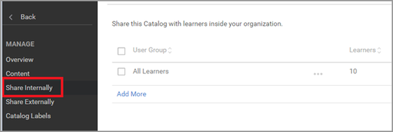
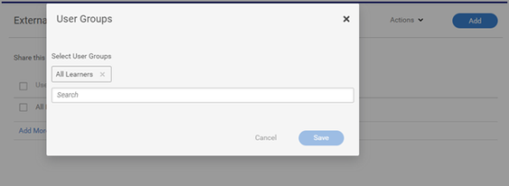
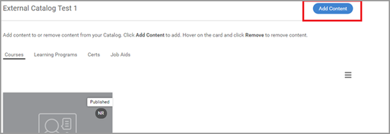

# 無法在Learning Manager中搜尋課程

## 問題

學習者無法在Learning Manager中搜尋課程。

## 案例1：透過高等教育物件註冊

### 摘要

在某些情況下，學習者會搜尋課程但課程未列出。 但如果學習者已註冊學習計畫/認證，則學習者可以在學習物件內檢視課程。

### 為什麼會發生這個情況？

在Learning Manager中，當學習者透過學習計畫/認證註冊時，該課程的註冊會透過學習計畫/認證進行。

因此，學習者無法搜尋下的獨立課程 **我的學習**.

但學習者無法檢視學習計畫/認證內的課程。

## 案例2：學習者無權存取包含課程的目錄。

### 摘要

學習者無法在目錄或學習控制面板中搜尋課程。

### 為什麼會發生這個情況？

此問題會在以下情況下發生：

* 學習者不是包含課程的目錄的一部分 **或**
* 課程不屬於學習者有權存取的目錄。

### 解決方法

1. 以管理員身分登入。

1. 按一下 **[!UICONTROL Catalog]** 並瀏覽至包含課程的目錄。
1. 按一下 **[!UICONTROL Share Internally]** 或 **[!UICONTROL Content]** （視上述情況而定）。

   

   *在內部共用目錄*

1. 請檢閱下列案例：

   * 學習者不屬於目錄

     若要共用目錄，請按一下 **[!UICONTROL Add]**，並新增該使用者所屬的使用者群組。 按一下 **[!UICONTROL Save]**.

     

     *新增使用者群組*

   * 課程不是目錄的一部分

     在「內容」區段中，按一下 **[!UICONTROL Add Content]** 並選取您需要新增至目錄的課程。

     

     *新增內容至課程*
