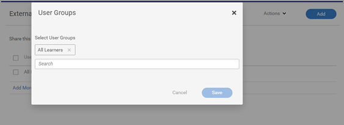
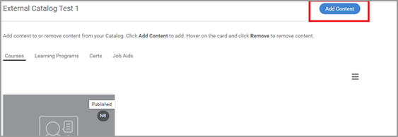

# 無法在學習管理軟體中搜尋課程

## 子嗣

學習者無法在學習管理員中搜尋課程。

## 情境一：註冊是透過更高階的學習對象進行

### 摘要

有些情況是，學習者搜尋課程時，該課程並未被列出。 但如果學習者已註冊學習計畫或認證，則能在學習物件中查看課程內容。

### 為什麼會這樣？

在學習管理中，當學習者透過學習計畫/認證註冊時，該課程的註冊會透過學習計畫/認證進行。

因此，學習者無法在「我的學習&#x200B;**」中搜尋獨立課程**。

不過，學習者可以在學習計畫/認證中查看課程內容。

## 情境二：學習者無法存取包含課程的目錄。

### 摘要

學習者無法在課程目錄或學習儀表板中搜尋課程。

### 為什麼會這樣？

此問題發生於以下情況：

* 學習者並非包含該課程 **的目錄的一部分，或**
* 該課程並非學習者可存取的目錄內容。

### 解決方法

1. 以管理員身份登入。

1. 點擊 **[!UICONTROL Catalog]** 並瀏覽包含該課程的課程目錄。
1. 點擊 **[!UICONTROL Share Internally]** 或 **[!UICONTROL Content]** （視上述情況而定）。

   

   *內部分享目錄*

1. 請回顧以下情境：

   * 學習器不包含在目錄中

     要分享目錄，請點擊 **[!UICONTROL Add]**，並新增該使用者所屬的使用者群組。 點擊 **[!UICONTROL Save]**。

     

     *新增使用者群組*

   * 課程不包含在目錄中

     在內容區塊，點擊 **[!UICONTROL Add Content]** 並選擇你需要加入課程目錄的課程。

     

     *新增課程內容*
